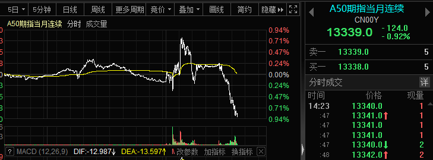
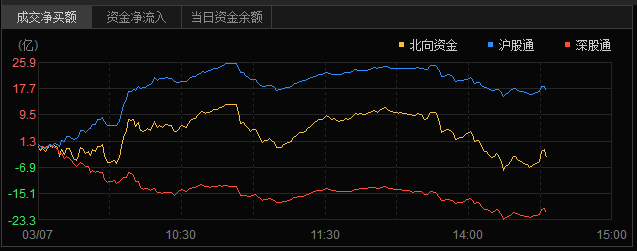

# A股全线告跌，发生了什么？分析人士认为内资情绪或受三方面影响

早盘，在中字头的加持之下，整个A股市场和港股市场指数表现尚可。然而从涨跌个股数量来看，依然是出现了颓势，全市场股票涨少跌多，成交量再度萎缩。已然是下跌之势。

**那么，究竟发生了什么？分析人士认为，主要有三点：**

一是今年一二月的进出口数据出炉，数据整体并不是太理想。市场也是从这个数据出来的时候开始杀跌的。

二是中字头个股盘子很大，吸金效果很明显，而整个市场的流动性又不够，因此对小股票杀伤力很大。

三是从外围来看，压力持续不断。今天又传出，拜登政府再度下黑手，或将限制私募基金等美企的投资。

与此同时，德国也有动作。今天千亿巨头中兴通讯大跌。据德国媒体报道，德国政府计划禁止电讯商的5G网络使用华为及中兴通讯的某些组件。

许多事件其实并非新闻，但在一定程度上，仍对市场情绪和投资者信心构成影响。然而，从外资大行的观点来看，对中国经济前景依然乐观。

突然杀跌

今天，A股市场在早盘轻度活跃之后，突然杀跌。午后更是单边向下，盘中抵抗力比较弱。

A50也出现了跳水走势。

港股市场也跟随杀跌。

**那么究竟发生了什么？分析人士认为，内资情绪可能受到了三方面的影响：**

一是进出口数据。据海关统计，今年前2个月，我国进出口总值6.18万亿元人民币，同比(下同)微降0.8%。其中，出口3.5万亿元，增长0.9%；进口2.68万亿元，下降2.9%；贸易顺差8103.2亿元，扩大16.2%。按美元计价，今年前2个月我国进出口总值8957.2亿美元，下降8.3%。其中，出口5063亿美元，下降6.8%；进口3894.2亿美元，下降10.2%；贸易顺差1168.8亿美元，扩大6.8%。这个数据显现出经济方面存在一定的压力。

二是市场结构。最近一段时间，中字头表现不错，今天更是出现了中海油一度涨停的情况，这使得中字头吸金比较多，然而整个市场的成交量并没有显著放大，这意味着市场的流动性出现了结构性问题。在这种情况之下，中小市值的股票出现了全线杀跌的情况，进而带动一些结构性资金跟随杀跌。

三是外部传闻。拜登可能在本周后期公布财政预算案时，提出一些限制美资投资的要点，其后再于数个月内公布细节，以维护国家安全。这个传闻并不是第一次出现，但仍给市场带来了一定的杀伤，特别是恒生科技。事实上，从目前的形势来看，投资者其实应该早有这样的预期才对。

值得一提的是，德国报章《Zeit
Online》报道，德国政府计划禁止电讯商的5G网络使用华为及中兴通讯的某些组件，禁令或包括已经安装在网络中的组件，因此电讯商或需要移除及更换相关的组件。受此影响，今天中兴通讯也杀得比较惨。

外资依然看好

不过，与内资相比，外资似乎并没有想象的那么悲观。其实，今天外资卖得并不多，而且人民币还处于升值状态。

瑞银亚洲经济研究主管，首席中国经济学家汪涛在电话会议中表示，去年在中国的外商投资的下降幅度较大，是由于疫情下人员交流和企业营运均受到冲击。汪涛预计，今年的外商企业投资会有回升，因为今年对中国的经济不确定因素已经大大减弱，加上重新开放及恢复人员交流。另一方面，不少企业考虑到关税和风险，加上成本增加，令制造业将一部分产能投放到东南亚和东北等地区。不过，汪涛指出中国的市场广大，经济在疫情下继续发展，是全球一个重要的经济体，仍有很多制造业公司在内地投资，因此，目前的产业链是一个调整和重组的过程，而不只是企业投资外流。

汪涛预期，今年内地会降准一次，因为目前的水平已经较低，下调的空间已经不大，加上央行仍有很多工具来提升市场流动性。今年中国的消费正常化带动经济复苏，因此经济目标增加5%是一个务实的预测。

对于高层提到的推动平台市场公平竞争制度，汪涛认为目前监管已经常态化，该政策已经确立了方向，且消除了监管的不确定性，这有助于鼓励平台企业在法规内发展及进行整改。不过，整体的具体措施仍要等待各部门的政策出台。

瑞银证券中国策略分析师孟磊表示，对今年A股表现感到乐观，料今年北向资金净流入将录得3000亿元，并相信海外资金仍将长期净流入A股市场，又预期今年A股盈利增长将回升至15%。他强调，海外投资对A股市场不是没有信心，而是需时恢复。

责编：战术恒

校对：李凌锋

