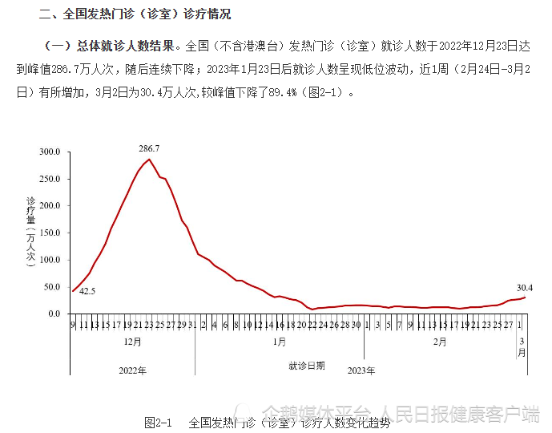

# 全国发热门诊就诊人数上升，专家：主要为流感病例增加

**人民日报健康客户端记者 刘静怡**

3月4日，中国疾控中心发布全国新型冠状病毒感染疫情情况最新通报，数据显示，2月底以来，我国发热门诊就诊人数呈上升趋势，3月2日达到30.4万人次。专家表示，发热门诊人数增加主要是流感导致。

_3月4日，中国疾控中心通报发热门诊诊疗人数变化趋势。通报截图_

3月6日，北京佑安医院感染综合科主任医师李侗曾同样向记者表示，发热门诊就诊人数增加主要是由于流感的病例增加。

“基于此前应对新冠病例的经验，发热门诊人数上升会协调发热门诊医务人员，增加药物储备。目前大家准备都很充分，医院压力不会像之前那么大，主要还是协调增加发热门诊的医护人员。”李侗曾指出。

据中国疾控中心疫情情况通报，从哨点医院监测情况来看，近3周流感病毒阳性率呈上升趋势，2023年第8周为25.1%，而新冠病毒阳性率则为5.1%，保持在较低水平。

_中国疾控中心通报哨点医院流感样病例新冠和流感病毒阳性率变化趋势。通报截图_

**什么样的患者需要去发热门诊就诊？什么样的情况能够自愈？**

李侗曾表示，65岁以上的老年人，5岁以下的儿童，孕妇，还有基础病免疫力低下人群等均属于高风险人群，如果得了流感建议尽早去医院，其他普通人群大概率可以在一周左右自愈康复。“当前流感病例还是以儿童和中青年为主，后期合并基础疾病的老年人感染流感的比例可能会增加，年轻人感染流感，最主要的是在家里做好隔离，尽量休息，对症用药，如果超过五天症状尚未缓解，就要及时就诊。”

