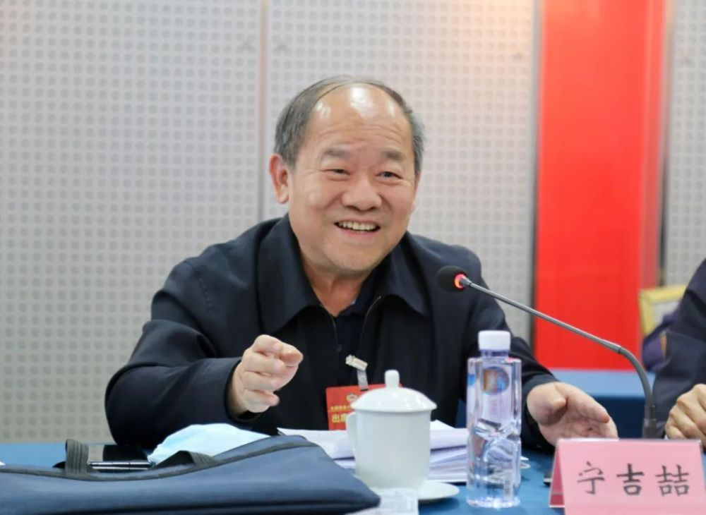

# 宁吉喆：过去三年我的消费大大降低了，消除消费阻碍需各方面努力

划重点：

  * _1_ “因为我的工资卡平时都是我的妻子负责管理，我的钱肯定还是家里用得多一些。过去三年受疫情影响，消费受阻，我的消费大大降低了，被动储蓄增加了。要消除阻碍消费的因素，需要各方面努力。”
  * _2_ 居民拿到消费券可以马上去消费，对促进消费有局部促进作用。但从全国来看，这不是一个必选措施。消费券实际是变相货币，会对货币市场产生干扰。如果一些地方把消费券当金融产品来操作，就与本意相违了。
  * _3_ 扩消费放在扩内需首位，不是说投资不重要，我们仍然要把扩大投资放在重要位置。消费对经济发展起到基础性作用，投资起到关键性作用，两个轮子一起转，中国扩大内需就有了强劲动力。

在全面贯彻党的二十大精神的开局之年，我们又迎来“两会时间”。

踏上新征程，奋楫再出发。政事儿工作室推出“奋进中国——2023年全国两会政事儿访谈录”，来自各条战线的新一届全国人大代表、全国政协委员讲述不负重托、同心圆梦的履职故事，畅谈中国发展新愿景。

**全国政协委员宁吉喆：**

**过去三年我的消费大大降低了，消除消费阻碍需各方面努力**

3月5日晚，全国政协委员宁吉喆接受“政事儿”专访，就中国经济发展、大学生就业、扩大内需与扩大消费、多渠道增加城乡居民收入、民营经济发展、人口增长等话题，深入解读政府工作报告。

他说，“对于过去五年，事非经过不知难，成绩来之不容易；对于今年，报告提出了经济社会发展总体要求。我认为目标政策已明确，经济回升可预期。”

报告指出，要稳定大宗消费，推动生活服务消费恢复。宁吉喆谈到一个细节，“因为我的工资卡平时都是我的妻子负责管理，我的钱肯定还是家里用得多一些。过去三年受疫情影响，消费受阻，我的消费大大降低了，被动储蓄增加了。要消除阻碍消费的因素，需要各方面努力。”

宁吉喆出生于1956年，曾任国务院研究室副主任、主任，2015年任国家发改委副主任（正部长级），次年兼任国家统计局局长、党组书记，去年3月转任第十三届全国政协委员、经济委员会副主任。

_参加全国两会的宁吉喆（受访者供图）_

**谈报告整体感受**

**“目标政策已明确，经济回升可预期”**

**政事儿** ：列席十四届全国人大一次会议第一次全体会议，听完李克强总理所作的政府工作报告，你的总体感受是什么？

**宁吉喆**
：作为十四届全国政协委员，我列席十四届全国人大一次会议第一次全体会议，听了李克强总理作的政府工作报告。报告贯穿习近平新时代中国特色社会主义思想、党的二十大精神和中央经济工作会议精神，也体现了过去五年在党中央坚强领导下，全国各族人民的辛勤努力艰苦奋斗。

对于过去五年，事非经过不知难，成绩来之不容易；对于今年，报告提出了经济社会发展总体要求。我认为目标政策已明确，经济回升可预期。

**政事儿** ：如果用几个关键词总结，你会用哪些？

**宁吉喆** ：印象比较深的关键词有四个，也与上述感觉有关系：成就辉煌，过程不易，工作艰辛，未来可期。

**谈GDP预期目标增长5%左右**

**“克服困难、看到机遇、战胜挑战，就可以危中寻机、化危为机，求得正常增长”**

**政事儿** ：政府工作报告指出，2022年我国GDP增长3%，今年预期目标是增长5%左右。从3%到5%左右，你怎么看这个变化？

**宁吉喆** ：去年中国经济实际增长3%，是受国内外多重超预期因素影响。虽然3%相当于世界各国平均增速，但比去年年初我们提出的5.5%预期目标要低。

今年政府工作报告提出2023年GDP预期目标是5%左右，这与去年实际增长3%相比，是一个明显的提升。

从现实需求来看，中国需要一个正常合理的经济增长速度，它是改善和保障民生的需要，无论就业、增收，还是一系列民生保障，都需要有增长速度为基础。它还是高质量发展的需要。高质量发展既包括质量有效提升，也包括数量合理增长。同时，它还是推进中国式现代化的需要。推进中国式现代化是党的二十大确定的中心任务，发展作为党执政兴国的第一要务，高质量发展是全面建设社会主义现代化国家的首要任务。这些都需要以合理增长速度为基础。

从可能性来看，我们人财物生产要素都具备。中国仍然拥有一支世界上数量最大的劳动者大军，资金保障也在提升，物质基础也雄厚，基础设施比较完善，产业体系完整齐全。从生产要素看，具备支撑条件。虽然世界经济增长有所放缓，国际市场有一些波动，但中国人口规模巨大的现代化主要依靠国内大市场，大国经济的特点是内需主导、拓展外需。市场空间可以支撑合理增长速度。

从长期发展来看，我们需要达到一个潜在增长率。去年3%低于增长的合理区间，今年提出5%左右，我认为能接近或达到中国经济潜在增长率水平。

**政事儿** ：实现这个目标，难度大吗？

**宁吉喆**
：难度还在于国际国内存在不确定性、不稳定因素。从国际来看，世界经济有放缓担忧，甚至出现衰退。如果各国宏观政策处理的好，可能会好一点。但总体来说，因为大国博弈、地缘政治、军事冲突等影响，例如乌克兰危机，外部市场不确定因素较多。

从国内来看，我国经济长期存在一些结构性矛盾，加上疫情干扰，形成了一些惯性。我们常讲周期性、结构性、体制性矛盾并存，其中有长期因素、近期因素，也有短期因素。

这需要我们克服困难、看到机遇、战胜挑战，就可以危中寻机、化危为机，求得正常增长。

**谈就业**

**“各级政府要把就业问题放在头等重要的优先位置”**

**政事儿** ：政府工作报告指出，今年城镇新增就业1200万人左右，把促进青年特别是高校毕业生就业工作摆在更加突出位置。你怎么看当前就业形势？

**宁吉喆**
：就业问题始终是民生之本。中国有14亿多人口，近9亿劳动年龄人口，但就业人数是7亿多人，劳动参与率60%多。加上城镇新成长劳动力、农村转移进城劳动力、复转军人、大学生等，需要在城镇就业的数量会越来越大。就业矛盾特别是结构性矛盾比较突出。

为什么说结构性矛盾？一方面，中国存在就业不充分问题，比如大学生就业难；另一方面存在就业招工难问题，比如制造业技术工人、高新产业符合条件人才比较缺乏。由于中国经济增长企稳回升，今年就业形势总体看，要比去年经济增长低于合理区间时有所好转，这是趋势。就业数量会扩大、就业环境会改善、就业形势总体稳定，是可以预期的。

**政事儿** ：数据显示，2023年中国高校毕业生规模预计超过1150万人。大学生就业目前存在哪些结构性矛盾？

**宁吉喆**
：大学生和农民工是两个重点就业群体。农民工虽然数量很大，进城农民工达到两亿八九千万人，但他们以体力劳动为主。1998年、2008年农民工也大量回乡，这个矛盾突出。受疫情影响，这两年也有一些农民工回乡，但这是非经济因素影响。现在随着疫情防控政策平稳转段、我们走出疫情大流行，服务业、建筑业在恢复，形势正在好转，农民工就业矛盾不及大学生就业这么突出。

中国促进高等教育发展、培养大学生有个周期，这两年每年毕业的大专以上学生突破了1000万，今年又创历史新高。大学生有知识，有求职诉求。而我们产业结构整体还是以中低端为主，对知识型劳动就业吸纳能力提升需要一个过程。同时，产业结构与大学生就业结构还不匹配，加上周期性矛盾影响和疫情惯性影响，要下更大力气去解决大学生就业问题。

**政事儿** ：应该从哪些方面着手？

**宁吉喆**
：最重要的还是建议各级政府要把就业问题放在头等重要的优先位置。按照政府工作报告里提出的，要落实落细就业优先政策。坚持把稳就业、保就业，特别是大学生就业放在“六稳六保”首位。

首先要明确政策取向，大家行动才能更加自觉。要活跃市场主体增加就业。要靠扩大内需扩大就业。大学生有知识、有技能，要投资更多知识型、技术型项目，鼓励扩大就业。要支持发展吸收就业多的服务业，通过服务消费带动服务业供给，带动就业。继续支持大学生创新创业。

从长期来看，需要调整产业结构来扩大就业。一方面，把产业结构朝着中高端、能吸引更多大学生方向去调整；另一方面要通过加大培训增强大学生就业能力，来适应就业发展趋势。总之，要综合施策来解决就业问题。

**谈扩大内需与扩大消费**

**“消费对经济发展起到基础性作用，投资起到关键性作用，两个轮子一起转就有了强劲动力”**

**政事儿** ：政府工作报告指出，要坚持实施扩大内需战略，培育更多经济增长动力源。如何理解这个问题？

**宁吉喆**
：扩大内需是国家的大战略。大国经济以内需为主导，中国式现代化也是人口规模巨大的现代化。以国内大循环为主体、国内国际双循环相互促进的新发展格局，建立在扩大内需基础上。

中国实施扩大内需战略已有20多年。1998年开始实施扩大内需，我们克服了亚洲金融危机影响；2008年国际金融危机，我们又扩大内需，经济调控取得明显成效。

现在中国经济发展规模越来越大，扩大内需是一个总方向。去年中共中央、国务院印发《扩大内需战略规划纲要(2022-2035年)》，公布扩大内需长远规划战略，国家发展改革部门出台实施方案，把方向、路径、政策都做了擘画，现在正在实施。

**政事儿** ：你怎么看扩大内需与扩大消费的关系？

**宁吉喆**
：内需分为国内消费和国内投资两大块。正常情况下，消费应该占到内需60%左右，投资占到40%左右。由于疫情原因，国内消费市场存在需求收缩矛盾。2021年消费在经济增长的贡献率降到30%，去年也是30%，这没有达到正常水平。受疫情等非经济因素影响，去年社会商品零售总额负增长，这不是常态。

现在要恢复常态，就要把扩大消费放在稳增长、扩内需的主要位置。今年随着疫情影响降低，受抑制的接触性消费、聚集性消费、流动性消费开始回升。从春节到现在，餐饮、住宿、客运、文旅都开始回升，今年全年消费上升势头明显。

扩消费放在扩内需首位，不是说投资不重要，我们仍然要把扩大投资放在重要位置。消费对经济发展起到基础性作用，投资起到关键性作用，两个轮子一起转，中国扩大内需就有了强劲动力。

**政事儿** ：对于扩大消费，还有哪些工作要做？

**宁吉喆**
：要扩大消费，除了提高消费能力外，还要改善消费环境。消费环境是消费条件和消费场景的综合。要创造消费场景，使居民在一定空间里消费更便捷，更满足需求。这不仅要靠市场主体提供，地方政府也可以有所作为。

还要引导消费方向。居民消费是分层次的，最基本的吃得饱穿得暖、出行方便、住得舒适。这些刚性需求要满足，改善性住房需求也要满足。这不仅涉及需求端，还涉及供给侧结构性改革。

**政事儿** ：你如何看地方政府发放消费券的作用？

**宁吉喆**
：居民拿到消费券可以马上去消费，对促进消费有局部促进作用。但从全国来看，这不是一个必选措施。消费券实际是变相货币，会对货币市场产生干扰。如果一些地方把消费券当金融产品来操作，就与本意相违了。我相信各级政府会加强监管。

**谈增加城乡居民收入**

**“增收本身是一个大问题，就业起主要作用，需要一起抓”**

**政事儿**
：谈到消费能力问题，国家统计局数据显示，2022年全国居民人均可支配收入36883元，比上年实际增长2.9%；全国居民人均消费支出24538元，实际下降0.2%。你如何看这一组数据变化？

**宁吉喆** ：你讲的这一组数据，实际是三个现象。

一是收入不够或有后顾之忧不敢消费；二是不能消费，这也与收入有关系；三是不愿意消费。这几个问题相互关联。

同时，去年到今年1月，因为疫情影响，一些居民存在消费不能实现的问题。除了你讲的数字外，还有一个数字是去年居民在收入增长降低情况下，储蓄存款增加了。

这几个现象叠加，这需要多方面努力，使居民收入能跟经济增长保持同步，解决能消费问题。消除居民后顾之忧，比如养老、子女上学或大病医保等要有所保障，使居民敢消费。同时引导消费方向，让消费成为改善生活很有意义的一件事。

**政事儿** ：你个人的消费结构是什么样的？

**宁吉喆**
：我的工资卡平时都是我的妻子负责管理，我的钱肯定还是家里用得多一些。我个人消费，偶尔也有吃饭AA制，但餐馆不开你就没法实现。在购书方面消费多一点，这属于文化消费。我还比较喜欢看电影，电影院恢复开放后，今年春节几个大片我都看过，还是带着家人一起去看。另外，我平时比较爱锻炼，体育用品磨损比较快，体育消费也占一部分。

所以我的消费结构是吃由家里人负责，文化消费、体育消费等我自己支出。过去三年受疫情影响，消费受阻，我的消费大大降低了，被动储蓄增加了。这就是我刚才讲的第四种现象。要消除阻碍消费的因素，需要各方面努力。

**政事儿** ：近期“超额储蓄”引发较多讨论，居民储蓄意愿增强。你怎么看？

**宁吉喆**
：主动的超额储蓄过去很多年都存在。我们过去养老、医疗、工伤、生育、失业保险等社保体系还不健全，居民会主动储蓄防止意外支出。这三年因为疫情不确定因素影响，主动储蓄意愿加强，还有刚才讲的被动的超额储蓄。随着各项兜底制度健全，这种情况会好转。

**政事儿** ：应该如何多渠道增加城乡居民收入？

**宁吉喆**
：从统计看，居民收入有四大来源。最大部分是劳动者工资收入。全国工资收入要占全体居民收入一半左右，农民工的占比还要大一点。第二是经营收入，农民种地、城里有1亿多户工商户自主经营等，这些属于经营收入，占了20％左右。第三是社会保障收入。城乡社会保障体系建立起来后有了转移性收入，占了百分之十几。第四是我们现在想扩大的资产性收入，包括投资股市、农村盘活土地等等。

要增加收入，需要从这四个方面着力。首先还是要靠劳动去工作，获得劳动性收入；通过自主创业或自主经营增加经营性收入，同时要进一步做好民生兜底工作，健全社会保障体系，加强对低收入者最低收入保障。通过改革增加资产性收入。

跟就业一样，增收本身是一个大问题。就业起主要作用，还涉及创业、制度改革等，需要一起抓。

**谈民营经济**

**“要把有效市场跟有为政府更好结合起来”**

**政事儿** ：政府工作报告重申“两个毫不动摇”，依法保护民营企业产权和企业家权益，鼓励支持民营经济和民营企业发展壮大。如何大力提振市场信心？

**宁吉喆**
：民营企业跟国有企业一样，都是国民经济重要组成部分。受疫情影响，中小微企业虽然没有大规模破产，但经营遇到了重重困难，接触性消费、聚集性消费、流动性消费大大降低。国家及时采取一系列惠企纾困政策，使得大多数企业没有关门。但现在还谈不上扩大经营、扩大就业，现在还处在从生存到发展的过渡阶段，确实需要各方面来提振信心。

当前正处在提振信心、稳定预期的关键时候，我们努把力，这些民营企业就能从生存转向发展、转向扩大经营，就能扩大就业、扩大收入、扩大消费、扩大内需，这是良性循环。

**政事儿** ：去年你在全国政协参加了一些调研活动，去了很多企业，感触最深的是什么？

**宁吉喆**
：去年全国政协经济委员会组织我们到福建东南沿海看了民营企业和外资企业，他们反映沿海地区市场订单不稳，回来后作为政协意见和建议反映，国家有关部门及时采取了措施。这次两会前，我去了江苏和天津的民营企业和外资企业，关心他们对中国市场的看法。虽然也有信心不稳的问题，但他们确实看到中国市场潜力大，民企外企经营保持了基本较好状况。看了以后，我的信心比原来还要足。

**政事儿** ：民营经济发展离不开亲清政商关系。政商关系的核心在哪里？

**宁吉喆**
：要遵循社会主义市场经济基本原则，市场在资源配置中发挥决定性作用，把有为政府跟有效市场结合起来，这是处理政企关系的要害。该由市场办的，交给市场；确实需要政府干预的，要帮助解决难题。

今年以来，地方不少党政领导频频向企业家喊话，为企业撑腰，这跟走出疫情有关系。疫情之下，一些企业生产经营活动受限，随着疫情较快平稳转段，地方党政官员主动加强跟企业联系，甚至带着企业到海外去招商，这都是正常的。

中央关于“两个毫不动摇”的政策是一贯的。总之，要把有效市场跟有为政府更好结合起来，政府要主动作为，帮助企业解决困难问题，各级政府要层层狠抓贯彻落实。

**谈人口首次出现负增长**

**“我们要正常看待这一现象，不能炒作”**

**政事儿** ：今年1月国家统计局数据显示，2022年末全国人口141175万人，较上年末减少85万。你怎么看中国人口自1962年以来首次出现负增长？

**宁吉喆**
：2021年第七次人口普查，是我作为国家统计局局长发布的，对这个情况还比较熟悉。首先，从世界范围看，有相当一些国家这两年人口增长放缓、甚至减少，这可能受疫情等多重因素影响。第二，从发达国家开始到新兴经济体，都出现人口老龄化、少子化趋势。以前有日本，现在韩国、我国台湾省、香港也有这种现象，这是一个趋势。

在长期因素跟短期因素共同作用下，人口增长放缓甚至减少，我们要从科学分析角度正常看待这个问题。第七次人口普查，2020年跟2010年相比中国的人口只增长7000多万人，这属于缓慢增长。另一方面要看到中国受教育人口、教育程度明显提升。

人们担心人口红利问题，它不仅是人口数量的红利，也是人口质量的红利。我们要把人口数量优势转化为人口质量优势，发挥人口质量红利、人才红利作用。中国劳动年龄人口将近9亿、就业人口7亿多，仍然有世界上最大的劳动力资源。我们要正常看待这一现象，不能炒作。同时，要采取措施缓解老龄化给社会带来的压力，发展老龄事业、老年产业，多渠道解决养老问题，建立生育友好型的社会，提供良好条件，降低生育成本。

生育问题，它不光是生育问题，背后还有养育问题、教育问题，是一个生育政策体系。党的二十大、中央经济工作会议、今年政府工作报告都在这方面推出一些政策，来缓解老龄化、少子化对中国经济社会发展带来的影响。

**谈统计数据重要性**

**“不仅是党政机关决策的依据，也是社会了解国家经济社会发展情况的重要参数”**

**政事儿** ：你长期从事重要文件起草工作，担任国家统计局局长6年，到全国政协任职后多次到地方进行专项调研。调查研究对于实事求是开展工作，有哪些作用？

**宁吉喆**
：调研太重要了。毛主席讲“没有调查研究就没有发言权。”习近平总书记强调“调查研究是谋事之基、成事之道。没有调查，就没有发言权，更没有决策权。研究、思考、确定全面深化改革的思路和重大举措，刻舟求剑不行，闭门造车不行，异想天开更不行，必须进行全面深入的调查研究。”我无论是在国家发改委工作，还是在国家统计局工作，都按中央要求加强调研。兼任国家统计局局长后，我用了大概一年时间，把31个省区市的统计部门都跑了一遍。

我们做任何工作，最关键的还是实事求是，从中国实际情况出发。中国取得了举世瞩目的辉煌成就，经济总量不断扩大，保持中高速增长，正在迈向高质量发展。但发展不平衡不充分仍然是我们的主要矛盾，中国仍是发展中国家，还处于社会主义初级阶段。要眼见为实，加强调研，了解实情，不能光是从文件当中去了解社会。当然，书本的调研也需要，加强理论探索，调查跟研究要结合在一起。

**政事儿** ：统计数据一个百分点可能影响的就是千千万万的老百姓，数据背后是庞大的民情社情。你怎么看统计数据的重要性？

**宁吉喆**
：真实准确、完整及时提供数据、确保数据质量，这是统计工作的生命线。数据不仅是党政机关决策的依据，也是社会各界了解国家经济社会发展、居民个人投资消费和企业生产经营的重要参数。统计是基础性工作，也是综合性工作。从工业农业各个产业到生产消费投资，再到刚才你关心的人口，这些数据都需要统计来提供。

我们建设中国特色社会主义统计体制机制，跟国际统计数据接轨，相互联系互接互补，国民经济核算体系跟世界国民经济核算体系是保持一致的。但有些统计知识宣传不足，大家对统计指标了解不够，这需要媒体向社会多宣传统计制度方法，达成更多共识。

**政事儿** ：面对这么多数据，你平常最关心的几个数据是什么？

**宁吉喆**
：我在国家发改委工作时，我是统计的大用户。统计调查提供数据，统计分析使用数据，统计监督保证数据真实性，这是统计的三大职能。我关心的，最重要还是全世界比较通用的经济增长指标。

随着经济社会全面发展，民生指标变得越来越重要。比如现在大家更多讲就业、收入、物价、农业产量等。就业指标、收入指标、物价指标、农村农产量指标都由统计调查系统通过抽样调查办法得到。这也是政府工作报告经济社会发展预期最重要的几个指标。

通过这些预期目标，使全国人民知道政府在经济工作方面的施政方向。当然这些预期目标本身是预期性的、指导性的，要经过努力去完成。

“政事儿”（xjbzse）撰稿/ 何强 马骏 受访者供图 校对 刘越

**【奋进中国——2023年全国两会政事儿访谈录】**

