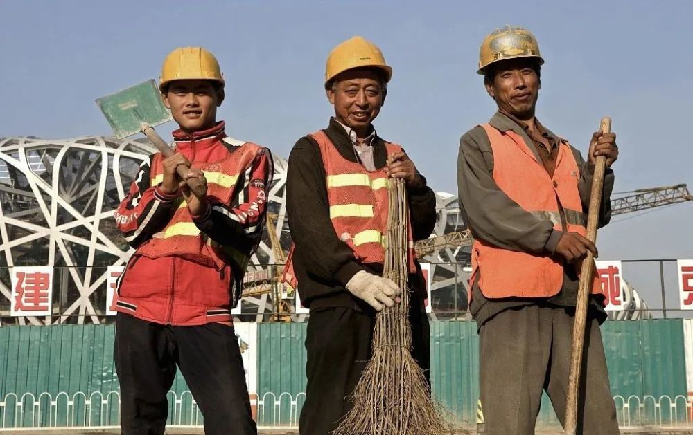

# 年轻人不愿盖房子：“谈对象都可能被歧视”

_来源：视觉中国_

作者 | 陈弗也

编辑 | 杨布丁

出品 | 棱镜·腾讯小满工作室

作为一个容易被忽视的群体，在今年的两会期间，“建筑工人”又被多次提及。

其中一位关注该群体的是谭双剑，他是全国人大代表，也是一位建筑工人，目前在北京建工三建公司机电安装分公司担任水电队队长一职。

“上一代农民工已经老去，这一代农民工也马上到了该退休的年纪，但是年轻一代没有接班，建筑工地上会逐渐出现断层。”谭双剑忧心忡忡地对媒体表示，他同时建议，政府出台相关政策，增加农民工待遇，提高工资水平，鼓励年轻人到建筑行业来。

在中国的城镇化过程中，建筑工人扮演着至关重要的角色，无论是摩天大楼，还是地面公路，都洒下过他们的汗水。

在这期间，中国的房地产行业突飞猛进，造就了众多亿万富翁、巨头企业。而作为这个行业的重要参与者，建筑工人的工作环境、社会地位却鲜有改善，他们也被视为农民工中最辛苦的一个群体。

很多人认为，作为蓝领工人代表的建筑工人工资会高一些，但是，从数据统计上，这个认识可能并不准确。

根据国家统计局发布的数据，2021年，在规模以上企业的就业人员中，建筑业就业人员的平均工资为68577元，只比“水利、环境和公共设施管理业”、“居民服务、修例和其他服务业”、“住宿和餐饮业”三个行业略高，低于制造业、批发和零售业等行业，与电力、软件等高薪行业更是不可同日而语。

当年轻人不愿再去工地，未来是否还有人盖房子？

**“谈对象都可能被歧视”**

经过一段尘土飞扬的土路后，就来到了佛山一个正在施工的建筑工地上，姜大哥正在这里涂墙、打腻子。作者见到他时正是去年夏季的一个午后，高温作业下的他汗流不止。

现年45岁的姜大哥，已经盖了23年的房子，黝黑的皮肤，孔武有力的臂膀，是行业和岁月留给他的印记。2000年，他离开家乡湖南跟着老乡们来到珠三角时，很多地方还是荒草一片，如今已是高楼林立。

广州是他打工的第一站，他在那里工作了6年，有时去广州坐火车，路过一些地方时，他还能认出来哪些房子是他盖的。

姜大哥当时的工地位于佛山市一个偏远的郊区，周边有个便利店，他经常会和工友们去那里买烟、买水，除此之外，连个像样的餐馆也没有，他们吃住都在工地上。

对于建筑工人们来说，这是自己生活工作的常态——他们要跟着项目走，项目到了哪里，他们就住在哪里，而这些项目往往都在一些交通并不便利的地方。相对来说，工厂里产业工人们的生活环境要好很多，他们可以长期在一个固定的地方生活、工作，周边也往往会有超市、餐馆、网吧、酒吧等生活、娱乐场所。

“做这一行，要耐得住寂寞，这是年轻人不愿意来干的一个主要原因。”姜大哥向作者表示，“年轻人如果说自己在工地上，谈对象时，可能都会被歧视。”

工作环境差、强度大、工种工序多、流动性强，是建筑行业的主要特征，在一些工地上，经常可以看到工人们光着膀子、顶着太阳、满身灰尘地施工。

有一些特殊的工种，还要承担一定的风险，比如在高空作业的“蜘蛛人”。
姜大哥所从事的涂墙、打腻子也存在一定的健康“危险”，很多时候，防护措施不到位，他就戴着一个医用口罩进去施工，几个小时下来，全身上下都是粉尘，他都不敢想象有多少被吸入到了肺部。

在23年的从业史上，姜大哥一直小心翼翼，但还是出过一次事故。

那是在惠州的一个项目上，他当时正坐在架子上对房顶进行涂抹，一不小心就摔了下来，胳膊和腿都有不同程度的骨折；更严重的是，脑部出现了淤血，恢复很长一段时间后，他才重新回到工地上。

**10年里，几乎没有年轻人来**

“身边的工友，很多都是我这个年龄的，最小的也有30大几了，年轻人都不愿意来。”姜大哥向作者感叹道。

回想23年前，姜大哥说，自己的文化程度不高，只有一身力气，没有什么技能，就跟着老乡来到了工地上。但现在年轻人的就业选择有很多，他们可以进工厂，也可以送外卖，无论做什么，看起来都要比建筑工人“体面”很多。

“我的小孩十七岁了，我不希望他来工地上扛活。”姜大哥说。

根据《中国劳动统计年鉴》（2020年），姜大哥这个年龄段的劳动者是建筑工人的主力军。该统计年鉴显示，2019年时，40岁以上的建筑业从业人数占行业总从业人数的55.8%，50岁以上的从业人数则占总人数的24%。

国家统计局发布的历年《农民工监测调查报告》则显示，在农民工当中，建筑工人的比例呈现下降趋势，第三产业的农民工比例则在上升。

2014年，在农民工当中，建筑工人的比例是22.3%，到了2021年这个数字变成19%；2014年，从事第三产业的农民工占比42.9%，2021年变成了50.9%。在年龄上，2014年时，农民工的平均年龄是38.6岁，2021年则是41.7岁，农民工群体正在“老龄化”。

“老龄化”这个问题在建筑工人群体中更为明显。2020年6月，一组关于建筑工人平均年龄的数据被多家媒体引用，这组数据显示，从2007年到2017年，建筑业一线工人平均年龄10年间增加了10岁。

这也意味着，在那10年，建业工人这个群体几乎没有吸引到年轻人进来。

去年3月，上海、天津、广东、江苏等多地发布建筑行业“清退令”：18周岁以下、60周岁以上男性以及50周岁以上女性，禁止进入施工现场从事建筑施工作业。这意味着，不少60后男性和70后女性将陆续告别自己熟悉的工地。

佛山一家建筑公司的负责人向作者表示，事实上，在建筑行业中，有不少工种要求从业者的年龄不能超过55岁，而在工地上，一个工人一般要做多个工种的活，按照要求，这些人55岁之后，能干的活就不多了。

“70后还是工地上的主力，再过10年，最后一批70后55岁了，工地上就很难招到人了。”这位负责人说。

45岁的姜大哥正处于“当打之年”，他有经验，有手艺，更重要的是有家庭，迫于生计，他也不会轻易从工地上离开。

不过，他感觉身体只能允许他再干10年，常年在工地上干体力活，他的身体早就吃不消，他和身边不少工友都备受肩周炎、腰椎间盘突出的困扰，肺部、呼吸道更是不敢去检查，可以想象，一查就都是毛病。

**建筑工人代表为群体发声**

在23年的“盖房子”生涯中，姜大哥经历了建筑行业的跌宕起伏，早些年，他们盖的厂房多，房地产火起来后，就主要在盖楼房。

与早些年的工作环境相比，姜大哥感觉最大变化是，不怕被拖欠工资了。他们在找工地、项目时，敢于做更多的选择，谁给的钱多，工作有保障，就跟着谁干。这几年，他也做过很多开发商的项目，恒大、万科、碧桂园、龙湖等，谁的工资高，谁的要求严格，他都很清楚。

而在刚出来的那几年，他和工友们根本不敢到处跑，只会跟着自己信任的老板、老乡去干，如果遇到一些无良包工头，就很有可能白干，拿不到工资。

如今，对于建筑工人们来说，要保障他们的合法权益，早已不是帮他们讨要工资的最初阶段了。

“工作没有高低贵贱之分，但是，社会上还是普遍认为建筑工人是社会地位相对较低的一个工种，这也是很多年轻人不愿意来干的一个重要原因。”上述建筑公司的负责人向作者表示，在他看来，应该提高建筑工人的社会地位。

据该负责人介绍，现在生活条件好了，家长们也不会像以前那样将孩子丢在工地上吃苦，他们会让孩子学点手艺，掌握一门技术，从事更有技术含量的工作。

提高农民工的社会地位，给予他们足够的尊重，这也是人大代表谭双剑两会建言的重要内容。

他提到，农民工是城市的无名建设者，应该多讲农民工的故事，增加人们对农民工的认可。此外，还要成立相关部门或社会化组织，为农民工上城市社保，既可以保障农民工就业的灵活性，也可以解决他们在城市里就医报销等难题。

与早些年相比，今天的建筑工地上也发生了翻天覆地的变化，建筑机器人开始被应用，对工人的技能要求更高，一个人干几个工种的现象正在减少。对于建筑工人们来说，这既是挑战，也是机会。

殷翠平是另外一位关注建筑工人的全国人大代表，他也是一位建筑工人，目前担任湖南东方红建设集团有限公司吊装事业部部长。

今年两会期间，他就建议，要建立健全新型建筑工人技能考评及社会保障体系，针对新型建筑产业工人队伍建设出台相关政策，建立工种认定体系，完善教育培训、考核发证、上岗就业、技能等级考评管理等相关实施细则。

同样来自基层建筑工人群体的邹彬是一位95后全国人大代表，他今年的两会建议是“进一步服务产业工人转型、弘扬工匠精神、推动质量强国建设”。

他在接受媒体采访时表示，他想通过职业教育、再培训，提高产业工人的技能，从而减少工友的流动性，提高收入的稳定性。同时，通过产业工人转型，促进更标准化的施工流程，建造出更高质量的产品。

谭双剑、殷翠平、邹彬都是建筑工人的“技术高手”，比如，邹彬曾获得世界技能大赛中国区砌筑项目冠军、“百优工匠”竞赛砌筑工冠军等荣誉；殷翠平则获得过“全国技术能手”等荣誉。

**腾讯新闻出品内容，未经授权，不得复制和转载，否则将追究法律责任。**

