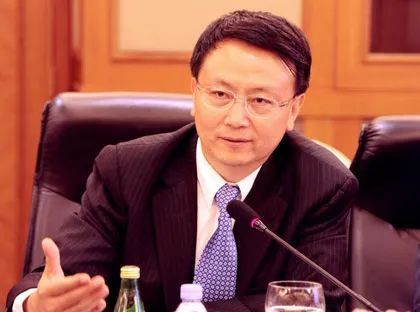

# 政协委员建议：大幅裁减非必要事业单位和人员，如各类协会、学会

深化党和国家机构改革，是贯彻落实党的二十大精神的重要举措，是推进国家治理体系和治理能力现代化的集中部署。

根据中国人大网3月5日公布的《第十四届全国人民代表大会第一次会议日程》，第十四届全国人民代表大会第一次会议日程安排中，关于国务院机构改革方案的几个关键时间节点已经明确。

3月7日，据北京大学中外人文交流研究基地官微，第十四届政协委员，北京大学国际关系学院教授、中外人文交流研究基地主任贾庆国发表了
**《关于配合党和国家机构改革、实行精兵简政的建议》** ，向全国政协提交该提案。贾庆国发文称， **建议大幅裁减非必要事业单位和人员，**
如各类行业协会、学会和协会。 **在减少不必要政府职能的基础上，裁减相应机构和人员，**
如原来管理计划生育的部分机构和人员。3月7日，相关词条登上微博热搜第一。

**贾庆国：建议适度提高公务员工资**

**裁减非必要事业单位和人员**

据北京大学中外人文交流研究基地官微，第十四届政协委员贾庆国发文称，中国共产党第二十届中央委员会第二次全体会议审议通过了在广泛征求意见的基础上提出的《党和国家机构改革方案》，这是新时期改进党和国家治理能力和提高治理水平的重要举措，是完全必要的，具有重大和深远的历史意义。据报道，
**这次改革的目标是让党和国家的领导“在机构设置上更加科学、在职能配置上更加优化、在体制机制上更加完善、在运行管理上更加高效。**
”贾庆国认为，这次机构改革要产生期待的效果，需要做各方面的努力。其中一个方面就是精兵简政。

贾庆国为此建议：

**·调整政府与市场和社会的关系。**
让市场在资源配置过程中发挥更大的作用，让社会承担自己可以承担的管理职能，如各类学会、行会和协会。在此基础上，减少不必要的政府职能。

**·在减少不必要政府职能的基础上，裁减相应的机构和人员。** 如原来管理计划生育的部分机构和人员。同时，大幅减少借调工作人员和辅助管理人员。

**· 大幅裁减非必要的事业单位。**
如裁减各类官办的学会和协会，精简相关工作人员，让民间社会组织发挥其应有的作用。国家可依法依规设立相应基金，支持这些民间社会组织的发展。

**·定期评估党政部门各种机构的工作，清理已经完成历史使命的机构和重新分配这些机构的工作人员去充实现有和因工作需要新设立的机构。**

**·在裁减机构和人员的基础上适度提高公务员的工资。**

**·政府有关部门定期公布财政供养人员情况，便于分析研究和优化管理。**

_贾庆国。图片来源：北京大学官网_

**财政部部长刘昆：政府过紧日子**

**换老百姓过好日子**

据红星新闻此前报道，3月1日，国务院新闻办公室举行“权威部门话开局”系列主题新闻发布会的第5场发布会，介绍财政贯彻落实党的二十大重大决策部署的情况。

会上，财政部部长刘昆介绍，近年来，各级财政部门始终把艰苦奋斗、勤俭节约作为财政工作指导方针。坚持党政机关过紧日子不动摇，“紧”是通过提高资金的有效性来实现的。以中央为例，中央部门带头严格支出管理，一般性支出连续四年压减，2022年，中央部门支出预算安排下降了2.1%。实际执行中下降了3.5%，把钱花在刀刃上，重点支出的保障反而是强化了。

刘昆说表示，
**政府过紧日子不是短期应对措施，而是应该长期坚持的方针政策，要压减开支，腾出更多财政资源，支持地方保基本民生、保市场主体，以政府过紧日子，换老百姓过好日子。**

刘昆表示，在财政的实践上，行政性费用、“三公”经费增加了，用于民生保障的支出就减少了。中央本级的经费增加了，用于对地方的转移支付资金就少了。所以说，在这方面“作文章”，保障了疫情三年来全国财政收支的平衡，把钱用在刀刃上，花出效果来，总体情况是好的。全国的财政保障情况并没有受到一些地方收入下降的影响。财政部门将继续严格落实过紧日子的要求，当好“铁公鸡”、打好“铁算盘”，把每一分钱都用在刀刃上、紧要处。

刘昆指出，一是编紧预算，二是硬化执行，三是盘活存量，四是做好常态评估。具体来说，将从严从紧编制预算，削减和取消低效无效支出，集中财力保障国家的重大战略任务。将把牢预算支出关口，从严控制部门预算追加调剂事项，除应急救灾等特殊事项外，原则上不出台新的增支政策。严禁超预算、超标准安排支出。将及时清理收回结余资金，不让资金趴在账上睡觉。对结转资金较多的项目相应减少预算安排。财政部将按季评估中央部门落实过紧日子要求的情况，强化评估结果应用。督促地方积极推进过紧日子评估体系建设，努力降低行政运行成本。

**事关国务院机构改革**

**全国两会日程安排关键时间点明确**

根据新华网此前刊文介绍，这次党和国家机构改革突出重点行业和领域， **针对性比较强，力度比较大，涉及面比较广，触及的利益比较深，**
着力解决一些事关重大、社会关注的难点问题， **对经济社会发展将产生重要影响。**

据澎湃新闻报道，根据中国人大网3月5日公布的《第十四届全国人民代表大会第一次会议日程》， **3月7日**
(星期二)下午3时，代表大会举行第二次全体会议。会议内容包括了听取国务委员兼国务院秘书长肖捷关于国务院机构改革方案的说明。

**3月8日**
(星期三)下午3时，代表小组会议审议关于修改立法法的决定草案、国务院机构改革方案、第十四届全国人大一次会议选举和决定任命的办法草案，推选监票人。

**3月9日** (星期四)下午3时，代表团全体会议审议关于国务院机构改革方案的决定草案。

**3月10日** (星期五)上午9时，代表大会第三次全体会议，会议内容的第一项是表决关于国务院机构改革方案的决定草案。

国务院机构改革之后的各部部长人选，将于 **3月11日** 下午3时经过代表团全体会议酝酿， **3月12** 日上午9时代表大会第五次全体会议决定。

**编辑|** 王月龙 杜恒峰

**校对|** 卢祥勇

