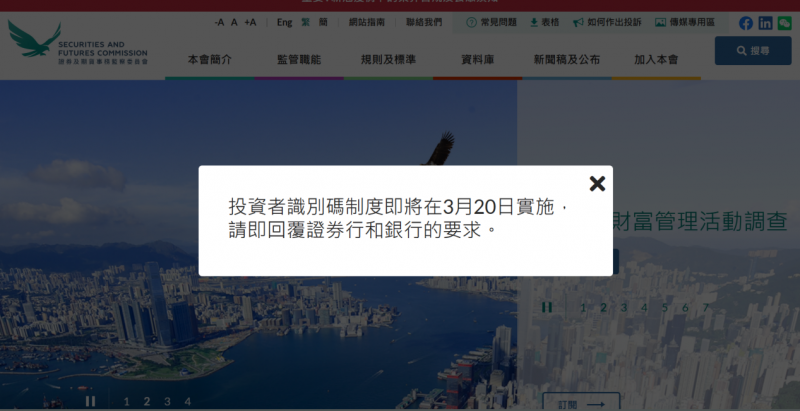

# 港股实名制来了！3月20日正式实施，未登记投资者“许卖不许买”

划重点

  * _1_ 据悉，个人投资者未回复开户券商同意其转交个人身份信息的要求，便只可出售他们目前持有的股票，而不得买入股票。
  * _2_ 在香港投资者识别码制度下，证券公司必须为每一位客户编配唯一的券商客户编码，以向联交所提交配对档案。
  * _3_ 港股实名制短期可能会对开户数量有影响，但从长远来看，实名制势必会加强投资者对自身证券账户的监管和安全保障。

3月2日，香港证券及期货事务监察委员会（下称“香港证监会”）对外公告表示，香港投资者识别码制度即将于2023年3月20日推出。值得注意的是，若投资者还未回复开户券商同意其转交个人身份信息的要求，后续将只能卖出股票不能买入股票。

中泰资本董事王冬伟在接受《华夏时报》记者采访时表示：“香港证监会推出投资者识别码制度是为了加强投资者保护和防范洗钱等违法犯罪行为。港股实名制（即香港投资者识别码制度）能够有效地遏制匿名交易，减少非法资金流入，保护市场的公正和透明。此外，实名制也有助于提高市场监管的效力，方便证券交易所和监管部门对市场的监管和调查。”

对于港股实名制实施所带来的影响，科方得投资执行总裁张晓兵在接受《华夏时报》记者采访时指出，港股实名制短期可能会对开户数量有影响，但从长远来看，实名制势必会加强投资者对自身证券账户的监管和安全保障，提高市场透明度和交易规范性，助力香港证券市场持续稳定和健康发展。

**未登记投资者“许卖不许买”**

3月6日，《华夏时报》记者登陆香港证监会官网，打开官网链接的第一时间便跳出弹窗提醒：“投资者识别码制度即将在3月20日实施，请即回复证券行和银行的要求。”

据悉，个人投资者未回复开户券商同意其转交个人身份信息的要求，便只可出售他们目前持有的股票，而不得买入股票。

根据香港投资者识别码制度及香港的资料私隐法例（包括《个人资料（私隐）条例》），中介人须向个人客户取得明示同意，以便向香港证监会及香港联合交易所有限公司（香港联交所）提交相关的客户身份信息。有关信息会以加密方式储存在数据资料库内，而只有证监会及联交所的获授权人员方可查取。

香港证监会方面表示，中介人普遍已就取得上述同意及更新客户身份信息，向客户提出了要求。

据悉，证监会于2021年8月就有关在交易层面上对香港证券市场实施投资者识别码制度的建议，以及为在香港联交所上市的股份引入场外证券交易汇报制度的建议，发表了咨询总结。

在香港投资者识别码制度下，证券公司必须为每一位客户编配唯一的券商客户编码，并与客户的识别信息配对，包括身份证明文件上的全名，签发国家/地区或司法管辖区，类别及号码，以向联交所提交配对档案。

香港证监会行政总裁梁凤仪女士表示：“推出投资者识别码制度符合国际做法。各监管机构将能够实时掌握证券买卖指令的投资者身份信息。毫无疑问，这将大大增强我们的市场监察能力，促进市场廉洁稳健，并提升投资者信心。”

香港证监会行政总裁欧达礼此前表示：“推出投资者识别码制度将会是香港证券市场的一个重要里程碑。该制度让我们能够适时和有效地进行监察，从而促进市场廉洁稳健和提升投资者信心，这些都是香港作为世界级国际金融中心的重要支柱。”

张晓兵向本报记者表示，推行港股实名制能够促进香港证券市场健康发展，提高市场稳定性和透明度，对于加强证券市场投资者信心、增加市场交易活力起到了积极作用。

**带来哪些影响？**

据悉，2021年8月就建议实施香港投资者标识符制度发表咨询总结文件后，香港证监会通过进行三次问卷调查，一直密切监察市场的准备情况。

调查结果显示，为实施该制度所做的准备取得重大进展，但部分中介人可能需要更多时间向个人客户就在香港投资者标识符制度下收集、储存、处理和使用个人资料取得所需同意，以及更新客户的识别数据。基于上述情况，香港证监会决定于2023年3月20日推出香港投资者标识符制度。

张晓兵告诉本报记者，根据了解和相关分析，推行港股实名制的原因主要是为了打击洗钱、不正当融资等不法行为，可以进一步加强对香港金融资本市场投资者的保护和市场稳定。实名制能够让证券交易行为更加透明、规范，避免因匿名或虚假交易而导致的影响金融市场秩序。

那么，港股实名制实施后将对市场、投资者、券商分别带来哪些影响？

王冬伟指出，对于香港市场而言，实名制的推行将对投资者、券商和市场产生影响。首先，对于投资者而言，需要配合提供个人身份信息，以获得投资者识别码，这有利于证券公司对客户身份进行核实，并加强风险管理。其次，对于券商而言，需要加强对客户身份和资料的审核，确保实名制能够得以有效落实。最后，对于市场而言，实名制有望提高市场的透明度和公正性，加大市场监管和执法力度，为香港证券市场的长期发展提供有力支持。

张晓兵认为，港股实名制短期可能会对开户数量有影响，因为实名制要求投资者提供更多的个人身份信息，可能会影响部分散户投资者的交易行为和决策。但从长远来看，实名制势必会加强投资者对自身证券账户的监管和安全保障，提醒投资者注意个人信息的保护。

“另外，实名制能够提高市场透明度和交易规范性，让更多合格的，活跃的，真实交易行为的投资者入场，提升交易效率，让资金充分流动，助力香港证券市场持续稳定和健康发展。”张晓兵进一步指出。

责任编辑：徐芸茜 主编：公培佳

