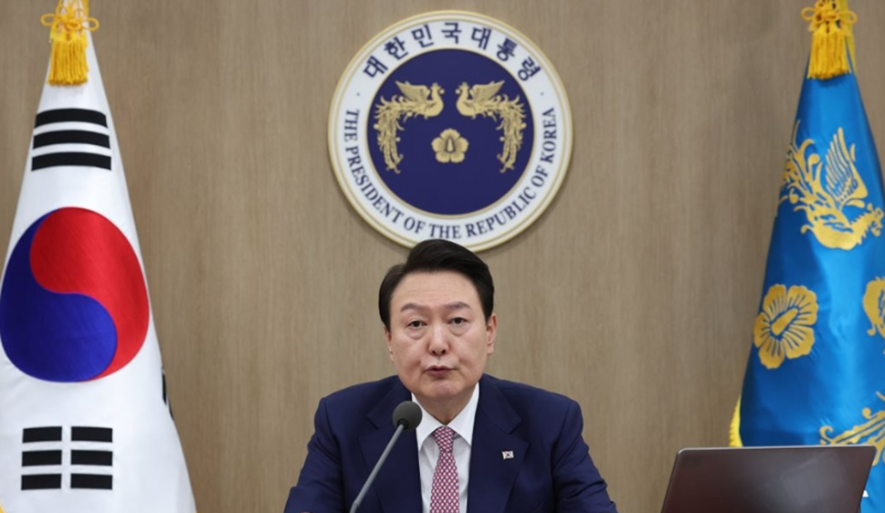

# 韩国公布对日本二战强征劳工受害者赔偿方案引不满，尹锡悦最新表态

【环球网报道】韩国政府6日公布针对日本二战时期强征劳工受害者赔偿问题的解决方案。据韩联社最新报道，韩国总统尹锡悦7日称，该方案是韩国政府在尊重受害者立场的基础上寻求符合韩日两国共同利益和未来发展方向的方案的结果。

_尹锡悦3月7日在国务会议上讲话的画面。图自韩媒_

报道称，尹锡悦当天在首尔龙山总统府主持国务会议时发表了上述言论。他称，韩日“面向未来”的合作将有利于维护韩日两国乃至全世界的自由、和平与繁荣。他还要求各个国务委员致力于建立韩日政府各部门之间的合作机制，并制定两国财经界、新一代之间的交流合作方案。

据媒体此前报道，韩国政府6日宣布针对日本二战时期强征劳工受害者赔偿问题的解决方案，决定由韩国行政安全部下属财团筹措资金，替被告日本企业代付赔偿金。尹锡悦的发言人称，尹锡悦6日表示，公布上述方案表明了韩国政府有与日本发展“面向未来关系”的决心。日本首相岸田文雄当天表示，他欢迎这一方案，并将与尹锡悦密切合作。日本外务大臣林芳正称，根据该方案，预计日本企业不需要支付任何款项，但如果它们愿意捐款，日本政府也不会阻止。

值得一提的是，上述方案一经发布即遭到韩国最大在野党和多个市民团体的批评和反对。韩国最大在野党共同民主党党首李在明6日表示，这一方案是对强征劳工受害者的“二次加害”，是“与大法院判决背道而驰的暴行”，更是“韩国外交史上的耻辱和污点”。韩国多个市民团体当天在首尔外交部大楼前举行紧急记者会，称该赔偿方案“屈辱”“卖国”，是“给战犯企业免罪符”，表示不接受第三方代付赔偿金，敦促政府撤回该方案。

日本1910年至1945年殖民统治朝鲜半岛期间强征了大批劳工到日本做苦力。长期以来，韩国受害劳工及遗属多次发起诉讼向日方索赔，但日本政府和相关企业一直以两国1965年签订《韩日请求权协定》“已解决”索赔问题为由拒绝赔偿。韩国大法院2018年就三起索赔诉讼做出终审判决，认定《韩日请求权协定》不妨碍强征劳工受害者起诉企业，判令涉事日企赔偿原告。

