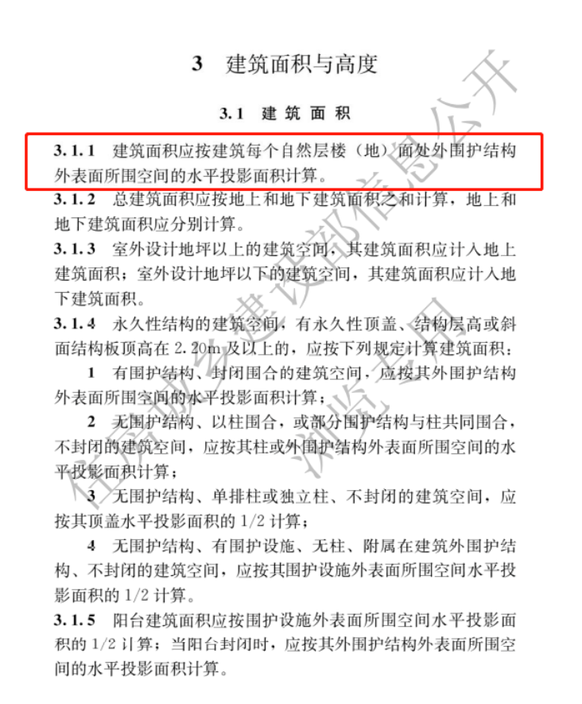
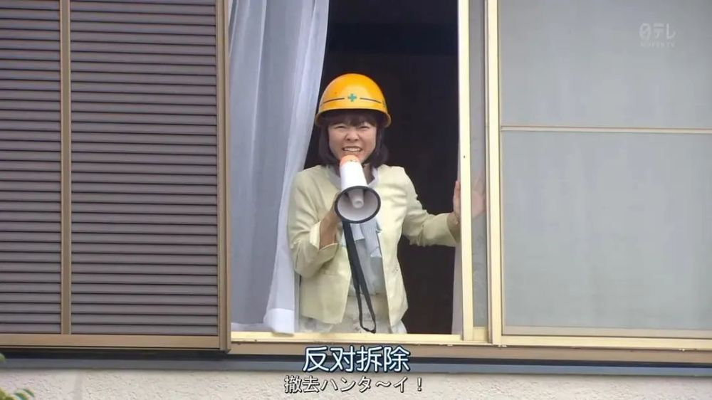

# 500万的房子，外墙就值50万？民间呼吁“取消公摊”声音已久

**开发商的不透明操作，让人们对公摊面积的痛恨程度日益高涨。“取消公摊”，几乎成了民间共识。但为什么直到今天，我们还在为公摊面积忧心？**

最近，有关#外墙面层均计入建筑面积#的话题在社交平台上被广泛讨论。

起因是3月1日起实行的新规——《民用建筑通用规范》。新规3.1.1条明确规定：“建筑面积应按建筑每个自然层楼（地）面处外围护结构外表面所围空间的水平投影面积计算。”

这句拗口的专业表述给了舆论以广泛的揣测空间。有分析指出，以前外墙水平投影面积不被算入建筑面积，以后则将算入，因而会大大增加公摊面积。

_去年，青岛一市民购房后发现，110平米的房子，公摊面积占到近一半。/中新经纬微博截图片_

由于公摊比例的不透明性，民间呼吁“取消公摊”的声音已久。连公摊的“鼻祖”中国香港，都于2013年取消了公摊面积。重庆也早在2002年就试点取消了公摊。

如今已经是2023年，为何取消公摊一事不仅没有进展，反而还往回走了呢？

有专家给出了相对积极的解读。据红星新闻报道，广东省城规院住房政策研究中心首席研究员李宇嘉就表示：“从建筑全生命周期管理角度来说，如果外墙计入房屋面积的话，对这部分的投入就会增加，有利于提升房屋的生命质量。”

此言一出，舆论哗然。网友对此相当不忿：

“房屋的生命质量？原来，割韭菜是可以上升到用生命和伦理哲学高度的。”

“质量安全不是开发商应该做到的吗？消费者自有评判和分辨，如果质量不好，白送都不要。”

**公摊面积不仅没取消，反而还扩大了？**

仔细对比新旧规定之后不难发现，在此之前，有关部门就已经把外墙面积算进了建筑面积里。

2013年12月，住建部发布了《建筑工程建筑面积计算规范》，其中明确定义：建筑物的建筑面积应按自然层外墙结构外围水平面积之和计算。注意关键词——“外墙结构外围水平面积之和”。

不过，这项《规范》也明确指出了不计入建筑面积的项目：包括勒脚、附墙柱、垛、台阶、墙面抹灰、装饰面、镶贴块料面层、装饰性幕墙等。

今年的新规从“外墙结构外围水平面积之和”改为了“外围护结构外表面所围空间的水平投影面积”，进一步划重点，也就是“结构外围”改为了“结构外表面”。这个改动意味着，原来不计入建筑面积的项目，现在都需要计入建筑面积。

而建筑面积由使用面积和公摊面积组成，外墙结构外表面显然是用不上的面积，自然要算到公摊里了。这也是舆论将新规解读为扩大公摊的原因所在。

很多人开始关心，这项新规实施之后，公摊面积能增加多少呢？这可能取决于外墙表面的材料厚度。别小看这层材料，它不是刷层漆这么简单。

据第一财经报道，有建筑设计从业者测算，一般来说，真石漆墙面厚度在18-20毫米，一个总建筑面积为10万平方米的刚需小区，建筑面积大约增加500平方米，假设有1000户，则每户多出0.5平方米。

而如果是幕墙外立面，厚度在200毫米左右，同样是10万平方米小区，建筑面积大约增加3000平方米，假设该楼盘为豪宅小区，户均面积较大，总计有500户，则每户多测算出6平方米。

_《香港爱情故事》剧照_

不过近日，住建部对媒体回应，《民用建筑通用规范》会增加公摊面积的说法是误读。

目前这项新规主要是针对建筑设计和工程的标准化规定，购房人买房时，房产证上的公摊面积则要由房产测绘部门出具测绘报告进行衡量。测绘报告的出具，则要根据各地发布的《房产面积测算规范》进行。

目前来看，各地的《房产面积测算规范》略有不同，主要是镶贴块料面层、装饰性的幕墙、垛、勒脚等是否计入建筑面积的区别。

也就是说，3月1日《民用建筑通用规范》的发布不会影响到公摊面积的增减，除非《房产面积测算规范》发生调整，后者才是关键。

**既然叫“公摊”，至少要公开透明**

公摊面积的概念最早出现在香港，历史并不长。

20世纪50年代，中国香港的房屋以整栋销售为主，这种方式简单直接，但价格也高，因此成交量低。随后，香港便出现了按户出售的售卖模式。但问题马上出现，楼梯、走廊等公共空间的建设成本由谁来承担呢？

位于香港尖沙咀的香槟大厦第一个提出了公摊的方式，这样既可以显得房屋面积大，又降低了每平米的单价，从而解决了这个问题。此后，更多房产商开始使用这种方式。

_发明公摊的香港，如今已经取消了这项制度。/土卫六摄_

与香港毗邻的深圳，也将公摊引进到当地的房产销售中。此后，这种模式从深圳辐射到全国其它地区，成为了中国房屋面积计算的主要模式。

但物极必反，各地开始出现开发商以公摊侵害购房者利益的事件。

2006年，长江实业开发的项目“元朗四季豪园”开售。交房后业主发现，原本300多平方米的洋房，实用面积只有不到90平方米，实际得房率仅为29%，而整个项目的得房率最高也只有42%。

类似的事件屡见报端，前文提及的青岛楼盘也是如此。

花园有多大、走廊有多宽，购房者尚且可以主观感受到，但墙有多厚，就很难感受到了。如果将来修改《房产面积测算规范》，也将“结构外表面”算进公摊，开发商能搞的小动作可以更多，比如外墙用很厚的砖，用来防止雨水反溅的勒脚也可以更宽……

开发商的不透明操作，让人们对公摊面积的痛恨程度日益高涨。“取消公摊”，几乎成了民间共识。

_《买房子的女人》剧照_

早在2011年两会期间，就有全国人大代表建议取消商品房预售制和公摊面积，与国际接轨。2021年两会期间，全国政协委员周世虹提交了一份“取消公摊面积”的提案；2022年，全国政协委员洪洋也提案建议取消商品房公摊面积。

“发明”公摊的香港，在2013年取消公摊后甚至明文规定，新房销售必须按照实用面积标注，否则将被罚款100万至500万港币、判处3至7年监禁。针对存量房售卖，政府要求卖家提供以“套内面积”和“建筑面积”计价的双份资料。

有专家说，公摊面积较小、实用率较高，并不意味着居住就舒适，电梯间、楼梯间或走廊太小，一梯多户、没有避难层等设计，尽管缩小了公摊面积，但居住者的舒适度、安全感也降低了。

_公摊=公共空间？这样的等号不负责任_

但公摊面积不应该与公共空间面积划等号。大多数国家都没有公摊面积这个概念，难道国外住宅中就不存在公共空间了吗？

本质上说，人们呼吁取消公摊，一方面是希望房价的计算能透明一些，另一方面则是因为这部分面积还会影响其他费用的计算，比如物业费、北方的供暖费，这些费用的收取都要按照房屋面积来计算。

诚然，公摊面积的取消，短期内难以实现，但既然具有一定的公共属性，那么它的范围、面积都应该明确公开，这样，公共空间能发挥该有的作用，实用面积也能得到保障。

**作者| 土卫六**

**编辑| 晏 非**

**校对| 杨 潮**

**排版| 韩博菲**

