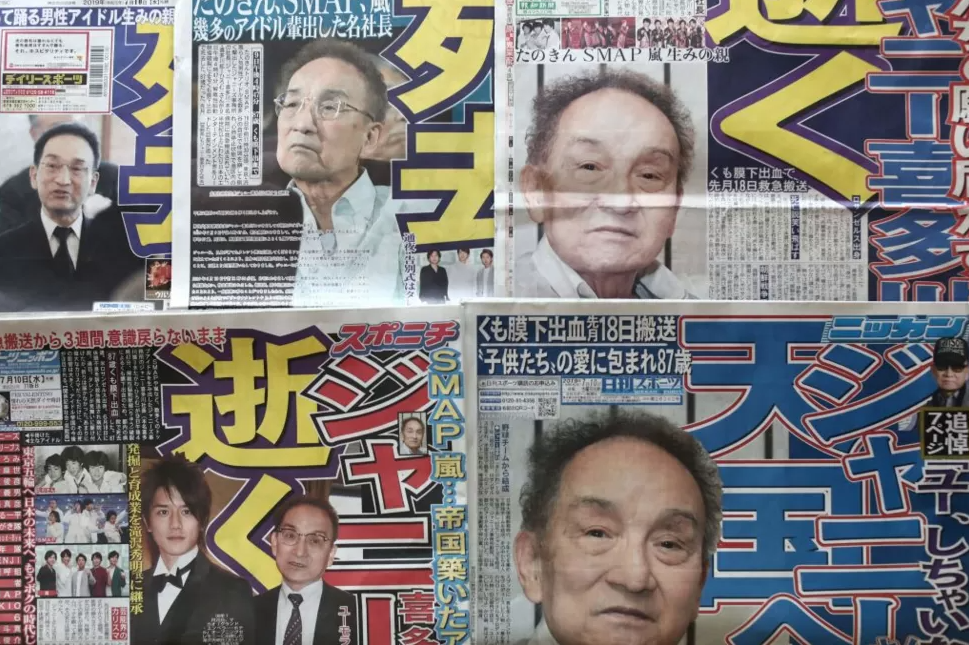

# BBC纪录片曝日本偶像教父喜多川丑闻：长期性侵公司旗下男生

（观察者网讯）当地时间3月6日，英媒BBC刊文预告纪录片《掠食者：日本流行音乐的秘密丑闻》，揭露了已故日本偶像教父、日本男性艺人经纪公司杰尼斯事务所前社长喜多川的“黑暗秘密”。数十年来，喜多川不断对其公司旗下的十几岁男生进行性虐待、性剥削。

早在1999年，日媒《周刊文春》就报道过喜多川的性侵丑闻，日本法院也曾裁定对喜多川的性侵指控成立。然而这些报道没能引起日本公众注意，绝大多数日媒依赖杰尼斯事务所的强大影响力，选择对此事视而不见。直至2019年喜多川离世，绝大部分日本人还把他视为英雄哀悼。

_BBC报道截图_

喜多川堪称日本流行偶像文化的缔造者，他创办的男性艺人经纪公司杰尼斯事务所过去几十年推出了多个人气火爆的偶像组合，比如SMAP、岚、NEWS等，日本国民偶像木村拓哉也是该公司的艺人。

喜多川2019年去世，受到日本全国上下的悼念。杰尼斯事务所当时在东京巨蛋举行了喜多川的告别仪式，众多日本名流偶像到场吊唁，时任日本首相安倍晋三也发来唁电。东京街头的一位年轻人如此评价喜多川：“他就是上帝”。

然而，这样一位日本国宝级的“偶像教父”，却被曝出惊天丑闻——他过去数十年里不断强奸杰尼斯公司旗下的未成年男生。

_喜多川去世时，日媒铺天盖地的报道_

在纪录片《掠食者：日本流行音乐的秘密丑闻》中，几位指控喜多川性侵或性骚扰的“受害者”讲述了自己的经历。

Hayashi(化名)向杰尼斯事务所投递简历时年仅15岁，他试镜时第一次见到喜多川，他对喜多川的第一印象是“善良、体贴”。但这个美好印象很快破灭了，试镜结束一周后，喜多川邀请Hayashi来到他的一处住所，很多男生都曾在那里过夜，被称为“宿舍”。

“喜多川对我说‘去洗个澡吧’，他洗了我的全身，就像我是一个洋娃娃一样。”Hayashi说道，他当时被吓坏了，喜多川当晚对他实施性侵。

Hayashi表示，杰尼斯内部的很多男生很明显都知道喜多川的行径，“他们都告诉我，‘你必须忍受，否则你不会成功。’我周围没有人退出（公司），喜多川是这个大家庭里的唯一的成年人。”

_图自纪录片《掠食者：日本流行音乐的秘密丑闻》_

另一位杰尼斯艺人Ryu也表示喜多川曾对他性骚扰，但被他拒绝了。

“当时我走进卧室，喜多川也跟进来了，他好像说了‘你太忙了，我给你按摩。’之类的话。他从我的肩膀开始，逐渐往下。我觉得有些过分了，说道‘不要再按了。’他说，‘对不起，对不起。’然后就去了另一个房间。”

Ryu称他2002年加入杰尼斯公司，担任了10年伴舞。遭遇性骚扰时，Ryu16岁，而喜多川当时已经70多岁了。

不过，Ryu拒绝就此事谴责喜多川，“我并不讨厌他，我爱他，他是一个很棒的人，我欠他很多。这件事对我来说不是什么大问题，所以我现在可以微笑着谈论它。”

和Ryu一样，杰尼斯的另一位前艺人Ren也对喜多川充满感激之情，哪怕他知道喜多川的性侵行径。

Ren表示，这实际上是喜多川和一些有野心的年轻偶像之间的一场交易，“有传言说，如果（性侵）发生了，你就会成功。”

当被问及会不会答应喜多川的性要求以换取事业成功时，Ren回答道，“我的梦想是成名，所以我想我会接受。”

_自称被喜多川性骚扰的Ryu
图自BBC_

1999年，日媒《周刊文春》的两位记者报道了喜多川的性侵丑闻，他们采访到了一位被喜多川性虐待的十几岁男生。这名男生向记者介绍了10多名有相同遭遇的男生，他们中有人被性侵时年仅12岁。

这些曾立志成为偶像的男生给出的证词十分具体，他们提到了喜多川强迫发生的“侵入性性行为”，还有人表示性侵就发生在自己家中，当时他的父母就睡在隔壁。记者甚至能根据他们的证词画出喜多川那处被称为“宿舍”的住所的地图，绝大多数的性侵事件在那儿发生。

然而，这些爆炸性的证词和一系列的调查报道却没能引起日本公众注意，因为日本媒体依赖喜多川的“偶像帝国”。

BBC称，杰尼斯事务所旗下的艺人能为媒体吸引观众、读者，带来广告收入，如果有媒体报道关于该公司的负面事件，就会被杰尼斯事务所封杀。因此，大多数日本媒体选择对喜多川的恶劣行径视而不见。

喜多川的性侵丑闻被报道后，杰尼斯事务所拒绝回应，并在一年后以诽谤罪起诉了《周刊文春》。

这场官司打了四年，日本东京高等法院最终裁定，《周刊文春》报道中对喜多川的10项指控有9项是事实，包括喜多川性侵未成年人的指控，只有喜多川向未成年人提供烟酒的指控不属实。

然而，日本媒体对这一判决结果保持沉默，喜多川始终没有被起诉，更遑论接受刑事审判。直至喜多川2019年以87岁高龄体面离世，绝大部分日本人还把他视为英雄哀悼。

_杰尼斯接待处挂着的喜多川的肖像艺术品_

“23年来，我一直对此感到绝望。”调查此事的记者之一中村龙太郎十分愤怒，他无法接受这件事就这样被“抹杀”。

中村还表示，日本社会存在的偏见也导致了喜多川性侵丑闻被掩盖。“在日本，人们似乎不相信男人之间的恋爱或性关系。”

BBC称，在日本的法律中，男性不能被认定为强奸案的受害者。在2017年以前，“强奸男生”在日本的法理中是不可能发生的。这些因素都促成了在日本社会中，对男人和男孩的性剥削不仅是禁忌，而且是被无视的。

对于喜多川的性侵丑闻，杰尼斯事务所现任社长、喜多川的侄女朱莉·藤岛(Julie
Fujishima)没有直接回应。她声称：“自我们的前社长于2019年去世以来，我们一直努力建立高度透明的组织结构，以适应时代、符合法律法规。我们计划在2023年宣布并实施新的结构和系统。”

BBC的这部纪录片《掠食者：日本流行音乐的秘密丑闻》于当地时间3月7日晚播出，目前只有《日刊现代》、“J-CAST”网站等少数日媒转发了相关报道，但并未过多评论。中村龙太郎表示，从现实角度来看，BBC的纪录片在日本不会被大规模报道。

**本文系观察者网独家稿件，未经授权，不得转载。**

