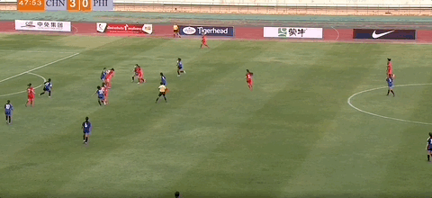

# U20女足亚洲杯预赛：中国6-0狂扫菲律宾 霍悦欣梅开二度

在北京时间3月8日晚结束的U20女足亚洲杯预选赛第1阶段首场小组赛中，中国U20女足6-0大胜菲律宾U20女足，取得开门红。上半场，霍悦欣梅开二度，邹梦瑶推射建功。下半场，卢家玉、欧阳玉环先后完成传射，乔睿琪主罚点球命中。

【关键焦点】

第9分钟，尹丽红分球，霍悦欣左路突入禁区小角度劲射破门，中国U20女足1-0菲律宾U20女足。

第22分钟，中国队左路下底传中，菲律宾防守球员解围失误，邹梦瑶轻松推射破门，中国U20女足2-0菲律宾U20女足！

第36分钟，欧阳玉环单刀突入禁区后无私横传，霍悦欣推射空门，上演梅开二度，中国U20女足3-0菲律宾U20女足！

第69分钟，替补登场的卢家玉接队友精准挑传，不停球左脚端射破门，中国U20女足4-0菲律宾U20女足！

第73分钟，卢家玉助攻欧阳玉环抽射破门，中国U20女足5-0菲律宾U20女足！

第80分钟，李淳英格突破造点，乔睿琪主罚命中。中国U20女足6-0菲律宾U20女足！

【精彩回放】

第2分钟，霍悦欣边路轻松突破，欧阳玉环面对空门绝佳良机，没有碰到皮球。

第12分钟，霍悦欣内切后尝试一脚射门，被门将没收。

第14分钟，欧阳玉环边路扣过防守队员后内切，想要打近角偏出。

第33分钟，尹丽红边路送出传中，太靠近门将被没收。

第48分钟，霍悦欣接到队友脚后跟妙传获得单刀良机，但遗憾被菲律宾门将拿到，随后主裁吹罚越位。

第64分钟，欧阳玉环边路传中，卢家玉门前抢点打高，边裁示意越位。

【出场阵容】

中国女足U20首发：1-刘晨、3-夏乐骄、5-汪思倩、6-乔睿琪、7-李淳英格、8-姜晨璟（46'18-张晨茜）、9-尹丽红（46'19-卢家玉）、10-邹梦瑶（77'20-何晶晶）、11-欧阳玉环（77'23-黄雪阳）、16-王爱芳、17-霍悦欣（84'13-吴烨嘉）

替补：2-曾雨佳、4-赵欣悦、12-梅璟艳、14-郭楠、15-余星悦、21-夏菲珥、22-郭欣煜

菲律宾女足U20首发：1-若塔、4-托伦蒂诺、6-萨宾娜-
拉莫斯、8-萨布里娜、9-查伊塞、14-马尔基、17-弗拉尼甘、18-萨尔瓦多尔、19-帕西翁、20-卢克班、21-玛尼迪

替补：2-比切罗、3-奥卡、5-亚历克、7-皮门特尔、10-霍金斯、11-迪宗、12-里塞尔、13-班宗、15-亚普、16-朱莉娅-
贝尼特斯、22-亚历克西斯-坦、23-莱哈延

