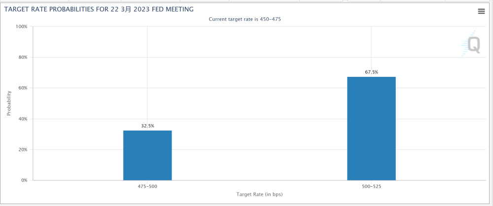

# “最鹰”鲍威尔：加息远未完成 逼迫市场重新调整预期｜潜望观察

划重点：

  * _1_ 鲍威尔在3月7日的听证会一开场便开门见山地直指要害，“如果全方面的数据反映更快的加息步伐是合适的，我们会准备加快提高利率的幅度。”
  * _2_ 对美联储这一轮加息周期的终端利率的预期，也从一周前的5.25-5.50%的区间，进一步上调至5.50-5.75%区间，并且将维持终端利率一直到今年年底。
  * _3_ 市场在整个2月份的回调，一定程度上是在修正年初的过于乐观的预期。

腾讯新闻《潜望》 纪振宇 3月7日发自硅谷

就在市场幻想着美国通胀已经得到抑制，美联储本轮加息周期行将终结之时，美联储主席鲍威尔突然给市场来了一个下马威。

在美国时间3月7日进行的参议院听证会上，鲍威尔表示，加息的任务还远未完成。（鲍威尔：美联储准备加快加息，利率最终水平可能高于之前预期）

美股市场应声下跌，截至当天收盘，美股三大股指均出现深跌。其中，标普500指数收跌62.05点，跌幅1.53%，报3986.37点；道指收跌574.98点，跌幅1.72%，报32856.46点；纳指收跌145.40点，跌幅1.25%，报11530.33点；纳斯达克100指数收跌1.22%，罗素2000小盘股指数跌1.1%。

“最近的经济数据比预期的更为强劲，这预示着终端利率可能要比之前预期的更高。”鲍威尔在3月7日的听证会一开场便开门见山地直指要害，“如果全方面的数据反映更快的加息步伐是合适的，我们会准备加快提高利率的幅度。”

2022年下半年起，为了尽快抑制高通胀水平，美联储开启了史上最快的加息节奏，连续四次加息75个基点，随着通胀见顶，去年12月，美联储将加息幅度放缓至50个基点，并在随后的货币政策会议上，进一步将加息幅度下调至25个基点。

在这一系列美联储政策趋势变化下，市场逐渐形成了通胀见顶、美联储加息周期即将终结的统一预期。在这一预期的推动下，美股在2023年1月份迎来了久违的“牛市行情”，压抑许久的市场情绪，被盲目的乐观幻想所释放。标普500指数单月涨幅超过8%，以科技成长股为主的纳斯达克指数更是涨幅高达16.6%。

但在进入2月份以来，市场开始出现明显“降温”，根本原因在于，一系列1月份经济数据的利好，令投资者开始担心美联储可能进一步加码收紧货币政策，市场在整个2月份的回调，一定程度上是在修正年初的过于乐观的预期。

具体来看，美联储最为关注的反映价格总水平的指标-
个人消费支出指数（PCE），在1月份同比上升5.4%，该指标的去除食品和能源价格的核心指数则同比上升4.7%，两项指标均小幅上升，出现“翘尾”，打破了之前持续下降的走势。

_美联储关心的PCE指数1月份出现意外反弹，加重通胀担忧_

与此同时，就业状况依然保持乐观。1月份美国失业率下降至53年来新低，服务业持续扩张业务，新增申领失业救济人数也在历史最低水平处徘徊。

这些指标令美联储担心，通胀会成为一个更为长期的艰巨挑战，因为就业强劲和工资上涨将会持续带来价格总水平上升的压力。

在上一次美联储货币政策会议后，鲍威尔曾被问及“价格/工资螺旋”的问题，他当时回答说，目前并没有观察到这样的现象发生，但如果观察到，一切就已经太晚了。

所谓“价格/工资螺旋”，指的是工资上涨会增加可支配收入，从而增加对商品的需求并导致价格上涨。价格上涨增加了对更高工资的需求，这导致更高的生产成本和进一步的价格上涨压力，从而形成“螺旋式”价格上升。

这也是美联储目前最为惧怕发生的一类情况，这将意味着通胀将成为美国经济更为棘手和长期的挑战。

事实上，美联储在货币政策的立场上，一直没有做出明显的改变。鲍威尔在此前的几次公开表态中，坚持表示“按数据说话”，即美联储的货币政策，是基于客观经济数据来实施和进行，并不断提醒市场不要过度幻想。美联储的“双重政策目标”：价格总水平稳定和就业最大化，也是任何货币政策实施的准绳。

然而市场在很多时候，并没有理会美联储的警告，依然陷于一厢情愿的幻想中，甚至在通胀出现反弹时，市场传出“美联储将通胀目标由2%调至4%”这样荒谬的传言。

以上这些都解释了鲍威尔为何在3月7日的参议院听证会上，突然换上一副非常“鹰派”的脸孔的原因。因为无论如何苦口婆心地劝说，市场一副不管不顾要上涨的样子，鲍威尔就只能用更直白的话来明确传达货币政策意图，希望市场能够重新调整预期。

3月7日鲍威尔的讲话，确实起到了重新调整市场预期的立竿见影的作用。美股三大股指在鲍威尔讲话开始后一路下跌。芝加哥商品交易所用于衡量市场对美联储加息预期的联储监测工具（Fed
Watch Tool）显示，最新的预计美联储在3月份货币政策会议上加息50个基点的概率，已经从一周前的不到30%，上调至高达67.5%。

对美联储这一轮加息周期的终端利率的预期，也从一周前的5.25-5.50%的区间，进一步上调至5.50-5.75%区间，并且将维持终端利率一直到今年年底。

但正如鲍威尔在当天的讲话中所强调，以及美联储事实上一直在强调的，美联储的货币政策走向，并不是“拍脑袋”的决定，而是根据经济数据的变化并结合美联储的长期政策目标来制定，鲍威尔当天的原话是“We
will continue to make our decisions meeting by
meeting”，意味着每一次的货币政策会议，要根据当时的经济状况来决定合适的货币政策松紧。

在鲍威尔完成为期两天的国会听证会后，美联储将在接下来直到3月21日货币政策会议之前保持静默，这也为最近动荡的美股市场提供了稍事喘息的机会。

