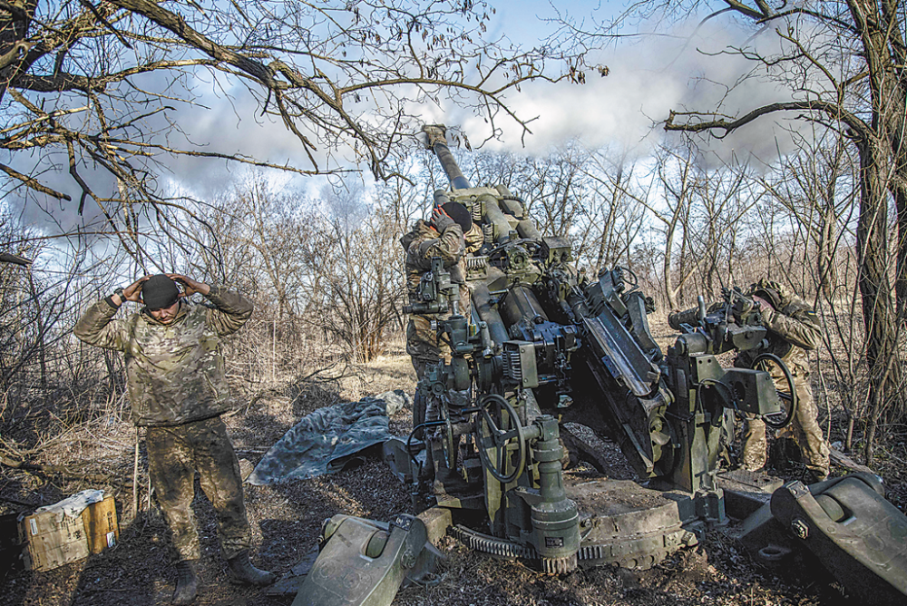

# 一方势在必得一方坚持死守！巴赫穆特牵动俄乌大战局

【环球时报驻俄罗斯特派记者 肖新新 环球时报特约记者 柳直
莫然】“控制巴赫穆特的任务仍在进行，该市是乌军在顿巴斯地区的重要防卫枢纽，控制它将帮助俄军继续深入乌军防线。”“我告诉总司令寻找合适的部队来帮助巴赫穆特的士兵。乌克兰没有任何一部分可以被抛弃。”面对已经持续数月的巴赫穆特之战，俄罗斯国防部长绍伊古和乌克兰总统泽连斯基分别在当地时间7日和6日的最新表态中表达了“势在必得”和“坚持死守”的决心。美国《国会山报》评论称，巴赫穆特已经变成废墟，但双方都不准备放弃，因为这场战役对双方的象征意义，远远超过战略价值。

**俄切断补给线，乌誓要“死守”**

据俄新社7日报道，绍伊古当天在同俄武装部队领导人员举行电话会议时表示，通过最近的进攻，俄军已在顿涅茨克和库皮扬斯克方向控制了5个城镇。绍伊古还表示，乌军部队人员损失增长显著，仅在2月份就比1月份增长40%，达1.1万多人。

塔斯社7日称，“顿涅茨克人民共和国”代理领导人普希林的助手加金当天表示，俄军及武器装备已在巴赫穆特城内，并已控制该市约一半的区域。乌军士兵正试图“成群结队地沿着乡间小路逃离”。

俄媒7日还引述俄“科尔萨”火箭炮营代号为“伊格纳特”的排长的话称，他们正切断从康斯坦丁诺夫卡方向到巴赫穆特的补给线，从而让乌军出现炮弹和人员短缺。他称，由于温度升高，田野泥泞，乌军的弹药只能通过沥青等硬化路面供应。因此，对俄军来说重要的是切断所有补给线，对这些道路进行火力打击。

俄罗斯“军事观察”网7日报道称，巴赫穆特战役已持续数月，其强度几乎快要达到最高水平。该地乌军已落入俄军作战包围圈。俄军正从北部、东部和南部不断向乌军施加压力。当前，乌军可利用的所有道路都是未经铺设的泥泞土路，乌军物资及重型装备运输已存在严重困难。

面对俄军的攻势，乌军方在此前一天举行的乌克兰最高统帅部会议上，一致决定将继续死守巴赫穆特。据乌克兰国家通讯社6日报道，泽连斯基当天在视频讲话中称，加强巴赫穆特防御的立场得到乌最高统帅部的一致支持，乌武装部队总司令扎卢日内和乌陆军司令瑟尔斯基均主张不撤军而是加强防守。泽连斯基称，他已指示扎卢日内寻找合适部队来援助巴赫穆特守军，乌克兰没有任何一个地方可以被抛弃。泽连斯基还称，乌军从巴赫穆特撤退是“虚假信息”，乌克兰将保卫自己国家的每一寸土地。

乌克兰武装部队总参谋部7日发布消息称，过去24小时，俄军主要在库皮扬斯克、利曼、巴赫穆特、阿夫季夫卡和沙赫塔尔斯克等方向发动进攻，乌军在这些方向击退俄军140多次进攻。目前俄军仍在继续袭击巴赫穆特及周边地区，但对多个定居点的进攻均未获得成功。

**“基辅抵抗”的象征符号**

俄乌双方围绕巴赫穆特的战斗引发国际媒体持续关注。《国会山报》7日报道称，对于乌克兰来说，保住巴赫穆特已成为“基辅抵抗”的象征符号，可能为未来的反攻铺平道路。而对俄罗斯而言，占领巴赫穆特将是他们在俄乌冲突中取得进展的一个重要标志。不过该报引述美国智库海军分析中心俄罗斯研究项目主任考夫曼的话认为，尽管控制巴赫穆特可能会让乌克兰削弱俄罗斯的力量，但死守该城也可能会付出沉重代价。

据俄罗斯tsargrad电视台网站7日报道，俄军事专家别兹索诺夫认为，当前乌军坚守巴赫穆特既有政治和军事战略考量，同时也意在不断消耗和牵制俄军，使俄军无法从其他方向发动更猛烈进攻。

据美媒报道，美国防部长奥斯汀6日称，巴赫穆特在这场冲突中对乌军来说没有太大的战略价值。俄军攻占该城也不会成为战斗进程的转折点。因此他不认为撤退是一场行动或战略上的挫折。这被视为华盛顿在为乌克兰的撤退“做铺垫”。

俄军事专家罗津认为，乌方称要坚守巴赫穆特，一方面可能是在打“信息战”，为撤军做掩护。因为乌军在从利西昌斯克和索列达尔撤军之前，也曾发表过类似声明，表示准备坚守直到最后。另一方面，他们计划向巴赫穆特派出一部分部队作为炮灰，在俄军进入时继续进行抵抗。此前他们在马里乌波尔和索列达尔也是这样做的。

**乌撤换安全部门官员为援助？**

值得注意的是，在乌方释出“死守”消息的同时，泽连斯基6日签署总统令，批准解除5名乌国家安全局官员职务，其中包括乌国家安全局副局长雅库舍夫以及乌国家安全局在苏梅州和扎波罗热州两地的负责人等。

俄《消息报》网站6日引述俄政治观察家斯韦托夫的观点认为，尽管乌方对从巴赫穆特撤军传闻进行了反驳，但乌内部对此的分歧可能依然存在。当前乌军在巴赫穆特等地伤亡巨大，乌方借反腐和政府人员调整或为整顿和凝聚军政力量，统一立场，同时也可能进一步向欧盟等西方国家示意和靠拢，以展现透明度，使其提供更多援助。

英国《卫报》报道称，英国领导的国际援助基金的新一揽子军事援助可能今年夏天才能抵达乌克兰。报道说，自去年12月以来，向该基金提交申请的供应商一直在等待英国国防部的答复。供应商担心第二轮申请的批复可能同样漫长，这将影响向乌克兰运送武器装备的速度。

俄连塔网7日还援引《经济学人》与英国数据分析公司YouGov联合进行的一项民调称，在美国和欧盟国家，对向乌克兰提供军事援助和加强对俄制裁的支持水平正在下降。

