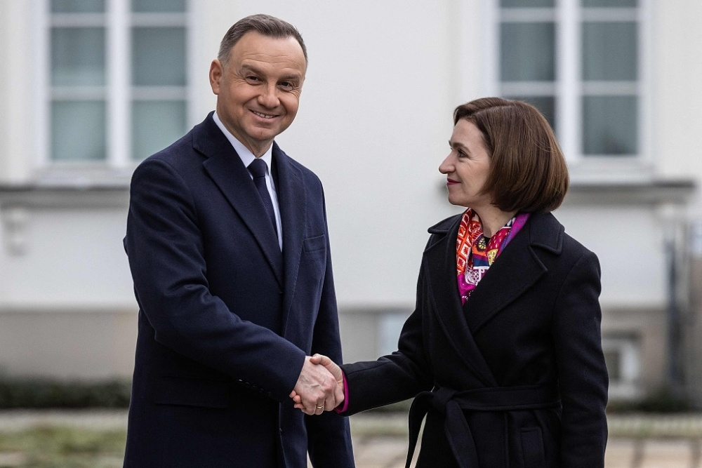

# 不安情绪在蔓延！摩尔多瓦，下一个乌克兰？

【环球时报驻俄罗斯特派记者 张晓东 环球时报记者
陈子帅】今年2月以来，无论是俄罗斯媒体，还是乌克兰、摩尔多瓦以及西方媒体，都充斥着大量有关摩尔多瓦局势紧张的报道，各方热炒这个原本存在感不强的东欧国家可能成为“下一个乌克兰”。西方和乌克兰指责俄罗斯计划在摩尔多瓦发动政变，而莫斯科披露基辅在靠近摩尔多瓦的边境地区部署军队，意图发动挑衅。满天飞的混乱信息叠加各方的秣马厉兵，让不安的情绪在该地区蔓延。俄乌冲突尚未结束，欧洲是否会再燃战火？摩尔多瓦是否会成为俄罗斯与西方斗争的下一个“战场”呢？

双方都说对方要“动手”

摩尔多瓦可能成为“下一个乌克兰”？这成为俄罗斯、摩尔多瓦、乌克兰以及西方近期广泛讨论的话题，然而它们各执一词，所指截然相反。据塔斯社等俄媒报道，俄罗斯外长拉夫罗夫2月初时表示，西方希望将摩尔多瓦变成“另一个乌克兰”，利用该国德涅斯特河左岸（德左）问题将摩尔多瓦变成反俄国家。俄联邦委员会（议会上院）国际事务委员会主席卡拉辛称，美国正在加工关于“俄罗斯破坏摩尔多瓦政局稳定”的材料，而华盛顿在摩尔多瓦挑起事端可能对欧洲产生不利影响。

与此同时，包括《华盛顿邮报》《华尔街日报》等在内的美国主流媒体纷纷发文，也表示摩尔多瓦可能成为“下一个乌克兰”，俄罗斯可能对这个国家发动进攻。美国CNBC网站援引分析人士的话称，俄罗斯可能利用摩尔多瓦以及该国东部亲俄的德左地区，在“新的战线上制造不和”。CNN表示，俄罗斯被指责计划在摩尔多瓦发动政变，而这可能将后者拖入俄乌冲突。如果俄罗斯在春季发动以乌克兰南部为中心的攻势，它可能会再次寻求悄悄向敖德萨挺进，然后与德左地区相连，这样就可以建起一座横跨乌克兰南部的“大陆桥”，进一步接近北约国家。

乌克兰和欧美国家还指责俄罗斯计划在摩尔多瓦发动政变。据美国CNBC网站等媒体报道，乌总统泽连斯基称，该国情报部门此前截获了“俄罗斯破坏摩尔多瓦民主秩序”的计划，基辅已向摩领导人发出警告。摩总统桑杜表示，克里姆林宫的破坏策略包括派俄罗斯、白俄罗斯、黑山和塞尔维亚的公民进入摩尔多瓦，伪装成摩公民并策动抗议活动，以推翻摩政府。不过摩前总理、发展和统一党主席基库在接受该国媒体采访时却批评乌克兰说，基辅官员一年来一直试图以各种方式将摩尔多瓦拖入与俄罗斯的冲突。

俄罗斯迅速否认了乌克兰的上述说法，同时指责基辅当局准备在摩尔多瓦德左地区进行武装挑衅，对该地区的俄维和军人发起进攻。俄罗斯国防部表示，乌克兰正在靠近德左地区的边境集结部队和军事装备，并出动大批无人机进入该地区。俄方表示，挑衅将由乌军部队实施，包括“亚速营”成员。俄《消息报》援引消息人士的话称，预计进攻集团将有5000人左右，此外还有600-800名北约军人。俄罗斯外交部表示，如果基辅政权对德左地区进行挑衅，俄罗斯武装部队将作出回应。乌克兰军方承认在靠近德左地区的边境附近部署军队，以应对“可能来自俄罗斯的威胁”。乌克兰国家边防局称，他们正在乌摩边境地区修筑防御工事，但这只是为了保护边界。

政治断层线上的“中立国”，想加入“更大军事联盟”

摩尔多瓦此次受到各方关注，和该国的地理位置密不可分。它位于欧洲巴尔干半岛东北部多瑙河下游，在东、南、北三个方向与乌克兰接壤，西隔普鲁特河与既是欧盟又是北约成员国的罗马尼亚毗邻，东南部遥望黑海，面积约为3.38万平方公里，人口约有260万。BBC称，摩尔多瓦位于欧洲地缘政治断层线上。中国社会科学院俄罗斯东欧中亚研究所研究员张弘在接受《环球时报》记者采访时表示，随着冷战后华约的解体以及北约的东扩，俄罗斯与北约之间形成了一条新的地缘政治边界，其中包括摩尔多瓦和乌克兰这两个既没有加入北约也没有加入集安组织的国家，它们处在俄罗斯与西方之间地缘政治的夹缝地带。俄罗斯与北约关系恶化后，这些夹缝地带国家或被拉拢或被施压，越来越难以保持中立立场。俄乌冲突爆发之后，受德左问题和乌克兰的影响，摩尔多瓦成为俄罗斯与北约全面对抗的一个前沿阵地。

据俄罗斯卫星通讯社报道，摩尔多瓦宪法规定该国永久中立，不允许其他国家在其领土上部署军队。不过，从1994年以来，摩尔多瓦与北约在独立伙伴框架内进行合作，不仅派兵加入北约驻科索沃部队，还在首都基希讷乌设有北约联络处。桑杜总统2020年上台以来特别是俄乌冲突爆发后，摩当局加速向西方靠拢。她此前在接受美国“政治新闻网”采访时表示，为加入大型军事联盟，该国“需要调整中立立场”。《华尔街日报》等美媒直言，桑杜在亲西方政策上加倍下注。她日前在华沙会见美国总统拜登，并参加了北约东欧成员国的一次聚会。去年9月联合国大会期间，桑杜在纽约会见了北约秘书长斯托尔滕贝格。

西方也向摩尔多瓦示好。据美媒报道，去年6月，摩尔多瓦和乌克兰一起被授予欧盟候选国地位。摩副总理兼外长波佩斯库参加了去年12月在罗马尼亚首都布加勒斯特举行的北约外长会议，这是摩外长首次参加北约部长级会议。在那次会议上，欧美再次确认了对摩尔多瓦的支持，包括为摩尔多瓦国防部队提供训练。张弘表示，西方拉拢摩尔多瓦有两个目的：一是扩大自身势力范围和安全空间；二是将摩尔多瓦拉入西方阵营。西方和俄罗斯的对抗是关于意识形态、价值观和国家治理模式的竞争，所以在西方看来，就算短期内没法达成所有军事目的，至少也要把摩尔多瓦等东欧国家拉入西方的外交、政治、经济阵营。

“冲突冻结”地区被重新炒热

德左地区成为此次俄罗斯、西方以及乌克兰争吵的焦点。在摩尔多瓦东部靠近乌克兰边界的地方，有一处长达249英里（约401公里）的狭长地带实际上不受摩政府控制，这就是德左地区。当地60%的居民是俄罗斯人和乌克兰人，在苏联解体前因为担心摩尔多瓦在民族主义浪潮中加入罗马尼亚，该地区要求独立。1992年摩当局试图以武力解决问题但是以失败告终，此后德左地区成为苏联解体后的“冲突冻结”地区之一。此外，当地北部的科巴斯纳村有欧洲最大的军火库之一，那里储存着大约2万吨苏联时代的弹药和设备。

俄罗斯、摩尔多瓦在德左地区驻有上千名维和士兵。虽然该地区传统上亲俄，但是当地政治学者季伦指出，这里已不是许多人记忆中30年前的“俄罗斯堡垒”，而更类似于上世纪50年代的柏林。在这个地区拥有强大影响力的不只是俄罗斯，在最近10-15年间，欧盟、美国与罗马尼亚的势力都不断壮大。

那么德左地区会成为俄乌冲突外溢的新爆点吗？德左地区社会学家舍因3日在接受俄媒采访时表示，德左问题的存在显然是北约东扩路上的绊脚石，也是悬在摩尔多瓦头顶上的“达摩克利斯之剑”，摩当局想统一该地区就必须借助外力，而俄乌冲突目前的胶着局面无疑使摩看到了“良机”。俄罗斯政治学家巴希洛夫对该国《消息报》表示，乌克兰希望对德左地区发动攻击，但却被一个因素制约，那就是该地区的科巴斯纳军火库，“如果军火有被抢夺的威胁，那么只能炸掉（该军火库），其后果将是各方难以承受的。这一军火库的爆炸威力相当于5个广岛原子弹，不仅将抹平摩尔多瓦，还将毁掉乌克兰的西南部”。

不过据美国CNBC网站报道，分析人士表示，所谓俄罗斯“入侵”摩尔多瓦的威胁被夸大了。驻扎在德左地区的俄军士兵也没有能力破坏摩尔多瓦的稳定，或被当成对付乌克兰的杠杆。此外，莫斯科不太可能先发制人地切断对摩尔多瓦的天然气供应，以免危及德左地区亲俄支持者的生活。

张弘对《环球时报》记者表示，德左问题是一个在俄乌冲突背景下被重新炒热的话题，但实际上摩尔多瓦和德左问题并不会成为西方和俄罗斯新的冲突爆发点。俄乌冲突爆发后，乌克兰将德左地区的俄军视为一种战略威胁，所以在该地区与乌克兰的交界地带开始军事布防，于是俄方担忧乌克兰要在德左地区开辟新的战线，但实际上乌克兰并没有这种能力，因为它首先要解决的还是来自俄罗斯的安全压力。此外，德左地区是摩尔多瓦的领土，乌军擅自进入是对摩尔多瓦主权的侵犯。从俄罗斯方面来看，在俄乌冲突爆发初期，俄方乐观估计能够“速战速决”，但目前来看俄方还要继续把重心放在乌东地区而不是德左问题上。可以说，短期之内俄罗斯没有跨过乌克兰单独解决德左问题的能力。

一边倒能带来安全吗？

“她（摩总统桑杜）只是在遵循美国的议程。”据《华尔街日报》等媒体报道，70岁的摩尔多瓦民众布拉迪斯蒂安这样说。和她一样，数千名抗议者2月19日聚集在摩尔多瓦议会大厦外的街道上，要求摩总统辞职。布拉迪斯蒂安称，她抗议是因为已无法负担基本的生活必需品，尤其是能源。美国CNBC网站报道称，俄乌冲突爆发后，摩尔多瓦面临着严重的能源危机，此前该国全部的天然气供应依靠俄罗斯。此外，乌难民的大量涌入也给该国带来巨大压力，现在摩尔多瓦的通货膨胀率超过30%。

35岁的摩公务员乌贝毫不怀疑摩尔多瓦的未来在欧洲，但许多摩尔多瓦人，包括她父母，仍在怀念苏联时代，并认为该国最好保持中立。乌贝说，因为家人对俄罗斯和欧美的态度不同，周末午餐“不可避免地会演变成争吵”。

这种争吵不只存在于民间。桑杜政府希望通过向北约以及欧盟靠拢，解决该国的安全和经济问题。不过，摩尔多瓦前总统多东日前提醒说，该国超过80%的农产品都出口到独联体国家市场，主要是俄罗斯。此外，俄罗斯外交部通报称，2022年，不少于12.5万名摩尔多瓦公民在俄登记务工或者从事其他工作。

多东批评桑杜听命于西方，不顾人民的反对，强行将摩尔多瓦拉向西方。据《华尔街日报》报道，去年11月的一项民调显示，32%的摩民众表示他们宁愿加入与俄罗斯的关税同盟，也不愿加入欧盟——这比俄乌冲突爆发前略有增加。相比之下，48%的人倾向于加入欧盟，而此前这一比例为57%。俄媒援引近期民调称，只有22.4%的摩尔多瓦人支持加入北约，54.5%的受访者反对，另有23%的受访者表示不确定。

倒向欧美能为摩尔多瓦带来安全吗？张弘表示，美欧能够一定程度上缓解摩尔多瓦当前面临的安全、经济压力，但是北约东扩压缩了俄罗斯的安全空间，最终导致俄乌冲突爆发，因此要想解决俄乌冲突并获得安全需要明白，不要寻求单边主义安全，不要持有“零和安全观”。此外，各方不应打破稳定的双边关系。西方拉拢乌克兰加入北约的做法正是因为打破了俄罗斯与北约原有的平衡关系，才导致冲突爆发。

