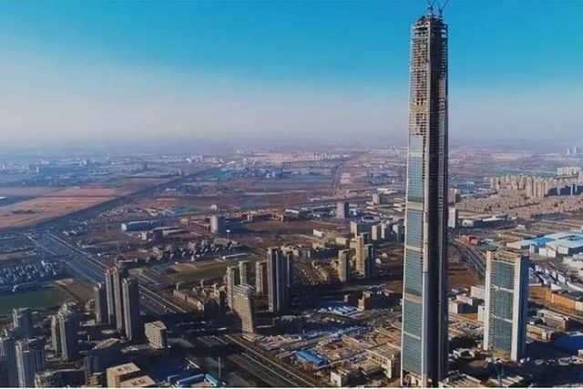
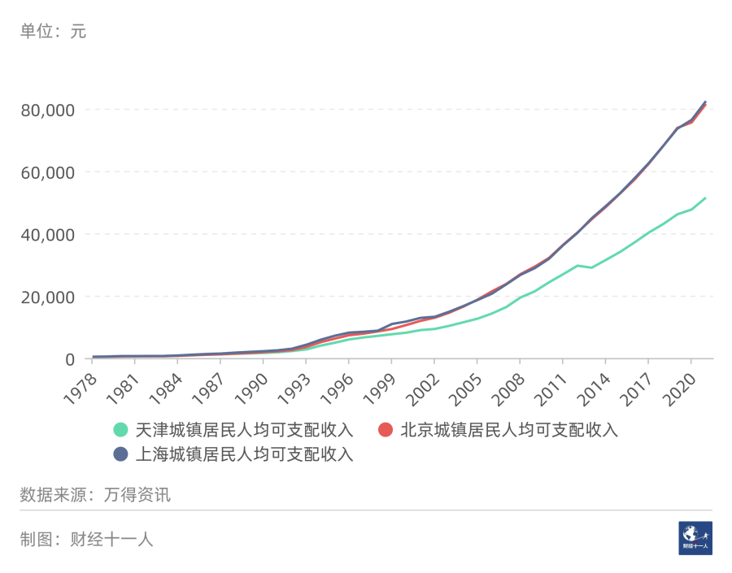
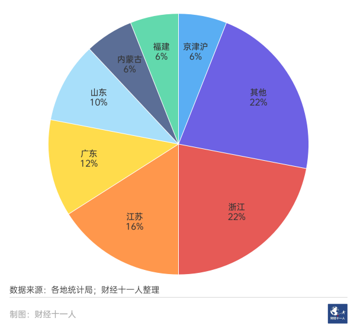
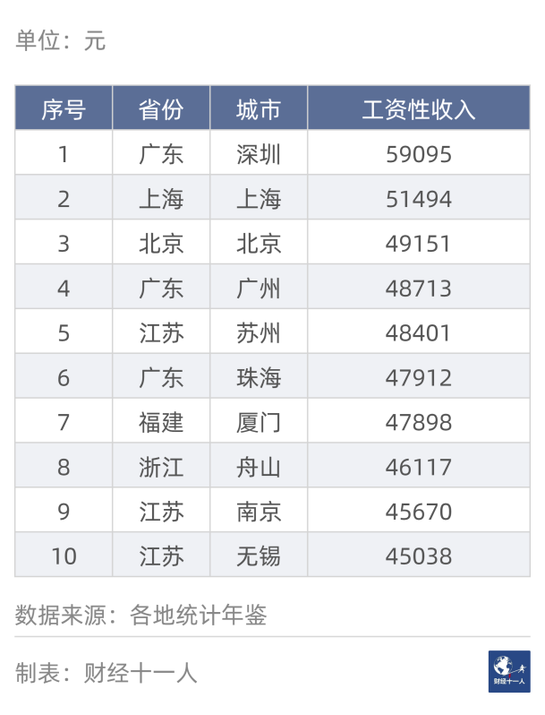
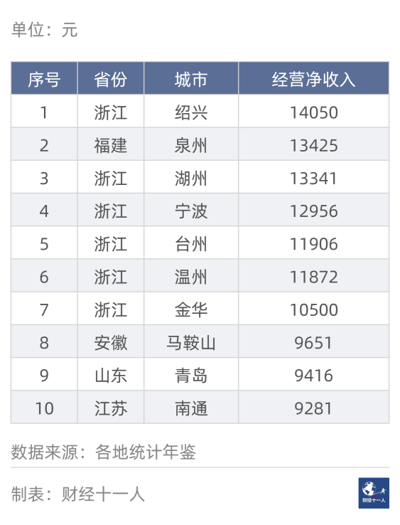
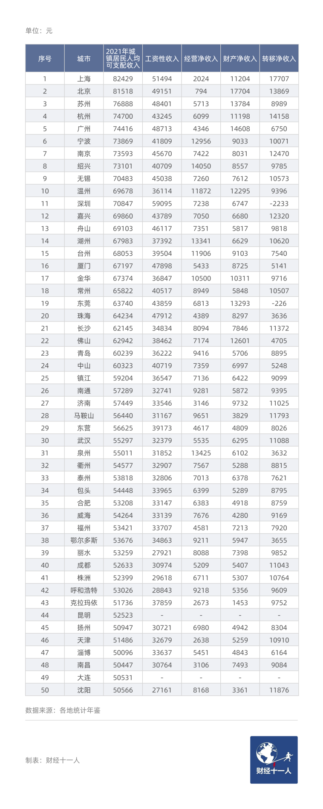

# 中国“民富”50城：沪京苏杭位列前4，深圳排第11

_图/视觉中国_

**文 | 陈汐 刘建中**

**编辑 | 刘建中**

生活在富裕的城市无疑是幸福的，那么中国最富的50个城市是谁？

本文用城镇居民人均可支配收入来衡量城市的富裕程度，因为“民富”的城市更有经济活力。

居民人均可支配收入是，居民可支配收入除以常住人口数得到的平均数。居民可支配收入，就是居民能够自由支配的收入，因此要从收入中扣除税金、五险一金、经常性捐赠等等。或者说，居民可支配收入就是能真实用于消费、投资和储蓄的收入。更详细解释见尾注。

各城市的城镇居民人均可支配收入排名与人均GDP排名存在较大差异。2022年鄂尔多斯人均GDP为25.9万元，排名全国第一，克拉玛依人均GDP23.7万元，排名第二。鄂尔多斯和克拉玛依的人均GDP大大高于北京的19万元、上海的17.9万元。但是克拉玛依和鄂尔多斯的城镇居民人均可支配收入进不了中国城市30强。

下面对中国地级以上城市进行排名。下文谈到城市，都指中国境内的地级以上城市，但不包括香港、澳门、台湾。排名结果见表1。

_表1:
中国地级以上城市城镇居民人均可支配收入50强_

表1展示了中国地级以上城市，城镇居民人均可支配收入50强（下文简称“中国最富50城”）的排名结果。结果中有以下几点值得注意。

**最富50城排名中值得注意的地方**

**第一，深圳仅排11位。**

深圳经济发达，房价比肩上海、北京。为何深圳人均可支配收入还不如绍兴、无锡、温州？

这是因为深圳常住人口为1756万人，而户籍人口仅为628万人，户籍人口比例为35.8%。北京这个比例为64.6%，上海为60%，广州为53.8%。在一线大城市的常住人口中，户籍人口的平均收入往往高于非户籍人口。深圳存在大量从事第二产业的、没有户籍的工人。这个群体人均收入低于平均水平，从而拉低了深圳的数据。

**第二，天津仅排46位。**

_天津有名的烂尾楼-117大楼_

读者需要知道，在1978年天津城镇居民人均可支配收入为388元，这不仅与上海的406元相差无几，而且超过了北京的365元。即使到了1987年，天津人均可支配收入为1187元，仍然高于北京的1182元。但最近的35年，天津的发展速度远远落后于上海和北京。

_图1:
北京、上海、天津的城镇居民人均可支配收入_

**第三，论“民富”，长三角完胜珠三角。前10强，长三角城市占了80%。**

10强中，有上海，北京；还有4个浙江城市：杭州、宁波、绍兴、温州；3个江苏城市：苏州、南京、无锡；1个广东城市：广州。所以前10中，有8个长三角城市。

**前15强，长三角城市仍占80%。**

_绍兴_

15强中，不属于长三角的城市仅有三个：北京、广州、深圳。所以，长三角是中国居民最富庶的地区。曾经有人问，长三角与珠三角谁的实力更强？如果论民富，当数长三角。

20强中，长三角城市有14个，占比仍高达70%。30强中，北方城市仅有北京和3个山东城市：青岛、济南、东营。40强中只有成都是西部城市，成都排在了第40名。

**第四，最富50城中有些四线城市** ，比如山东东营、安徽马鞍山、内蒙古包头、内蒙古鄂尔多斯、新疆克拉玛依。这些城市有共同特点，都属于资源型城市。

比如，东营虽不大，但却是胜利油田的总部驻地。胜利油田所属企业待遇较好。胜利油田在东营有在职员工约20万人，退休数万人。如果考虑到家庭因素，就能影响约50万人。也就是直接或间接受益的人群大约占了全市人口的四分之一。

_桩139-平30井正在钻井施工。图源：中国石化胜利油田官网_

包头是著名的“草原钢城”、“稀土之都”；马鞍山不仅离南京很近，还有马钢；鄂尔多斯有煤炭、稀土、天然气；克拉玛依有新疆油田。这些城市虽然层级低，但居民收入都较好。

**看一下中国最富50城中各省所占的比例。**

从图2看，在50强中，江苏、浙江、广东、山东、福建、内蒙古六个省份加直辖市占了78%；而浙江、江苏、广东、山东四省占了60%。

内蒙古有3城入选，这个表现超出了很多人的预期。

_图2: 中国最富50城中各省所占比例_

**最富50城可支配收入分项中的信息**

居民可支配收入按照收入来源可分为四项，分别为工资性收入、经营净收入、财产净收入和转移净收入。因为2022年很多城市的分项数据尚未公布，我们用了最富50城2021年的数据。

工资性收入简单理解就是上班的收入。表2列出了中国最富50城中，工资收入最高的10城。

_表2：2021年工资性收入最高的10个城市_

这时发现，单纯看工资收入，北上广深进入了前四名。

经营净收入简单理解就是经商赚的钱。表3列出了中国最富50城中，经营净收入最高的10城。

_表3：2021年经营净收入最高的10个城市_

我们发现，经营收入最高的10个城市里面没有一线城市，仅有两个二线城市：宁波和青岛。全国经营净收入最高的城市是三个并不吸睛的三线城市：绍兴、泉州、湖州。所以，平均来讲，这三个地方的人最会做生意。

转移净收入主要包括政府、非行政事业单位、社会团体对居民转移的养老金或退休金、社会救济和补助、政策性生活补贴，以及住户之间的赡养收入、经常性捐赠等。

在最富50城里，仅有两个城市的转移净收入为负数，它们是深圳和东莞。

深圳为-2233元，东莞为-226元。为何深圳如此特殊？

统计局相关负责人曾解释，深圳居民中离退休人员比例较低，对转移净收入增长拉动作用有限；从转移性支出角度看，占深圳居民绝大部分的外来人口尤其是青壮年就业人口，在收入增加的同时会相应增加“社保支出”、“个税支出”、“赡养支出”、“外来人员寄带回家支出”等转移性支出，最终使转移净收入小幅负增长。东莞的情况和深圳类似。

最后的表4列出了2021年中国最富50城各个分项的收入，供读者参考。

_表4:
2021年中国最富50城的分项收入_

**尾注：居民可支配收入**

居民可支配收入是参照国际上通用的可支配收入概念制定的，方便国际间比较。居民可支配收入既包括现金收入，也包括实物收入。按照收入来源，
**可支配收入包含四项，分别为工资性收入、经营净收入、财产净收入和转移净收入。**

**工资性收入** 指就业人员通过各种途径得到的全部劳动报酬和各种福利，包括受雇于单位或个人、从事各种自由职业、兼职和零星劳动得到的全部劳动报酬和福利。

**经营净收入** 指住户或住户成员从事生产经营活动所获得的净收入，是全部经营收入中扣除经营费用、生产性固定资产折旧和生产税之后得到的净收入。

**财产净收入**
指住户或住户成员将其所拥有的金融资产、住房等非金融资产和自然资源交由其他机构单位、住户或个人支配而获得的回报并扣除相关的费用之后得到的净收入。

**转移净收入**
是转移性收入扣除转移性支出后得到的净值。其中，转移性收入指国家、单位、社会团体对住户的各种经常性转移支付和住户之间的经常性收入转移。转移性支出指住户对国家、单位、其他住户或个人的经常性或义务性转移支付。

转移性收入包括退休金、社会救济和补助、报销医疗费、以及本住户非常住成员寄回带回的收入等。转移性支出包括缴纳的税款、各项社会保障支出、经常性捐赠等。净收入是指二者差值。

这些概念听起来似乎跟我们的日常生活离得很远，但换几个名称可能大家就熟悉了：工资、奖金、津贴、补贴、经营利润、利息红利、离退休金、税务等。

如果住户是上班族或者打工者。可支配收入大部分可能来源于工资、奖金、津贴和补贴。

如果是个体经营户，比如开个小卖铺，那么每天拿到手的营业额，扣除进货成本、房租水电等税费之后的净利润就成了可支配收入。

如果是种粮大户，那么可支配收入的主要来源就是卖粮收入，当然还要扣掉相应的种子、化肥、雇工等生产成本、中间投入以及其他经营费用；同时，该住户领取到的各项政策性生产补贴也是收入的重要来源。

如果一个人没有工作，但是有一大笔银行存款或者有笔资金入股某公司，那么利息或红利就是可支配收入的一个来源。

如果是离退休人员，那么离退休金就是可支配收入的一个来源。如果是低保户，最低生活保障金是可支配收入的来源之一。如果是享受各种扶贫补助的贫困户，各项到户扶贫补助补贴也构成了可支配收入的一部分。

