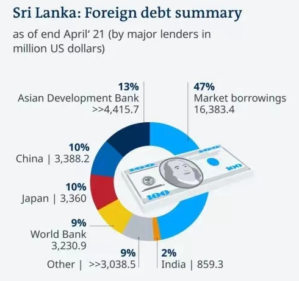

# 中方给斯里兰卡债务重组开绿灯，“为IMF批准纾困资金铺平道路”

观察者网讯
自去年发生大规模骚乱以来，斯里兰卡经济社会秩序遭遇重创，而中方一直为其提供力所能及的帮助。据路透社3月8日报道，作为双边的官方债权人，中国进出口银行于6日致信斯里兰卡政府，同意斯方暂停偿还2022和2023年到期债务，并向其出具了融资支持文件。我外交部发言人毛宁在8日记者会上证实了这一消息。

路透社称，中方支持对斯里兰卡来说至关重要。国际基金组织（IMF）同日表示，斯里兰卡已获得中国、印度和其他主要债权人的融资支持，这将为3月20日批准向斯里兰卡提供29亿美元纾困资金铺平道路。

_路透社报道截图_

根据路透社看到的信函内容，中国进出口银行在3月6日致斯里兰卡政府的信中写道，中方已“通过债务处理向斯里兰卡提供坚定支持”，斯方将不必立即偿还2022和2023两年期贷款的本金和利息，“以帮助缓解斯方短期债务的偿还压力”。

“与此同时，我们愿意在这个窗口期加快与你方就中长期债务处理的谈判进程，以期在未来几个月内敲定债务处理的具体细节”，中国进出口银行表示，“我们将尽最大努力为斯里兰卡债务的可持续性做出贡献”。

信中表示，中方将呼吁商业和多边债权人“共同作出贡献，帮助斯里兰卡更好地应对并摆脱危机”。

在8日的例行记者会上，我外交部发言人毛宁表示，中国进出口银行此前已向斯方提供了支持斯债务可持续性的信函，表示愿对斯2022、2023年到期债务进行展期。作为双边的官方债权人，中国进出口银行3月6日再次向斯里兰卡出具了融资支持文件，这充分体现了中方支持斯里兰卡实现债务可持续的诚意和努力。

毛宁重申，中方支持有关金融机构同斯里兰卡方面积极协商债务处置方案，同时也主张公平分担责任，商业和多边债权人都应当共同参与斯里兰卡的债务重组。中方愿同有关国家和国际金融机构一道，为斯里兰卡应对当前困难，缓解债务负担，实现可持续发展发挥积极作用。

毛宁曾指出，作为友好邻邦和真诚朋友，中方一直在力所能及范围内为斯里兰卡经济社会发展提供帮助。

_去年7月，斯里兰卡爆发大规模示威。图自社交媒体_

据中国外交部介绍，
斯里兰卡民主社会主义共和国是南亚次大陆以南印度洋上的岛国，西北隔保克海峡与印度相望；面积65610平方公里，人口2192万（2020），首都科伦坡。

2021年，斯里兰卡的经济危机初现苗头。2021年9月，前总统拉贾帕克萨宣布该国进入“经济紧急状态”。去年6月，该国通货膨胀飙升至54.6%，食品价格飙升80%，时任总理维克拉马辛哈则表示IMF纾困是避免发生经济灾难的唯一选择。

但在随后的7月，斯里兰卡接连爆发大规模骚乱、国家破产、总统辞职“跑路”等重大变故，由于外汇储备消耗殆尽、商品进口无法得到保证，至今仍处于70多年来最严重的金融危机之中。

美联社去年7月称，斯里兰卡的外债总额已达510亿美元，2026年前需支付250亿美元。斯里兰卡央行近期表示，该国经济预计在2022年收缩8.7%，但将在2023年下半年复苏。但据世界银行的数据，该国经济今年估计收缩了9.2%，预计2023年将进一步收缩4.2%。

而在国家宣布破产前，斯里兰卡政府正在与国际基金组织（IMF）举行谈判，希望寻求29亿美元的纾困资金。《纽约时报》此前指出，2022年的动荡将使谈判进一步复杂化，从而推迟IMF的救助计划。

值得注意的是，尽管西方一直以所谓“债务陷阱”为由指责中国，但根据官方数据，斯里兰卡的债务结构中，中国只占10%至20%左右，而欧美、日本等西方国家金融机构和国际组织才占大头。IMF数据显示，截至2020年底，斯里兰卡欠中国进出口银行28.3亿美元，近占其外债的3.5%。

_斯里兰卡债务结构，德媒援引官方数据制图_

不过，路透社称，赢得中国的支持，对IMF协议的推进至关重要。

当地时间8日，斯里兰卡总统维克拉马辛哈向议会证实，政府于6日晚收到了中国进出口银行的来信。他表示，不久后，他和央行行长一同致信IMF，就纾困资金问题发出意向书。

IMF同日表示，目前，斯里兰卡已获得中国、印度和其他主要债权人的融资支持，这将为3月20日批准向斯里兰卡提供29亿美元纾困资金铺平道路。

维克拉马辛哈办公室的一名匿名消息人士告诉路透社，自上周四以来，总统便一直期待中方的来信。在此之前，“斯里兰卡已与中方进行了数周的会谈、讨论和谈判，主要是在线上进行，因为这是我们的任务”。该人士表示，国际社会的支持，由于是来自中国、日本和美国的对话，极大地帮助了斯里兰卡。

斯里兰卡内阁发言人兼交通部长班杜拉·古纳瓦德纳此前在新闻发布会上表示，如果IMF最终批准针对斯里兰卡的纾困资金，这将是一个“伟大的成就”。他说，斯方为此付出了巨大努力，因为“没有IMF的纾困计划，斯里兰卡就无法扭转当前的经济形势”。

**本文系观察者网独家稿件，未经授权，不得转载。**

