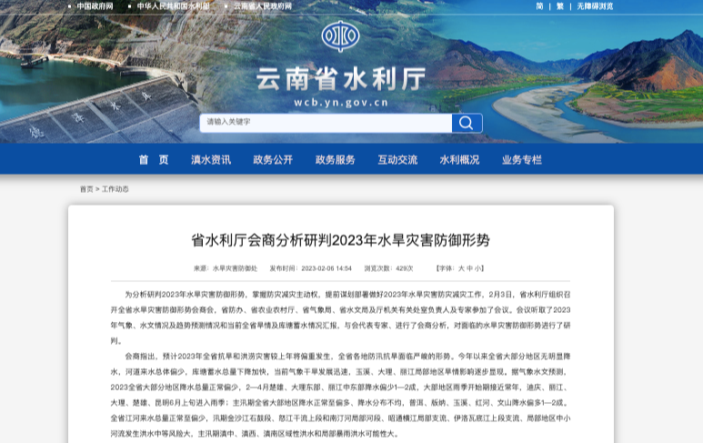
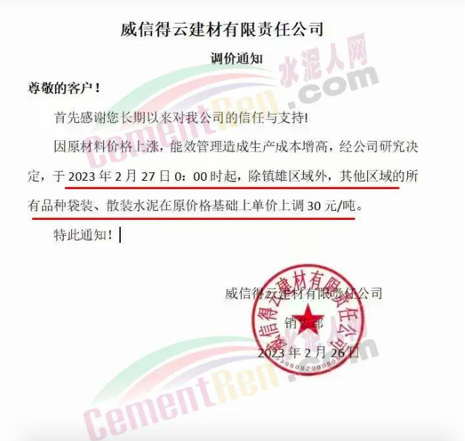

# 云南再限电，有电解铝企业减产40％，工人“过剩”被派往外地

继2022年9月两轮限电后，水电大省云南再度传出限电的消息。红星资本局了解到，本轮限电已波及云南当地的电解铝、黄磷、锌等行业，部分大型企业被要求减产，压减用电负荷。

3月6日，电解铝企业云南其亚金属有限公司（以下简称“云南其亚”）的相关负责人告诉红星资本局，“2月中旬就收到了限电通知，2月27日已经全面完成（压减负荷要求）了。”同日，上市公司神火股份（000933.SZ）董秘也向红星资本局表示，限电调整后，工厂电解铝产能已减少40%。除了电解铝，同属高耗能行业的黄磷也是本轮云南压减用电负荷的对象，上市公司云天化（600096.SH）也停了一条生产线。

气候干旱导致水电减少，是云南本轮“限电减产”的主因，但在云南保山一家小型硅企的负责人严先生（化名）看来，限电频发也与近几年云南引进大量高耗能企业有关。

红星资本局注意到，限电通知落地后，下游市场的价格也开始出现变化，黄磷、水泥都迎来了价格上涨。

_↑资料图 据IC photo_

**压减企业用电负荷**

**有铝企减产40%，工人“过剩”被派往外地**

云南其亚是当地的大型电解铝冶炼企业之一，是新疆其亚铝电有限公司的控股子公司，电解铝在运产能为35万吨/年。上述负责人表示，本轮限电要求压降20%的用电负荷，对企业的电解铝产能影响不小，“原本是3个工段，限电后只有1个工段（运行）。”

除了减产，云南其亚的员工也受到限电影响，该负责人提到，“过剩”的员工被派往新疆公司支援，等限电结束再返回云南。

红星资本局注意到，上市公司神火股份也受到此轮限电的影响。3月6日，神火股份的董秘向红星资本局表示，公司在2月就收到了限电的通知，调整后电解铝产能已减少了40%。

“按年均产能90万吨来算，现在每月减产大约是3万吨。”神火股份董秘还表示，因为减产，云南神火的工人也开始轮休。

另一家上市公司云铝股份（000807.SZ）则在投资者交流平台披露了限电减产的信息。2月23日，云铝股份回复称，公司按电网要求配合调整生产组织，在开展用能管理期间公司的电解铝产量将相应减少，同时公司将及时优化安排好全年的设备检修工作。除受用能管理影响的设备外，公司的其他电解铝生产设备在正常运行生产。

_↑云铝股份透露限电影响_

受云南限电影响的不止电解铝行业。红星资本局了解到，同属高耗能行业的黄磷企业也是本轮云南压减用电负荷的对象。

3月7日，上市公司云天化相关工作人员回复红星资本局称，公司的黄磷产能大约是3万吨/年，如今因为限电，只能按照2万吨/年的产能在开生产线，“之前是3条线，现在暂停了一条。”

有业内人士向红星资本局表示，云南省“有序用电”限制范围或许还会扩大至工业硅等其他行业。3月7日，云南省龙陵县龙山硅有限责任公司相关工作人员表示，暂未接到限电通知，目前还是正常生产。

**限电频发**

**水电供应紧张是主因**

气候干旱导致水电减少，是云南本轮“限电减产”的主因。国家统计局数据显示，水电一直以来都是云南省发电的主力，近6年来占比均在80%以上，但水电有着明显的季节性变化，丰水期多枯水期少。

目前云南正值枯水期，据五矿期货数据，截至2月中下旬，云南省主要地区1月、2月降雨量显著低于往年同期。云南境内的溪洛渡水电站也处于同期显著偏低的水平，2月下旬较其正常蓄水位低40米或6.7%。

云南省水利厅在2月3日组织召开全省水旱灾害防御形势会商会。会上指出，今年以来云南全省大部分地区无明显降水，河道来水总体偏少，库塘蓄水总量下降加快，当前气象干旱发展迅速，玉溪、大理、丽江局部地区旱情影响逐步显现。

_↑截图自云南省水利厅官网_

枯水期与干旱，导致云南水电供应形势紧张，迅速传导至下游产业链。云铝股份在回复投资者提问时就提到，云南电网通知，目前云南省内电力供需形势严峻，水电蓄能同比大幅减少，为确保电网安全运行和电力可靠供应，要求公司开展用能管理降低相应用电负荷。云南其亚与神火股份的相关负责人也向红星资本局表示，限电主要是枯水期水电供应减少导致。

红星资本局注意到，近两年云南限电情况频发，如2021年9月，云南省节能工作领导小组办公室发布《关于坚决做好能耗双控有关工作的通知》，提出加强重点行业管控，水泥、工业硅等都被要求压减产能。到了2022年9月，云南因夏季干旱少雨，叠加缺煤影响，导致电力供应紧张，接连两轮限电。

此外，云南也是西电东送的重要电力输出省。据21世纪经济报道，云南即使本身缺电，也需执行在省间协议框架下的外送电量。

**业内人分析：**

**与云南引进大量高耗能企业有关**

但在云南保山一家小型硅企的负责人严先生（化名）看来，限电频发也与近几年云南引进大量高耗能企业有关。他表示，因为云南电费价格优势，高耗能企业都“一窝蜂”似地迁过来，突然增加这么多产能，对电量供应肯定是有影响的。

此前，云南水电资源丰富，但自用比例不高。据中国能源报，云南每年“弃水”电量达300亿千瓦时。为了消纳富余电量，2017年云南出台一系列电价优惠政策，吸引一批水电铝、水电硅企业落地，如上述云南神火、云南其亚、魏桥集团；还有隆基股份、晶澳科技、通威集团等。

2021年底，云南超越山东成为全国电解铝第一大省，但电解铝产业也成了云南的耗电大户。行业网站Mysteel统计数据显示，云南省电解铝耗电量占第二产业用电量的41%，占全省用电量近30%。

随着高耗能企业的增加，限电加码的情况也在发生。红星资本局注意到，与去年9月相比，云南神火的电解铝产能压减目标从20%增加到40%。“电网会根据整体电量的情况去跟企业（产能）匹配，今年产能基数上去了，所以压得也更多一点。”神火股份董秘说。

**下游市场黄磷、水泥涨价**

**限电将持续到何时？**

限电通知落地后，随着工厂减产，下游市场的价格也开始出现变化。

例如黄磷，据百川盈孚初步统计，限电前云南地区总计黄磷日产约790吨，此次云南限电预计导致黄磷日产减少210吨。

红星资本局注意到，黄磷价格已经迎来上涨行情。据Wind数据，3月3日，磷矿石再度跳涨，最新报价1089元/吨，较去年同期(659元/吨)涨幅约65%。

另据中国化工报报道，截至3月初，云南地区黄磷厂家报价上调至3.1万-3.2万元（吨价，下同），较2月22日累计上涨1500～2000元，市场成交价格低于3万元不接单。四川、贵州地区黄磷企业跟随上调报价，意向接单价格上调至3万元左右。

目前，电解铝市场价格变动不大，但银河证券认为，在未来云南减产落地及需求进一步复苏下，国内电解铝供需边际好转，铝锭社会库存有望进入去库阶段，或将提振铝价。

除了电解铝、黄磷，云南工业用电大户还包括水泥行业。红星资本局注意到，受本轮限电影响，水泥企业也开始调价。

华创证券周报指出，云南地区部分水泥企业已接到限电通知，但具体限电程度尚未明确。另据行业网站水泥人网消息，位于云南昭通的威信得云建材有限责任公司通知，因原材料价格上涨，能效管理造成生产成本增高，经公司研究决定，于2023年2月27日起，除镇雄区域外，其他区域的所有品种袋装、散装水泥在原价格基础上上调30元/吨。

_↑图片来自水泥人网_

云南限电将持续到何时？云南其亚与神火股份的相关负责人均表示，限电什么时候结束暂未接到通知，但预计雨季来临，丰水期时会有所缓解。

短期来看，云南水电发电量或难有起色，部分地区的干旱或许会持续到5月下旬。据云南昆明气象局预计，今年雨季将于5月下旬至6月上旬开始，开始期较常年偏晚5天至10天。

红星新闻记者 强亚铣

编辑 余冬梅

