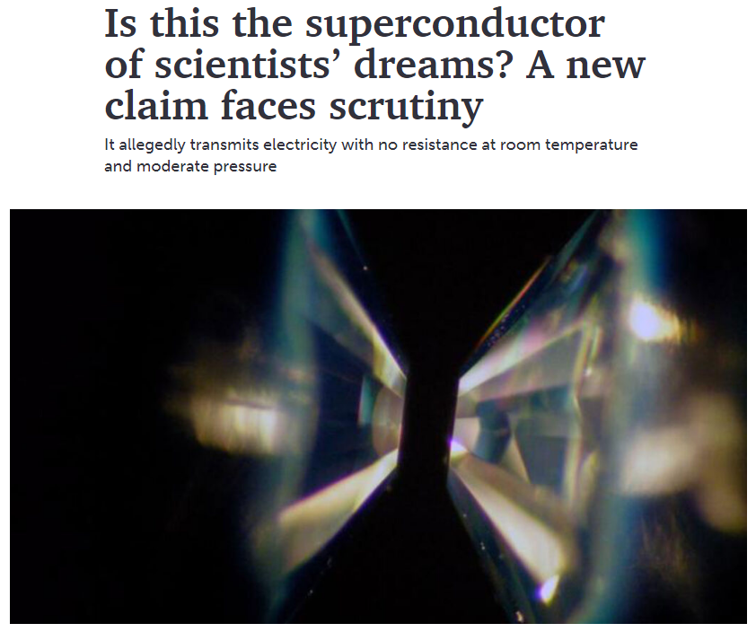
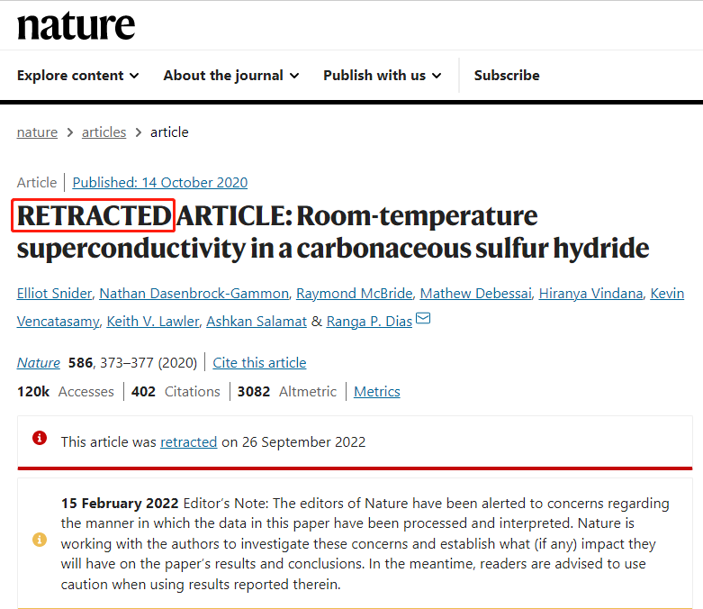

# 基础科学重大突破？美研究团队称突破“室温超导”

_图注：电影《阿凡达》中常温超导体的悬浮情景。_

每经记者：蔡鼎 每经编辑：兰素英

据美国双周刊科学杂志ScienceNews，美国罗切斯特大学的物理学家Ranga Dias及其团队日前在美国物理学会会议上宣布，
**他们已经创造出一种可在实际条件（practical conditions）下工作的超导体。**

不过，由于该团队于在2020年10月发表的一篇类似论文受到质疑，最终导致《自然》杂志撤稿， **这表明该团队的最新研究成果将面临更为严格的审查。**

21摄氏度条件下，新材料实现超导

许多材料都可以成为超导体，只要它们被冷却到非常低的温度，就能够在没有电阻的情况下传输电力。虽然有些超导体可在较高的条件下工作，但它们必须承受极大的压力，这意味着它们无法在实际中应用。

_ScienceNews报道截图_

美国罗切斯特大学的一个研究团队表示，他们已经创造出了一种在室温（room
temperature）和相对较低压力条件下工作的超导体。超导体在常规条件下工作，可能预示着一个高效率机器、超灵敏仪器和革命性电子产品的新时代即将到来。

罗切斯特大学的物理学家Ranga Dias在3月7日的美国物理学会会议上表示：“这预示着，对实际应用有用的新型材料已经出现。”

**这种超导体是由氢、氮和钚组成的材料。** Dias和他的同事们将这些元素混合在被称为金刚石压砧（diamond anvil
cell）的装置中。然后，他们改变了压力，并测量了化合物中的电流阻力。

**令人惊讶的是，在约21摄氏度的温度条件下，这种材料似乎失去了任何对电流的阻力。** 不过，
**实现超导仍然需要10千巴的压力，这大约是大气层压力的1万倍。但这远远低于室温超导体通常所需的数百万个大气压。**
如果这项研究结果得到证实，这将使这种材料更有希望应用于现实世界。

该团队类似论文曾遭《自然》撤稿

不过，该研究团队的这项研究可能会面受到严格审查。

2020年10月15日，该团队曾在《自然》杂志刊文，称他们在260万个大气压下，成功创造出了临界温度约为15℃的室温超导材料，这也是人类首次实现室温超导。该文章还成为当月《自然》封面文章，引起轩然大波，因为通常来说，超导现象离不开极低的温度。

罗切斯特大学的物理学家Ranga
Dias与Salamat等合著者一起，将一种碳氢硫混合物放入他们在两个金刚石尖之间切好的微腔中，用激光激发样品发生化学反应，并观察到一个晶体形成。随着他们不断将实验温度降低，穿过材料的电流电阻降到了零，显示该样品已经具有超导性。随后，他们开始增加压强，发现这种转变会在越来越高的温度下出现。

然而，
**后来《自然》杂志的编辑不顾Dias及其合著者的反对，最终撤回了这篇论文，理由是研究人员在数据处理方面存在违规行为，这削弱了编辑们对这些研究结果的信心。**

_Dias所在团队的论文于2022年9月26日被《自然》撤稿（图片来源：《自然》杂志）_

超导体是一种比常规导体更为优越的无损耗导电材料。现有的超导材料大都需要在极低温下才能工作，这大大限制了它们的大规模应用。因此，
**找到一种室温超导材料，是全世界物理学家长久以来的梦想。**

《每日经济新闻》记者注意到，距离人类首次发现超导现象已经有100多年了。早在1911年，荷兰物理学家Heike Kamerlingh
Onnes就已经发现，当温度降低至4.2K（约-268.95℃）时，浸泡在液氨里的金属汞的电阻会消失。

但直到1957年，才有了第一个真正能描述超导现象的理论——BCS理论。该理论由美国科学家John Bardeen、Leon Cooper和John
Schrieffer基于“波粒二象性”建立。他们认为，金属外层自由电子在有电压时，会流经晶格点阵形成电流，但通常情况下，这种晶格点阵有缺陷，会因热振动使电流产生阻碍。

2015年，德国马克斯·普朗克化学研究所实验物理学家Mikhail
Eremets及同事报告了第一个超导氢化物——氢和硫的混合物。一些理论物理学家认为，在混合物中添加第三种元素会带来一个新的变量，能够接近环境压力或室温。

每日经济新闻

