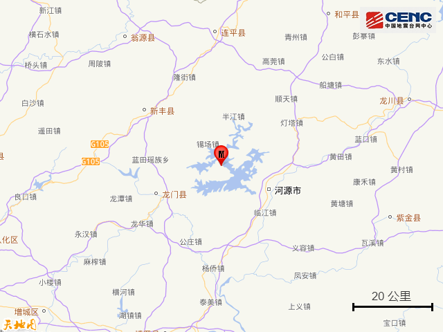
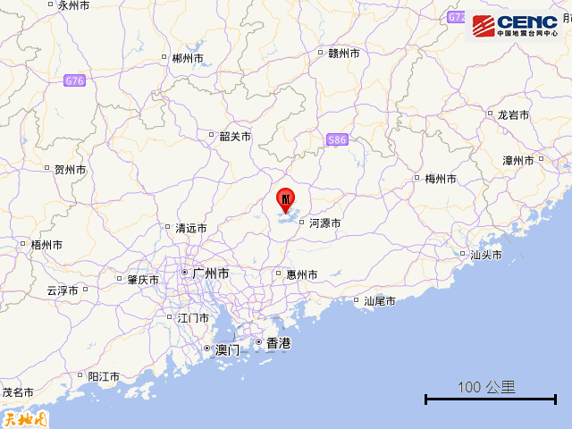
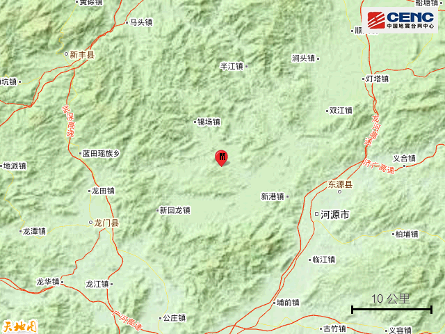
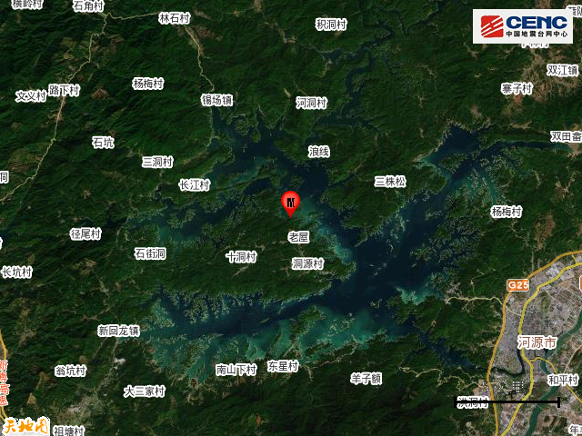
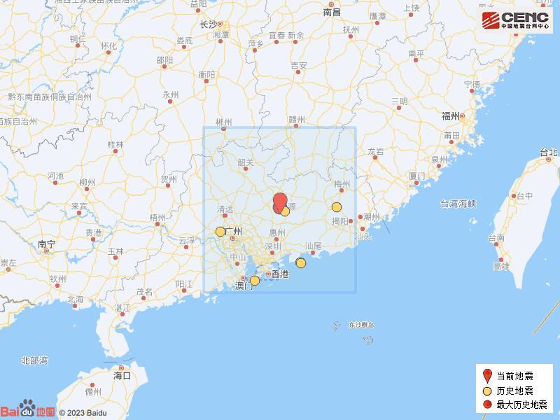

# 广东河源一天发生两次地震！官方：广东进入地震活动相对活跃时段

每经编辑：李泽东

据中国地震台网正式测定， **3月8日13时21分在广东河源市东源县发生3.4级地震，震源深度8公里，震中位于北纬23.84度，东经114.51度。**

**震中地形：** 震中5公里范围内平均海拔约156米。

**历史地震：**
根据中国地震台网速报目录，震中周边200公里内近5年来发生3级以上地震共11次，最大地震是2023年3月8日在广东河源市东源县发生的4.5级地震（距离本次震中1公里），历史地震分布如图。

今日早前消息，据中国地震台网正式测定，
**3月8日5时15分在广东河源市东源县发生4.5级地震，震源深度10公里，震中位于北纬23.84度，东经114.52度。**

多位网友表示，“被震醒”“感觉窗户都在响”“广州震感明显！”

广东地震台副台长：广东进入地震活动相对活跃时段

3月8日，广东河源市东源县发生4.5级地震，随后又发生3.4级余震。此前的2月11日，河源市源城区也发生了4.3级地震。两次地震间隔不久，彼此之间是否有关系？

对此，广东地震台副台长王力伟介绍，两次地震均发生在新丰江水库，属库区正常地震活动。“近期来看，河源地区地震活动有所增强，但从广东乃至华南地区来看，目前的地震活动都处在正常范围之内。”

今年以来，广东佛山、河源等地先后发生地震， **广东是否进入了地震活跃期？**
王力伟介绍，广东的地震活动大概可分为两个大周期，按照300多年一个周期来算，初步判定，
**广东目前属于第二个大周期的第V地震活跃幕，进入地震活动相对比较活跃的一个时段。** 不过，从广东乃至华南地区来看，目前的地震活动都处在正常范围之内。

实际上，广东地处中国东南沿海地震带，是华南地区地震相对活跃的省份。研究表明，在广东陆地及其沿海存在一系列强震断裂构造，如著名的滨海断裂带、河源邵武断裂、从化断裂、广州瘦狗岭断裂等。粤闽交界、粤桂琼交界区域都存在潜在强震震源构造，全省18个沿海地级市大都位于地震活动相对活跃的区域。

每日经济新闻综合中国地震台网、南方plus、公开资料

每日经济新闻

