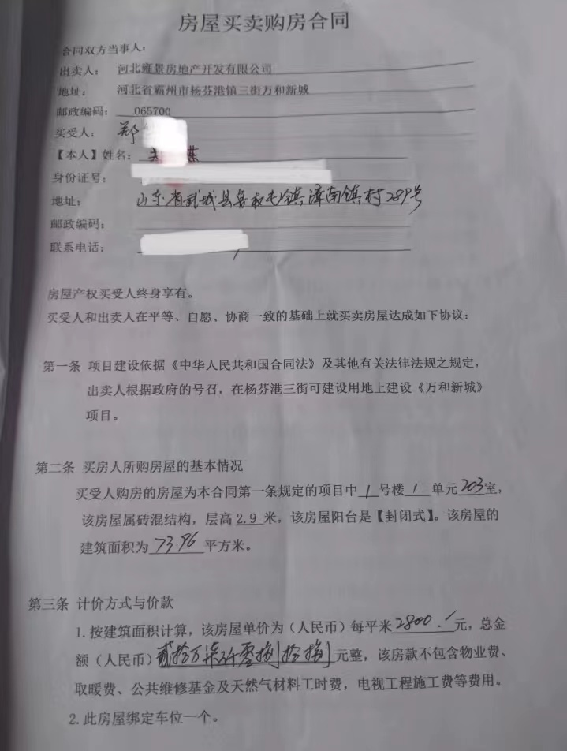
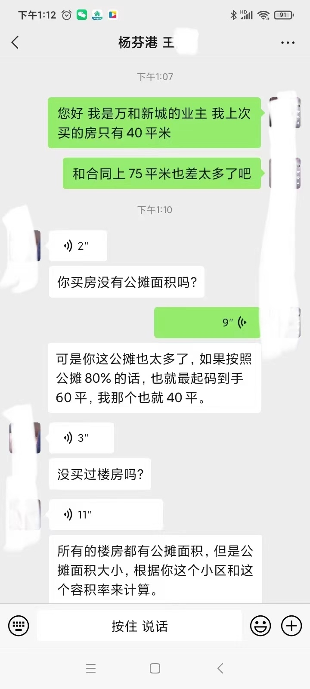

# 河北霸州一业主购74平房屋套内仅40平，售楼处工作人员：公摊所致

近日，河北衡水的郑女士向澎湃质量观投诉平台（https://tousu.thepaper.cn）反映，
2020年10月3日，她与河北雍景房地产开发公司签订合同，购买河北省霸州市杨芬港镇万和新城的一处房产。事后，郑女士发现，房屋实际面积与合同中的建筑面积相差近半，因此要求退还房款。但开发商工作人员却以公摊面积为由拒绝退款。

_购房合同
显示，郑女士的房屋面积为73.96平方米。_

接到消费者投诉后，澎湃新闻联系到了涉事房产中介曹某和开发商售楼处工作人员王某。其中，王某称对郑女士的购房合同不知情，随后将记者拉黑。

此外，涉及此事的安居客表示，曹某在销售过程中不存在虚构房源和瞒报信息的问题，建议郑女士与开发商沟通协调。安居客同时表示将配合用户维权。

**消费者投诉：**

郑女士介绍，2020年8月，她在安居客App上看中了河北霸州市华山家园一套房产。随后，她通过安居客App联系到了房产中介曹某。曹某称这套房已经没有了。后，曹某向郑女士推荐了杨芬港镇万和新城的一套房产。

郑女士说，曹某当时表示万和新城是新民居性质，无法办理房产证。因为价格低廉，且靠近天津，郑女士最终选择了这套住房。

郑女士最终决定购买这套房产，并于2020年10月3日与开发商河北雍景房地产开发公司签订了购房合同，“这套房离我家比较远，签完合同我着急回家，就没有测量房屋套内面积”。

此后，郑女士再次来到新买的房子发现，房子大约宽3米、长12米，加上厨房和卫生间，套内面积约为40平方米，与购房合同中的建筑面积相差近半，“他们告诉我，房子有70多平方米”。

郑女士提供的购房合同显示，涉事房屋建筑面积73.96平方米，每平米2800元，共计207088元。

2021年5月，郑女士再次前往万和新城时发现，楼外墙标注了“拆”字，“这房子没有房本，万一被拆了，我这21万就打水漂了”。

郑女士事后了解到，万和新城是河北雍景房地产开发公司开发的一处楼盘，只有两栋七层住宅楼，不是商品房，是新民居的产权性质，当地中介称为永久产权房。

郑女士还表示，事后她查阅相关规定发现，目前国家没有明确规定多层住宅楼的公摊面积标准，但按照房地产市场经验，普通的18层以下多层住宅楼，公摊系数约为7%-20%，“我买的房屋公摊面积约为46%，远超楼市常见的公摊系数，而且购房合同也没有对公摊的具体项目、面积大小等进行说明”。

售楼处工作人员称，“缩水”面积为公摊面积。

**企业回应：**

就郑女士反映的问题，澎湃新闻联系到了涉事房产中介曹某和开发商售楼处工作人员王某。

其中，曹某称自己的客户都是在对房屋实际面积知情的情况下，才会签订购买合同。曹某表示，会查询相关订单再回复。而王某则称对此次交易不知情。

2月28日，郑女士再次联系王某。郑女士提供的聊天记录显示，王某表示，相差的35平方米是公摊面积，属于正常情况，并表示售后问题需要找开发商。

澎湃新闻记者随后再次联系王某，发现已被拉黑。

3月2日，涉及此事的安居客专员称，曹某在销售过程中不存在郑女士所说的虚构房源和瞒报等问题，建议郑女士与开发商沟通协调。安居客专员还表示，将配合用户维权。

澎湃新闻多次尝试联系万和新城开发商，未果。而郑女士则表示，将继续维权。

**律师说法：**

对此事，上海浦深律师事务所律师徐紫东表示，购房合同应当注明建筑面积和分摊的共有建筑面积。

根据《商品房销售管理办法》第十八条第三款之规定，“按套（单元）计价或者按套内建筑面积计价的，商品房买卖合同中应当注明建筑面积和分摊的共有建筑面积。”徐紫东律师认为，本案中，如果购房合同中没有写明公摊的具体部位、面积大小等，则侵犯了郑女士的知情权。

对公摊面积如何界定，徐紫东称，原建设部对分摊面积曾作出相关规定：根据《商品房销售面积计算及公用建筑面积分摊规则（试行）》第十一条的规定，“各套（单元）的套内建筑面积乘以公用建筑面积分摊系数，得到购房者应合理分摊的公用建筑面积。”即：分摊的公用建筑面积=公用建筑面积分摊系数×套内建筑面积。

