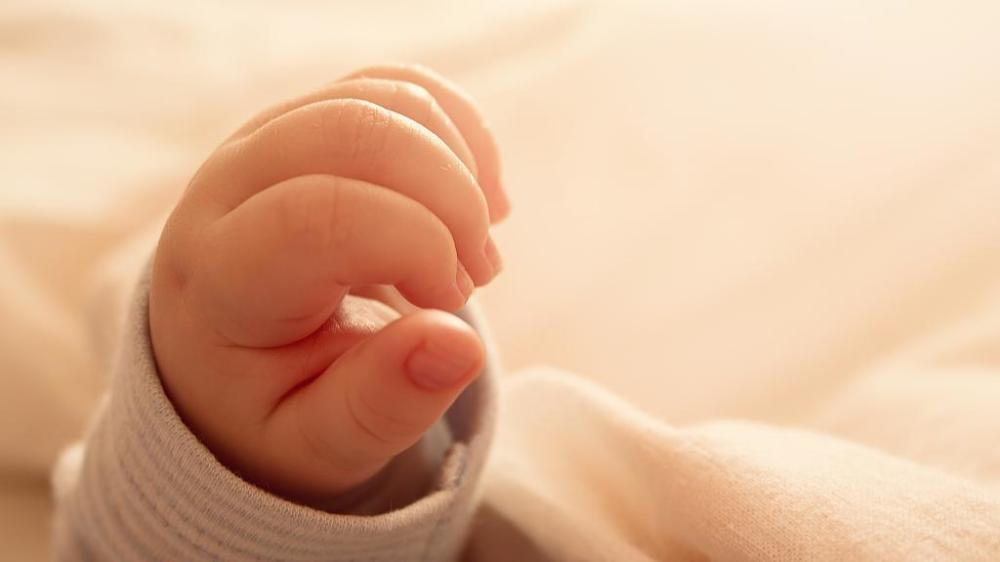

# 河南平顶山人口发展报告：家庭生育行为明显低于社会预期

“自然增长率的不断下降警示我们必须高度重视人口出生规模的变化，加紧落实有力的鼓励生育政策，加大劳动适龄人口的力量储备。”

3月8日，河南省平顶山市2022年人口发展报告在平顶山市统计局官网上发布。报告称，根据2022年人口变动情况抽样调查结果推算，平顶山市常住人口总量继续下降，自然增长人口大幅缩减，人口老龄化程度持续加深，城镇化水平稳步提升。

2022年末，全市常住人口4961253人，比2021年末减少6786人（2021年比2020年减少19852人）。2022年末，全市公安口径户籍人口5697659人，比2021年末减少7247人。常住人口和户籍人口总量呈现双下降趋势，主要是出生人口减少和外出人口增加所导致。人口是经济运动的出发点和归宿点，人口数量的多少，对经济发展有着重要的影响。地区生产总值稳定增加，人口总量下降和经济发展初步呈现背离趋势。

2022年，全市出生人口38559人，出生率为7.77‰；死亡人口37540人，死亡率为7.56‰；自然增长人口1019人，自然增长率为0.21‰。上述人口发展报告指出，受生育观念转变、婚育年龄推迟、养育预期焦虑等因素影响，家庭生育行为明显低于社会预期，自然增长率创历史新低。

与2021年相比，平顶山全市出生人口减少1460人，出生率下降0.32个千分点（全省下降0.58个千分点）；全市死亡人口增加525人，死亡率上升0.10个千分点（全省上升0.14个千分点）。

就此，人口发展报告分析称，这既有全面二孩政策效应的弱化和育龄妇女减少的因素，还有人口流出加剧和人口老龄化提速的因素，也反映了医疗卫生事业发展和人口寿命延长的情况。自然增长率的不断下降警示我们必须高度重视人口出生规模的变化，加紧落实有力的鼓励生育政策，加大劳动适龄人口的力量储备。

报告还介绍，2022年末，全市0—15岁人口为1216142人，占全市人口的24.51%（全省为22.95%）；16—59岁人口为2795024人，占全市人口的56.31%（全省为58.18%）；60岁及以上人口为950185人，占全市人口的19.18%（全省为18.86%）。与2021年末相比，0—15岁人口减少5.13万人，16—59岁人口增加2.19万人，60岁及以上人口增加2.27万人。少儿人口继续减少，老龄化进程进一步加快，人口负担系数增大，人口红利正在逐渐消退。

