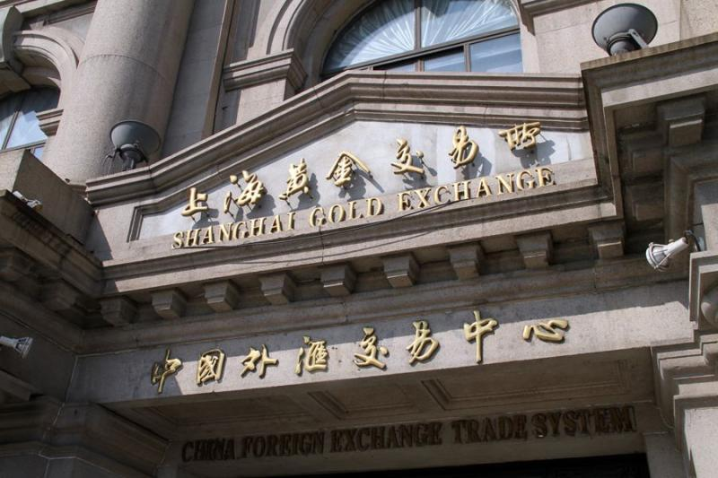
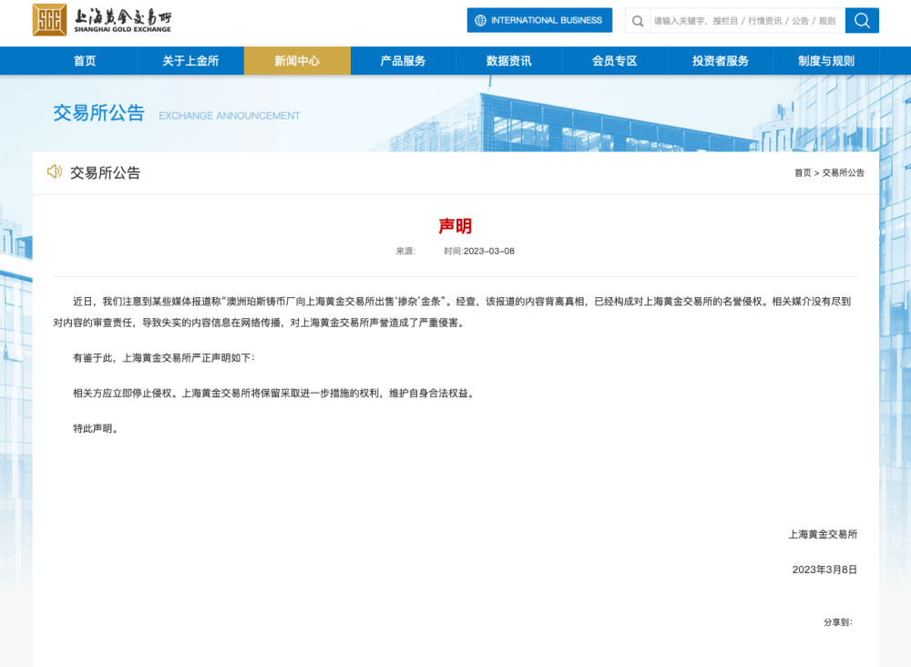

# 澳洲一铸币厂向中国出售“掺杂”金条？上金所：报道内容背离真相

3月8日，上海黄金交易所（下称“上金所”）发布声明称，近日注意到某些媒体报道称“澳洲珀斯铸币厂向上金所出售‘掺杂’金条”。

经查，该报道的内容背离真相，已经构成对上金所的名誉侵权。相关媒介没有尽到对内容的审查责任，导致失实的内容信息在网络传播，对上金所声誉造成了严重侵害。

有鉴于此，上金所严正声明如下：相关方应立即停止侵权。上金所将保留采取进一步措施的权利，维护自身合法权益。

据环球时报3月7日报道，近日，澳大利亚广播公司爆出惊人猛料，称位于该国西澳大利亚州著名的珀斯铸币厂，竟然涉嫌将上百吨不符合上金所要求的金条卖到了中国，而且还对中方隐瞒了这一情况。

环球时报称，从澳大利亚广播公司的介绍来看，被爆出这一丑闻的珀斯铸币厂，由于开办的历史相当长——可追溯到19世纪，同时又是当今世界上最大的铸币厂之一，所以这不仅令该铸币厂成了澳大利亚当地著名的旅游景点，更令其在全世界都享有不小的名声。

然而在2018年，这家铸币厂为了“节省开支”，开始在制作金条时采用了掺入杂质进行稀释的做法。这种被掺入的杂质主要以银和铜为主。

此前报道：

澳大利亚出大丑闻：将上百吨掺杂质的金条卖往中国，并隐瞒相关情况

