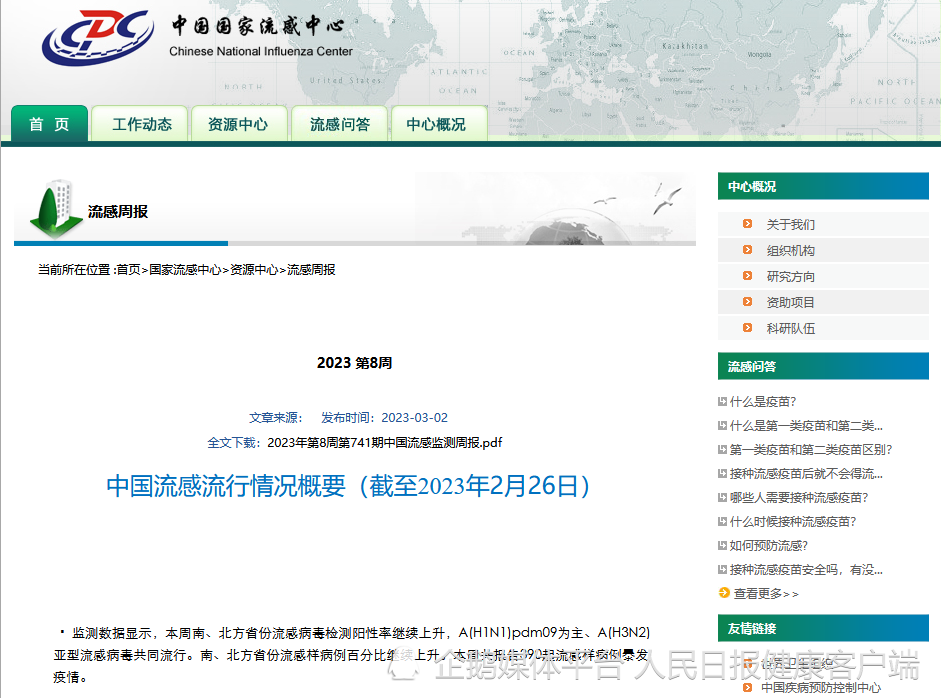

# 甲流阳性率继续上升，北京、上海多地发布中医药防治方案

**人民日报健康客户端记者 高瑞瑞**

“甲流属于温病范畴，‘冬不藏精，春必温病’指的就是这个病毒。中医治疗甲流，应因时、因地、因人制宜，辨病与辨证相结合，随证加减。根据证候类型，采用疏风解表、清肺解毒、凉血解毒等内外治法。”北京市丰台中西医结合医院感染科主任王波告诉人民日报健康客户端记者。

当前，流感处于感染高峰期，根据中国国家流感中心2023
第8周监测数据显示，本周南、北方省份流感病毒检测阳性率继续上升，A(H1N1)pdm09为主、A(H3N2)亚型流感病毒共同流行。南、北方省份流感样病例百分比继续上升。本周共报告390起流感样病例暴发疫情。

“目前正处于甲流的流行期，主要有H1N1和H3N2两种流行株。从患病人群来看，近一两周，学生及青中年患者较多。针对目前流行的甲流，医院为发热门诊选派了有经验的中医师出诊，我们根据患者的危险人群分层，给予中西医结合的治疗方案。”王波告诉人民日报健康客户端记者。

人民日报健康客户端梳理，针对目前全国甲流疫情的发展情况，目前多地中医管理局制定了中医药防治方案。

3月6日，上海卫健委官微发布了《2023年上海春季流感中医药防治方案（试行）》，制定了针对流感治疗的儿童中药协定方药和中成药，还提出了一系列简便验廉的中医外治法，家长还可以通过食疗，推拿、耳穴、敷贴和香佩疗法等外治法开展中医药干预。

3月2日，北京中医管理局官微发布了《2023年北京春季流感中医药防治方案（试行）》，同时还印发了《2023年春季流感治疗相关中成药推荐目录》。《推荐目录》中从疏风解表、清瘟解毒、疏风宣肺、化痰止咳、理气和中等多个方面推荐了36款适用中成药，包括连花清瘟胶囊等名列其中。

据上海卫健委官微介绍，上海方案执笔者之一、上海市新冠中医药救治专家组副组长、曙光医院肺病科主任张炜认为，流行性感冒是由流感病毒所引起的呼吸道传染病，四季均可发生，以冬春季为主。潜伏期一般为1~2天；发病时多见高热，最高体温可达39~40℃，伴有畏寒，常持续2~3天，病情发展大多呈现自限性的特点，部分体弱儿童，以及合并有基础疾病的老年人群可因外感引发其它并发病证，则是中西医防治的重点。

王波向记者分析道，中医在治疗甲流方面具有减缓患者症状，缩短疾病病程，副作用小，见效快等特点，目前甲流的核，对于甲流的高危人群，可以通过神经氨酸酶抑制剂和RNA聚合酶抑制剂两种阻断病毒药物。在中医方面，可以通过优化和筛选一些针对甲流的中成药对患者进行对症治疗。建议甲流患者在专业医生指导下选择药物，尤其在应用清热解毒类药物时，避免药物过寒而伤及脾胃，甚至出现寒遏冰伏，使症状加重。

