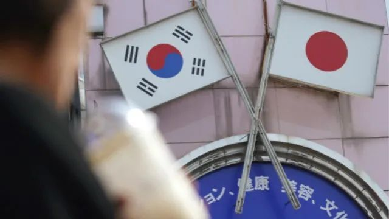

# 贸易对抗熄火历史赔偿松动，日韩“大和解”受美日欢迎，韩民间反对

日本和韩国要“和解”了？

韩媒3月6日报道称，韩国外长朴振在记者会上正式公布韩国政府解决二战期间被日本强征劳工对日索赔问题的第三方代赔方案，即拟由韩方设立一个公共赔偿基金，从韩国私人领域筹措资金，向1910年至1945年间被日本殖民者强征为劳工的韩国受害者支付赔偿。

中国外交部发言人毛宁3月6日在被问及“韩国外长朴振6日正式公布日本二战强征劳工第三方代赔方案，中方对此有何评论”时表示：“强征和奴役劳工是日本军国主义在对外侵略和殖民统治期间对包括中国、韩国等在内的亚洲国家人民犯下的严重人道主义罪行。这一历史事实铁证如山，不容否认和篡改。中方从来要求日本政府以诚实和负责任的态度妥善处理有关历史遗留问题。这就需要日方切实正视和深刻反省历史，以实际行动体现对历史罪行的忏悔和对受害者的尊重，同时以正确史观教育下一代。只有这样，日本才能真正取信于亚洲邻国和国际社会。”

一直以来，这一索赔是横亘在历届日韩政府间悬而未决的历史问题之一。2018年10月，韩国大法院（最高法院）判令日本涉案企业赔偿二战时期被强征的韩籍劳工受害者。近一年后，日本政府于2019年7月采取反制措施，限制对韩出口高纯度氟化氢、氟聚酰亚胺、光致抗蚀剂三种关键半导体材料，同年8月还将韩国踢出适用简化出口程序国家白名单。韩国于2019年9月将日本对韩采取出口限制一事诉诸世贸组织（WTO）。日韩间贸易摩擦一触即发。

目前，日韩两国产业部门表示，将就解除出口管制启动磋商。期间，韩国将停止在WTO对日本的诉讼程序。

随着日韩在劳工赔偿问题上出现了松动，是否意味着已降至低谷的日韩关系未来会朝着相互和解迈进？

**美日欢迎，韩民间反对**

对于韩方的决定，日方表示欢迎。日本外务大臣林芳正说：“日本政府认为韩国政府今日宣布的方案是促进日韩关系恢复健康的举措，双方关系在2018年韩方裁决以后陷入非常严峻的局面。”大洋彼岸的美国也第一时间发声。美国国务卿布林肯发声赞赏韩方举措，称韩国和日本是“美国重要盟友”，并再次强调美日韩三边关系重要性。

不过，韩国国内民众对政府此番操作普遍不满。主要在野党共同民主党批评尹锡悦政府这一方案是“投降外交”。共同民主党党首李在明把这一“代赔”方案称之为韩国“外交历史上最大的耻辱和污点”。

对此，中国国际问题研究院亚太研究所助理研究员李旻告诉第一财经，5年多来，起初，韩国民间反应激烈，比如采取了抵制日货、不去日本旅游等举措，但这些年间，随着时间的流逝，韩国民间的反日情绪也开始出现了疲劳，已恢复到2018年前购买日本货的情况，同时去日本旅游也出现热潮。“反日情绪的变化也算是给了尹锡悦政府改善日韩关系的一点底气。”他说。

在赔偿方案中，韩方希望以韩国企业“代赔”的形式，盼日本企业能“自愿”捐款。对此，林芳正表示，对于日本公司自愿向韩国政府下属的基金会捐款，“（日本）政府不会采取任何特别的立场”。

对于这一赔偿形式，李旻不否认此举会招致韩国国内的反对。“但目前在韩国国内，进步势力，也就是在野党党首李在明官司缠身、党内分裂严重。在这种情况下，对于尹锡悦而言，牵制力量自顾不暇。”李旻说，“改善日韩关系也是尹锡悦就任韩国总统后一直在谋划的内容，他此前的竞选纲领中也包含这些内容，当前算是找到了比较好的时机。”

首尔科学综合研究生院大学主任教授黄菲认为，尽管日方表示在贸易、军事等领域可以进一步加强日韩紧密合作，“但对韩出口管制和强征劳工是两码事。所以尹锡悦政府这样大幅度的让步妥协，并没有换来日本的积极应对。何况日韩还有很多的历史问题交织，比如教科书问题、参拜靖国神社的问题等，这些问题在日后都是一触即发的，所以并不能说从现在开始日韩的关系就彻底和解了。”

6日当天，这一方案引发部分韩籍受害劳工及家属和市民团体的强烈反对，并敦促尹锡悦政府撤回该方案。

李旻则认为，目前韩方已抛出了橄榄枝，后续就看日方如何接招。据外媒报道，
**日韩两国目前已在协调尹锡悦3月中旬访日并与日本首相岸田文雄会谈的事宜。有方案提议尹锡悦访日日程安排在16日至17日。而日韩首脑上一次在日本会谈，还是在韩国大法院判决前的2018年5月，时任韩国总统文再寅访日时实现的。**

**哪些因素在背后助推？**

尹锡悦政府缘何会做出如此改变？李旻认为，这其实是内外因共同作用的结果。“韩国的这届政府，非常强调国家的身份认同以及所处的阵营。在尹锡悦政府看来，日本是需要积极靠拢的对象。所以可以看到韩国对日战略从文在寅政府时期的模糊相处，到如今逐渐清晰，即要明确改善日韩关系。”李旻说。

此外，两位采访对象均认为，尹锡悦政府对朝鲜半岛的关切也在某种程度上助推了日韩关系改善。李旻认为，其中有加强日韩安保方面的动因。黄菲则表示，在尹锡悦政府看来，半岛局势是关乎到韩国国民安全的首要问题。

黄菲还认为，经济也是一个关键因素，毕竟与日本出口管制相关的产业涉及韩国的半导体和高端制造业，“如果不去直面韩日间的尴尬关系，那么经济上的被动局面始终将得不到解决。”据她介绍，之前文在寅政府时期就号召韩国大企业自力更生，确保供应链不出差池。“当时记得还宣称：没有日本，我们（韩国）也不差。”黄菲说，“但现在看来影响还是非常大的。可能不仅仅是限制原料出口的问题。韩国企业愿意出钱，就表明，在经济利益权衡上利用这笔钱换回与日本的经济正常合作，显然是划算的。”

在李旻看来，美国因素则是助推日韩关系改善的一个不可忽视的外因。“美国的目标需要加强美日韩三边安全合作。文在寅政府开始就受到来自美国的压力，到尹锡悦政府时则变得更明显。可以看到，其实美日韩三边，不管是首脑外交，还是政府工作层面的接触，都是非常频繁的。”他说道。

黄菲认为，“美国一直希望日韩恢复正常的关系，不要老闹别扭，这是美国出于本国利益优先的考虑。”美国白宫7日发布消息称，韩国总统尹锡悦将于4月26日赴美进行国事访问。

那么，日韩关系的改善，将如何影响东北亚？李旻认为，这其中有利有弊。“东北亚不仅有美日韩，还有中日韩。之前中日韩三边会议被搁置，很大一部分因素就是日韩矛盾的影响。”李旻告诉第一财经，等日韩关系缓和后，中日韩三边关系能否有所提升，将是关注的焦点。

