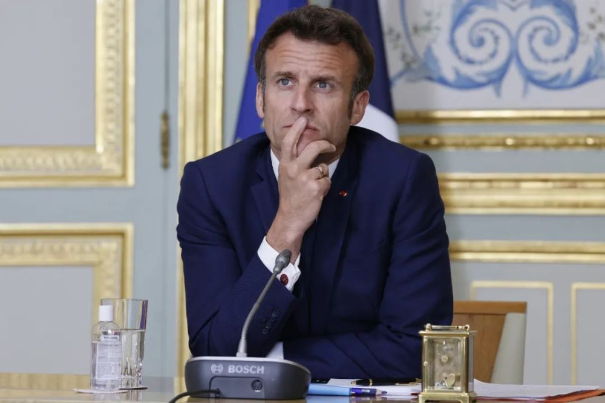
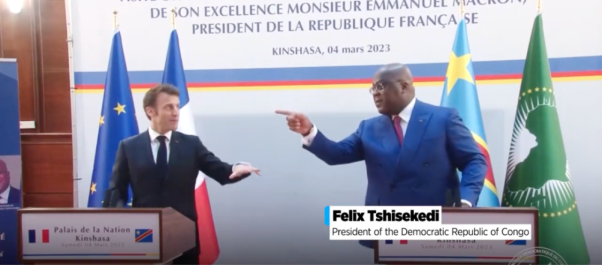

# 马克龙“访非吵架”，暴露法国困境

刚刚结束非洲之行的马克龙，最后一站行程并不愉快。

3月1日起，法国总统马克龙开始对非洲四国的访问。在非期间，马克龙先后访问了加蓬、安哥拉、刚果（布）和刚果（金），此行被认为意在重拾法国在非洲的影响力。

在访问开始前，马克龙宣布“法属非洲已成为过去”，并誓言与非洲国家建立新型伙伴关系模式。他还表示，在非洲面前法国必须展示出“深刻的谦逊”。

然而，就在非洲之行的最后一站刚果（金），马克龙却遭遇尴尬一幕——在和刚果（金）总统费利克斯·齐塞克迪召开的联合新闻发布会上，两人当场“吵起来了”。

_马克龙 资料图_

彭博社指出，刚果（金）东部地区与乌干达、卢旺达和布隆迪接壤，矿产资源丰富，当地活跃着100多个反政府武装组织，暴力冲突频发。

法国《费加罗报》称，近两年来，刚果（金）在北基伍省面临反政府武装“M23运动”发动的战争，刚果（金）指责卢旺达支持该运动，因此寻求盟友对卢旺达施加压力。

据非洲当地媒体报道，3月4日，马克龙与齐塞克迪会面并举行联合新闻发布会。两人在会上谈及刚果（金）东部地区的动荡局势。齐塞克迪表示，动荡局势已经造成近700万人流离失所，并敦促马克龙对卢旺达实施国际制裁。

但马克龙没有直接回应齐塞克迪的要求，只是称法国“会忠实于作为刚果（金）坚定盟友的角色，捍卫其领土完整和主权”。

齐塞克迪又谈到1994年的卢旺达大屠杀事件，称这一事件当时蔓延到刚果（金）东部地区，其遗留的问题至今仍困扰着当地民众，是东部地区诸多冲突的根源。

马克龙当即反驳称法国在该地区的暴力事件中没有责任：“自1994年以来，这不是法国的错，请原谅我说得如此直白，你们没有能力在自己的国家恢复主权，无论是军事、安全还是行政，这就是现实。”

指责完刚果（金）政府无能后，马克龙继续表示：“你们不需要在国外寻找替罪羊。”

此后，两人的言辞愈发激烈，齐塞克迪回应说：“欧洲，尤其是法国，对待我们的方式必须改变，你们必须尊重我们，以不同的方式对待非洲。”

齐塞克迪要求法国不要以“高人一等的态度”看待非洲：“ 你们必须把我们视为合作伙伴，而不是用家长式的作风对待我们。”现场随即爆发阵阵掌声。

_新闻发布会视频截图_

《费加罗报》指出，马克龙为自己辩护，称自己是“坚定的盟友”，但又说法国“不需要充当救世主来提供解决方案”，这一点没有说服力。

刚果（金）一位官员表示：“齐塞克迪总统十分恼火，因为他希望（法国）采取制裁措施。”而齐塞克迪之所以抱有如此期望，也是因为去年12月，法国国务秘书赫丽苏拉·扎哈罗普卢曾明确谴责卢旺达支持“M23运动”。

这一插曲为马克龙的非洲行蒙上一层阴影。长安街知事（微信ID：Capitalnews）注意到，恰恰是这场争吵，暴露了法国意图经营非洲面临的困局。

在非洲之行开始前，法新社报道称，马克龙此访试图通过外交驱动力“检验法国与非洲之间所谓新型‘负责任的关系’”。

3月2日在加蓬首都利伯维尔，马克龙表示，法国不会再像过去那样干涉非洲国家内政，“法非特殊关系”时代已经终结，法国希望重塑与非洲国家的关系。

“法非特殊关系”是指从20世纪60年代起，原法属非洲国家纷纷独立后，法国依然通过经济援助与合作、货币关联和控制、驻军等方式影响这些国家，以换取资源和军事基地，被不少人诟病其本质仍是殖民主义。

俄卫星社称，长期以来，法国一直想要摆脱非洲殖民国家的形象。马克龙在出访之前还曾说，法国需要在同非洲交往的过程中展现出极为谦逊的态度。然而在这场争吵中，马克龙的表现却难言“谦逊”。

要知道，马克龙出访非洲的背景并不乐观：法军被接连赶出马里等国，反法抗议在非洲多国此起彼伏，要求废除非洲法郎的声音不绝于耳，法国在非政治和经济影响力日益下降……

历史和现实因素交织，给法国与非洲的相处之道提出了更为严格的要求。想要重塑与非洲国家的关系，法方的每一个微小言行，都会成为外界对其“新型负责任的关系”口号的考验。在刚果（金）发生这场争吵之后，人们至少有三方面的疑问。

一问，法国的目的真是与非洲打造“新型负责任的关系”，还是另有所图？

按马克龙的说法，“负责任的对非关系”指的是一种互惠的伙伴关系。但有学者指出，马克龙最主要的目的是借这种关系来维护法国在非洲的利益，特别是在非洲一些资源比较丰富的国家。

马克龙此次出访的4个国家，资源都比较丰富。就拿加蓬来说，该国享有“资源宝库”和“绿金之国”的美誉，森林覆盖率高达85%，可开采面积约为国土面积的60%，是非洲石油、锰矿砂和木材生产大国。加强与这些国家的联系，对法国获取丰富的战略资源和石油资源来说非常重要。

_访问加蓬期间，马克龙参观当地植物园。图源：视觉中国_

二问，法国的对非政策是长期稳定、一贯的，还是朝令夕改、投机的？

“（马克龙的）这次访问没有任何政治或战略上的连贯性，感觉就像他们在执着于某种东西。”加蓬反对党国家联盟副主席让·加斯帕德·恩图图梅·阿伊说。

可以预见，法国提出的新对非政策实施起来，实际面临的困难不在少数，法国真有诚意排除万难、持续推进新政吗？还是会像这次争吵一样，一旦遇到需要商榷的问题，就只是推责和指责？

三问，马克龙政府是否有足够的诚意，以期改变非洲国家的态度？

就在马克龙到访前，数十名民众来到法国驻刚果（金）首都大使馆前示威抗议。分析指出，长期以来，法国在处理对非关系时一直抱着殖民者心态，经常干涉非洲国家内政，这一点很难在短期内作出改变，非洲国家不会抱太大的期望。

土耳其阿纳多卢通讯社援引“中东研究中心”研究员 Abdennour Toumi 的话称，马克龙仍然将非洲视为法国的“后院”：“
非洲大陆的反法情绪非常强烈，巴黎必须修改其非洲政策。今天，非洲青年不再依赖法国，他们有其他选择。”

而在当前形势下，法国对非政策的被动转向，其核心是为谋求自身利益，非洲国家对此也很清楚，要想取信于非洲国家和人民，法国的诚意需要经得起时间的检验。

齐塞克迪对马克龙的忠告很实在：“如果法国希望与非洲大陆的其他潜在伙伴合作，就需要认真倾听非洲人民的需求。”

