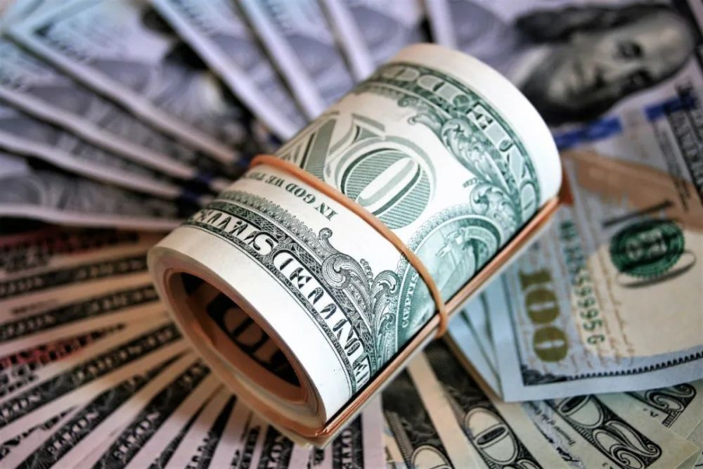

# 黑石CEO，月入7个亿

文丨杨博宇

来源丨投中网

近日有几则外媒消息引发了很大的讨论声音：黑石集团联合创始人兼首席执行官苏世民（Stephen
Schwarzman）去年获得了超过12.7亿美元的薪酬和分红，约合人民币87.63亿，相当于每月入账7.3亿元。

既然讲收入高，就要有个标准，而12.7亿美元这个数字，就算是在以“高薪”著称的华尔街也无出其右。

不过12.7亿美元的总收入，并非全部都是薪资。其中，2.531亿美元为报酬总额（包括近1.905亿美元的结转利息和激励费用）。而剩下的部分，则是来自于公司派息。黑石集团在2022年支付的每股股息总额为4.40美元，苏世民是公司最大股东，持股约19%，得到了10.2亿美元的股息。

此消息一出，立刻引起媒体口诛笔伐。“他没有为投资者赚到钱，但是却为自己赚了钱！”美国财经网站24/7wallst撰文评价道。

确实如此，黑石集团在2022年可谓流年不利。投中网在《凛冬将至，黑石一笔债券也违约了》一文中写道，黑石集团刚刚违约了一笔5.31亿欧元的债券。此外，去年由于对商业房地产市场的担忧，大量投资者寻求赎回投资。但黑石集团紧急限制了旗下房地产投资信托基金（BREIT）的资金赎回。引起了投资者们强烈不满。

不过更让投资者怨声载道的，是2022年黑石集团的营收和股价大幅下降。据财报显示，黑石2022年度营业收入同比下滑74.78%，为34.61亿美元；净利润同比下滑75.85%，为29.88亿美元；股东可分配收益同比下滑70.16%，为17.48亿美元。其股价从2022年最高的128.53美元，跌到了目前的91美元，一年时间跌去了26%。

不过针对CEO的天价收入，黑石集团也有一番说法。在一份给路透社等媒体的电子邮件声明中，黑石写道：“我们高级管理人员的上市报酬中，有很大一部分与2021年的业绩有关，由于奖励时间的原因，这些报酬是在第二年支付。”“在2022年，黑石集团提供了创纪录的可分配收益，有2260亿美元的资金流入，并实现了我们历史上一些最有利可图的基金投资。”而苏世民30%的上市薪酬是与黑石集团2021年的业绩挂钩，而剩下的部分是2022年上半年的奖励性报酬。另外必须强调一下，苏世民的基本工资依然只有35万美元。

那么，华尔街的其他管理人呢？

高盛集团将首席执行官大卫·所罗门（David Solomon） 2022年的薪酬削减了29%至2500万美元；摩根大通首席执行官杰米·戴蒙（Jamie
Dimon）的总薪酬则保持不变为3450万美元；摩根士丹利行政总裁詹姆斯·戈尔曼（James Gorman）
2022年的薪酬减少10%至3150万美元；美国银行行政总裁布莱恩·莫伊尼汉（Brian Moynihan
）2022年的薪酬减少6.25%至3000万美元。

而与黑石集团同台竞技的凯雷，也于近期公布了CEO的薪资。据东四十条资本报道，凯雷刚刚走马上任的CEO哈维·施瓦茨，薪资有望在5年内获得1.8亿美元（前提是哈维·施瓦茨能够成功提振凯雷的股价）。

相比之下，苏世民的收入吊打一众大佬。现实地讲，这笔高额的收入一定不是全无由来的，仔细分析的话，逻辑大概有二：一个数字，一个身份。

首先是数字，资管规模。

苏世民的天价收入，与黑石集团巨大的资产管理规模密不可分。黑石曾预计，2022年其管理规模将提升至1万亿美元。而到2022年末，其披露的数据显示，管理资产规模已经高达9747亿美元，同比增长11%，距离万亿美元目标只有一步之遥。

相比而言，黑石集团的管理资金规模几乎是KKR、凯雷和TPG三家之和。（2022年末，KKR管理资金规模为5040亿美元，凯雷3730亿美元，TPG1350亿美元，三家合计约10120亿美元）。据此前投中网报道，黑石的管理费用收入占比高达86%。可见，相比于投资回报，管理费才是黑石等机构真正的稳定来源。

而且今年开年，黑石集团就再次显示了强大的募资能力。美国加州大学首席投资官办公室 （UC
Investments）向黑石房地产投资信托基金(BREIT)的第一类普通股 (Class I common
shares)投资40亿美元，约合人民币275亿元。

虽然遭遇了年前的赎回风波，但是加州大学依然看好黑石集团的投资能力：“BREIT是美国最具优势的大型房地产投资组合之一，其管理者也是世界顶级的房地产投资者之一。”他们认为，“在当前环境下，投资者可以从稳定的现金流投资中获益，这类投资的收益会伴随全球通胀走高而实现增长。”能否如愿以偿，还需要时间来检验。

其二，就是创始人这个身份。

1985年，苏世民怀揣40万美元创办黑石，至今已过去38年。2018年联合创始人彼得·乔治·彼得森（PeterG.
Peterson）离世。今年苏世民也已是76岁高龄。

和他同时代的大佬，都已经退居二线。凯雷的两位联合创始人比尔·康威和大卫·鲁宾斯坦先后推选李揆晟、哈维·施瓦茨领导公司；KKR早在2021年换帅，两位少壮派领袖约瑟夫·贝、考特·纳托尔成为公司的新任联席CEO。桥水基金的瑞·达利欧也已经将控制权移交给新一代管理层。

黑石“太宗”还要奋斗多久？

70后首席运营官乔纳森·格雷(Jonathan D.
Gray）一直被认为是最佳接班人。格雷于1992年加入黑石集团，于2005年成为房地产业务的联合主管，并于2011年升任为房地产的全球主管，负责领导美国、欧洲和亚洲的酒店、办公室、零售、工业和住宅物业的投资。其最成功的投资案例，是主导了对希尔顿酒店的杠杆收购。

2007年秋，黑石集团在房地产泡沫高峰期斥资260亿美元（自有资金56亿美元）通过杠杆交易收购了希尔顿。但随着2008年金融危机到来，希尔顿酒店收入下降了20％，现金流下降了约30％。外界一度认为这是黑石最危险的收购之一，很可能损失56亿美元的大部分资金。

但在格雷和职业经理人纳塞塔的通力合作下，希尔顿的市场份额和利润率都显著增长。2013年12月，希尔顿上市，随后股价一路走高。最终黑石在这一笔交易中，获利140亿美元。这笔投资也成为全球私募股权史上，最赚钱的房地产交易案例。

2018年，格雷取代詹姆斯成为黑石集团总裁兼首席运营官，正式成为二号人物。此次公开的信息显示，格雷2022年的总薪酬跃升近90%，达到2.965亿美元。包括约1.62亿美元的结转利息和奖励费，还有因持股3.4%派发的1.827亿美元分红。虽然比不上自家领导，但也是业内顶破天的存在了。

格雷能否重复希尔顿的奇迹，带领黑石摆脱颓势？目前尚为未知数。不过这应该是投资人最想看到的一幕。

另外一句题外话：所以大家就懂了为啥有条件投资机构都要在资管的路上狂奔了吧，真香啊！

