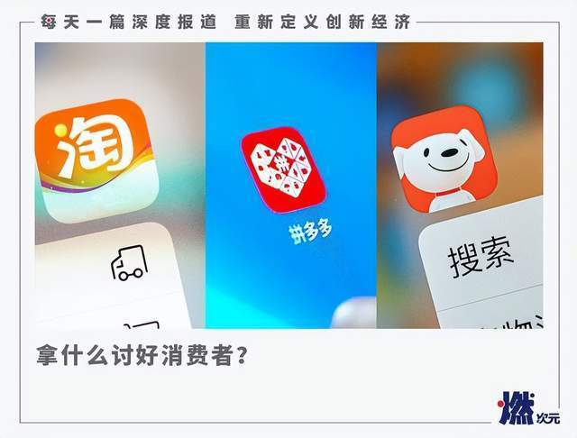
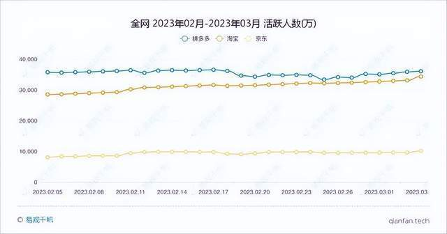
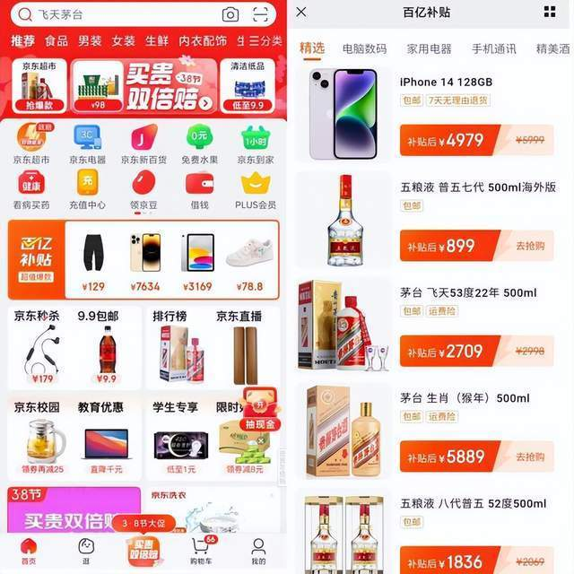
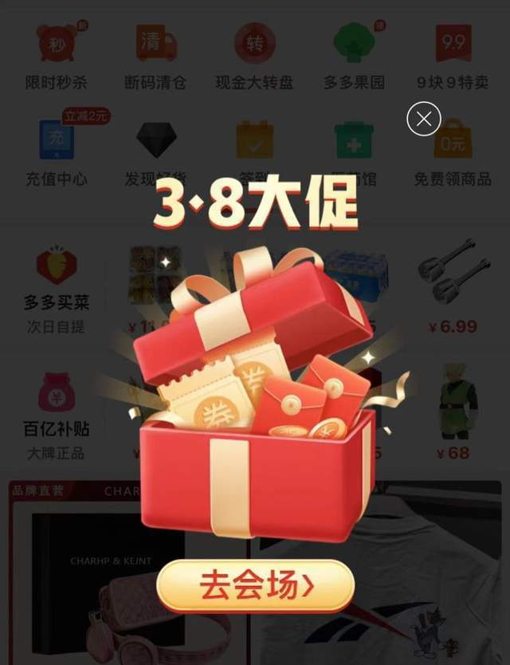

# 38大促，无人关注：预热宣传热闹，但消费者不买单

燃次元（ID:chaintruth）原创

作者 | 冯晓亭

编辑 |饶霞飞

3月9日零点一过，便意味着，为期数日的“38大促活动”也收官了。

既没有成交数据，也没有业绩通稿，作为2023年开年的首场电商S级大促活动，在一片寂静中落幕了。

**有意思的是，38大促结束得多么“安静”，前期预热宣传就显得多么“热闹”** 。

正所谓“兵马未动粮草先行”，营销推广往往走在活动前。今年38大促也不例外，在2月下旬时，各大平台就摩拳擦掌积极参战，APP图标换新、活动预热、商品预售，一套组合拳下来，大促气氛给烘托起来了。

特别在2月份“京东要在3月初上线‘百亿补贴’”的传闻“渲染”下，更是让不少消费者也做好了“薅羊毛”的准备。

“38大促本来就有活动，特别京东又是百亿补贴又是买贵双倍赔偿的，仍凭谁听了都会想等38活动上线了再购物吧。”2月份就有意购置运动手表和运动耳机的楚萍，便特意为即将上线的38促销活动多等了半个月时间。

**但随着活动的落幕，“低价”似乎成了这场S级大促，为数不多的亮点** 。

京东拿出“百亿补贴”和“买贵双倍赔”为诚意；淘系在跨店满减基础上，天猫延续了年货节的“官方立减”玩法；拼多多则加强了官方补贴力度。电商界新秀抖音电商和快手电商也不甘示弱，流量扶持和现金补贴下，玩法多样，场景也多出现“全网低价”字眼。

平台把“低价”当武器无可厚非，毕竟消费者不是“冤大头”，消费者更愿意为“性价比”买单。

但实际成效几何？

在38大促活动期间，紧盯销售的某位京东事业部员工在38大促结束后，只淡淡对燃次元说了一句，“没有掀起一片浪花。”

眼巴巴盼了38大促半个月之久的楚萍，除了清单必买的两款商品，并没有额外进行消费，“之前大促，都是说不买最后待发货订单二十多个，反而这个38节，总共就下了三单，而且在3月4号那天就结束了战斗。”

**据多位商家和消费者向燃次元反应的情况来看，这场S级电商大促，并未让消费者提起更多兴趣** 。

“数据和平日对比，的确有增长。但要和早几年那种成倍的增长相比，太弱了。”寄望于38大促期间推一把店铺女装春季上新的陈生，直言转化率不甚理想，“电商平台的增多，总的线上流量被打散，同时广告成本又水涨船高，还能小赚就知足了。”

如下图易观千帆数据所示，拼多多、淘宝和京东这三家电商平台近30日全网日活数据如下图所示，38大促期间，三个平台的日活数据都有增长，但并不多。甚至拼多多和京东在38大促期间日活数据也并不是近30日内的最高点。

图/三家电商头部平台近30人全网日活数据

来源/易观千帆

和2022年“惨淡”的618以及双11这两场同为S级的大促活动相比， **2023年的这场38大促，因知名度稍逊色，在“惨淡”上，唯恐有过之而无不及** 。

01

**首个S级活动，预热到位**

尽管关于38电商促销活动的地位，业内有争议。但受刘强东回归后雷厉风行态度下推动的“低价战略”影响，已有多年历史的38大促活动，在预热前，更是徒增了许多看点。

在零售电商行业专家庄帅看来，“38”不能算是大促，只能算是普通的节庆活动。所以电商平台对这样的中型促销活动投入资源和人力比较少，传播力度也较弱。

和618、双11这两个家喻户晓的“大促活动”相比，“38活动”的确谈不上“大促”，但在电商平台造节热之下，在年初节点的“38活动”，的确也是全平台多品类、多部门合力发起的“S级”营销活动。

作为“S级活动”，38大促尽管国民热度不够，但节前三大购物平台更新的APP图标上打出的“38节”“38大促”字眼，以及S级活动应有的平台满减等系列操作，还是吸引了消费者的关注。

尽管38大促的战线并不算长，但为了吸引尽可能多的消费者在平台进行消费，电商平台的38大促还是早早在2月下旬就拉开预热帷幕。

京东从2月24日便开始预热38大促，3月1日开启专场，3月3日开始正式销售。其中京东在38大促中还有个小插曲，原定于3月6日全面上线的“百亿补贴”，实则在3月2日晚便悄悄上线，但据燃次元3月2日晚观察来看，当晚上线的“百亿补贴”频道还未上线京东主页，用户只能通过链接跳转，没有搜索功能的同时，商品数量也谈不上丰富。

但提前外传链接的京东“百亿补贴”，还是给不少消费者打了一剂鸡血，可惜效果寥寥。

图/38大促期间，京东“百亿补贴”界面

来源/京东APP 燃次元截图

“一看到群里在传京东百亿补贴的链接，我就迫不及待点进去看了。”来自北京的消费者奇奇告诉燃次元，当晚他便将链接里“精选”一栏的商品浏览完了，但频道内的商品无一激起奇奇兴致，“看完之后的感觉就是，有优惠但不多。完全打动不了我，让我有激情下单的冲动。”

和京东相比，淘系平台的活动则相对平静。

淘系将38大促命名为“38焕新周”，顾名思义，活动时间为一周。3月2-4日为活动预热期，3月4日晚8点至8日24点则为正式活动期。天猫店的主要玩法为官方立减，此外还包括20点前N限时限量秒杀，购物车惊喜直降等玩法；淘宝店的主要玩法为跨店满减，此外还有品类券、惊喜券等消费券发放。

拼多多也在2月底上线了38节大促活动，除了满减活动外，还额外发放388元满减消费券包。38活动主场入口也被提为了一级入口，用户只需通过首页底部的活动入口即可直达大促会场。

传统电商平台外，电商新秀抖音电商和快手电商的表现同样积极。

38节大促期间，抖音电商在满减活动之余，出资提供数千万张消费券供消费者使用。快手电商则从原先提出的8亿现金加码至发放10亿消费券，此外快手上大牌大补活动将由平台出资，通过平台审核的商家商品可享受一定比例的价格补贴。

不难看出，38大促，作为2023年全平台的首个S级活动，各平台都给予了相应的重视。

02

**消费者不买单，一切都白搭**

各平台重视下的38大促，要提及期间最大看点，无疑还是京东挑起的“价格战”。

一方面，京东追着拼多多学上线了“百亿补贴”，另一方面还提出“买贵双倍赔”服务，表示“用户在京东购买带有买贵双倍赔服务标识的商品后，如订单支付当天发现商品到手价高于拼多多百亿补贴和天猫平台，用户可申请买贵双倍赔服务。”

其他平台虽然没有和京东一样将“买贵双倍赔”摆在明面上，但围绕“价格”对的宣传依旧随处可见。

在淘宝“聚划算百亿补贴”会场，能直接看到“官方补贴·买贵必赔·15天保价”提示。拼多多百亿补贴也有“买贵必赔”的保障。而在抖音商城中，除了活动宣传外，还能见到“全网低价”字样。

来源/拼多多APP燃次元截图

然而， **即便大促力度足够大，消费者对此反应却并不明显** 。

“38大促？然后呢？能便宜很多吗？不还是满减、叠券那一套东西。”00后Cici对电商大促大促显然索然无味，“日日直播、天天低价，还有什么消费欲望能被攒下来的？”

出生于2004年的Cici，去年刚上大一，也是去年才成功注册支付宝账号，从而成为“网购大军”一员。此前有什么想买的，Cici都让家人帮忙下单，Cici如今也养成了在直播间购物的消费，“想买什么直接就买了，等到大促，要低价还得各种凑单，也太没意思了。”

“说实话，也不见得38大促有多便宜。”习惯了低价购入商品的“羊毛党”杨清清告诉燃次元，原本打算趁着38大促多囤点抽纸和洗衣凝珠的她，等了一周时间都没等到“好价”。

“对于其他消费者来说可能价格算比较低了，但对我来说大多都是刚需价。反正一周时间下来，就买了几件上新的春装，计划要囤购的商品一单也没买到。”

同样 **对今年38大促意兴阑珊的，除了消费者，还有商家** 。

“为了增加自己店铺的权重还有提升店铺信誉度，只能报名参加活动。虽然大促期间店铺客流量和销量都会提升，但将前期投入还有背后的营销成本考虑进去，实际上利润被摊薄不少。”在淘宝经营一家网店的商家说。

对此，海豚智库电商创始人李成东对于大促活动也难以激活消费者参与欲望，给出了自己的观点，“一方面，电商促销过多导致消费者对大促已经麻木了；另一方面是电商直播兴起，基本都在说全网低价，用户注意力已经发生了转移。”

李成东分析在理， **随着平台“造节运动”登峰造极，几乎月月都有的多节点促销活动，让消费者逐渐对平台的大促活动无动于衷** 。

那么，38大促还有存在的必要吗？

庄帅认为，“大促在零售电商行业是长期存在的，存在的必要性和价值是毋庸置疑的，因为通过大促可以提升平台的商家组织能力和平台运营能力，订单峰值对技术水平的提升，以及大促推动消费的作用仍将长期存在。”

换言之， **待促销对消费的拉动力度不够之时，便是大促活动失去了存在的价值之日** 。

03

**电商再卷“价格战”？**

作为2023年电商赛道第一个S级大促活动，以及作为京东重新拿起“低价”武器迎战的“第一个战场”，38大促平淡落幕之余，也引发了业内人的新一波讨论，即“电商这个旧战场的新战事，是否一触即发？”

所谓的“旧战场”，在于电商这一赛道确实很“老”。

淘宝成立于2003年，京东商城2004年上线。电商这一赛道也曾涌现了无数玩家，最激烈的交锋发生在2012年前后，当时的电商赛道，出现了七雄争霸的格局，时称“电商七雄”，分别为阿里巴巴、京东商城、苏宁易购、国美、易迅、当当网和1号店。

但正如很多朋友都不曾听说过“电商七雄”一般，十年前的“电商七雄”几经鏖战，阿里巴巴笑到了最后，成为最大的电商平台。但就在2016年阿里巴巴判断战事已经结束时，不曾想横空出世的拼多多，再次拉响了战事的号角。

当国内电商行业已经形成阿里巴巴、京东和拼多多的三强格局之时，已经牢牢攥住流量的短视频平台也开始进场做电商，电商战事可谓愈演愈烈。

来源/视觉中国

所谓“新战事”，在于当前电商格局出现松动之时，京东再次发动了“价格战”，即便刘强东方面认为重申“低价”不过是重申“自身优势”，“低价是京东过去成功最重要的武器，以后也是唯一基础性武器。”

但众所周知，价格战是商战中不可或缺的一环，“低价”的威力，毋容置疑。

在38大促期间不惜笔墨放在“低价”上的京东，深谙“低价”的魅力。

十多年前，京东对当当网和国美苏宁发起的两次“价格战”，刘强东对相关事业部员工下达的“三年内零毛利”硬性要求，让京东威名显赫，从最初一个电商界无名小卒成为巨头之一。

时光荏苒，唯恐成为“第二个苏宁”的京东，再次拿起了“低价”利器，38大促是京东重拾“低价战略”的第一个战场。

从其他平台表现来看，虽然都并没直面回复要不要陪京东参与进“价格战”中，但已然做出了防御之势。

在阿里早日举行的财报电话会上，阿里虽然直接点出“价格补贴不是新鲜事物，历史上没有哪家平台是通过价格补贴最终改变局面的”，但同时也表示自己有雄厚资金实力并做好了应对准备。

此后不久，晚点LatePost报道称，阿里的管理层们确定了淘宝今年的五大战略，分别是直播、私域、内容化、本地零售和价格力。“价格力”被阿里列为了2023年重点的突破对象，将会用阿里的主站淘宝APP来贯彻这个策略，并将性价比贯彻到整个淘宝的业务中。

与此同时，有抖音知情人士向燃次元透露，抖音电商近期也有从追求高客单价朝向追求数量方面转变趋势，调整了流量分配机制，“据我所知，下周开始抖音电商就不再重点看GPM（千次展示成交金额），而是看OPM（千次展现成交订单数）。以订单数量为优先获取自然流量，谁的订单数量越多，获得流量就越多。”

该知情人士进一步向燃次元解释，“可以理解为，低价商品将会获得更多流量，1分钱也计为1个订单。而本次调整将覆盖全抖音，包括短视频、直播间和商场。”

无论是京东躬身下场，还是阿里、抖音接下来在“价格”上的进一步举措。电商赛场，“价格战”这一新战事已然有愈演愈烈之态势。

“高性价比本就是零售业经营的基础，而精细化运营最终体现的恰恰是成本优势和效率优势，最终才能实现更高的性价比。”庄帅认为，价格竞争一直存在于零售电商行业，“2019年拼多多启动的百亿补贴在获取高线城市用户的同时，实际上同样是应对当年到现在淘宝直播、快手和抖音电商带来的低价竞争所采取的策略。”

庄帅还认为，在存量市场的竞争环境下，单一的价格竞争策略对行业格局不会带来太大的影响。

毕竟，除非拥有一个不可撼动的价格优势，从而能够阻止竞争对手以同样的方法反击，否则通过降低价格来建立一个持续的竞争优势几乎是不可能的。

但这也给电商赛道新一轮玩家留下了一个新命题，当大促魔力失效后，除了“低价战略”外，还有什么能留住消费者？

*题图及部分内文配图来源于视觉中国。

*文中楚萍、奇奇、陈生、Cici、杨清清为化名。

*免责声明：在任何情况下，本文中的信息或所表述的意见，均不构成对任何人的投资建议。

