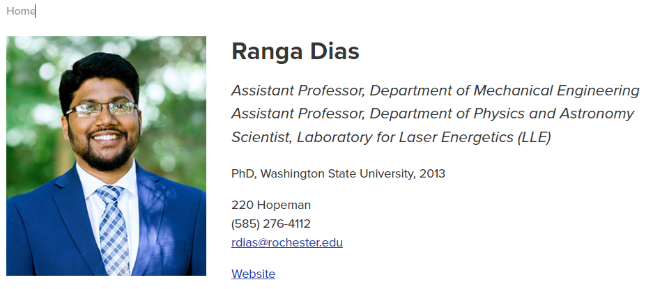

# “室温超导”新材料发现者：已重复实验有信心过审，现实应用还要几年

美国罗切斯特大学的物理学家兰加·迪亚斯（Ranga Dias）及其团队日前在美国物理学会会议上宣布，他们已经创造出一种可以在室温（room
temperature）条件下实现超导的物理学大突破！Nature凌晨发稿：21℃实现室温超导，赌城现场被挤爆。消息发布后，在全球引起轩然大波。不过，由于该团队在2020年10月发表的一篇同题论文受到质疑，最终导致《自然》杂志撤稿，这表明该团队的最新研究成果将面临更为严格的审查。

北京时间3月9日凌晨，该研究的主要作者及论文主讲人、罗彻斯特大学机械工程系和物理与天文系助理教授兰加·迪亚斯通过邮件接受了《每日经济新闻》记者的独家专访。

在专访中，迪亚斯博士对其团队此次的全新发现充满信心，他认为这将是一项重塑21世纪的革命性技术。不过他同时还指出，“要将我们对室温超导新材料的发现应用到任何规模的现实世界中，还需要几年的艰苦工作。”

迪亚斯：这将是一项重塑21世纪的革命性技术

**NBD：** 您的团队此次发现的这种新材料的可靠性如何？它与您的团队此前发现的一种硫和氢的化合物在超导方面有何不同？

**兰加·迪亚斯** ：关于我们实验工作的细节现在已经可以在《自然》杂志上找到。我们对这种新材料和实现（室温）超导所需工艺感到非常兴奋。当然，
**要开发理论上可行的技术和应用，还需要做更多的工作。**

_兰加·迪亚斯教授（图片来源：罗彻斯特大学官网）_

**NBD**
：您的团队在2020年发表的一篇类似论文，称在260万个大气压下，成功创造出了临界温度约为15℃的室温超导材料，但这篇论文后来被《自然》撤稿。您对这次您的团队宣布的新材料通过审查有足够的信心吗？

**兰加·迪亚斯** ：我们这次有信心，原因有以下几个：首先，
**这项工作在我们的罗彻斯特大学实验室和其他实验室都重复了好几次，并有第三方观察和独立的工作验证；** 其次，
**我们的论文已经经过了同行审议，并符合该出版物的严格标准** ；最后，
**我们还重新提交了2020年的论文供《自然》杂志再次审议，因为《自然》杂志编辑当时提出的问题对实验数据的质量或我们得出的结论没有影响**
。我们也对2020年当时工作和实验的质量充满信心。

**NBD** ：如果您的团队此次发现的室温超导材料最终通过了审查，那么这对全球超导行业来说意味着什么？这将如何重塑超导行业？这对全世界来说又意味着什么？

**兰加·迪亚斯** ：
**这种新的室温超导材料将改变整个超导行业，这将使得一系列技术成为可能，这些技术将改变我们使用、存储和传输能源的方式，更不用说在计算、交通和医疗设备中的更多种应用了**
。我们认为这将是一项重塑21世纪的革命性技术。

**NBD**
：您的团队称，在约21摄氏度的温度条件下，新材料似乎失去了任何对电流的阻力。不过，实现超导仍然需要10千巴的压力，这大约是大气层压力的1万倍。但这远远低于室温超导体通常所需的数百万个大气压。那么，既然需要如此大的压强，那么您的团队所发现的这种室温超导材料能否在短期内大规模应用？在大规模的应用前，人们必须克服哪些困难？

**兰加·迪亚斯** ： **要将我们对室温超导新材料的发现应用到任何规模的现实世界中，还需要几年的艰苦工作。**
这些挑战本质上是技术性的，但它们都是可以被克服的。

每经记者：蔡鼎 每经编辑：高涵

