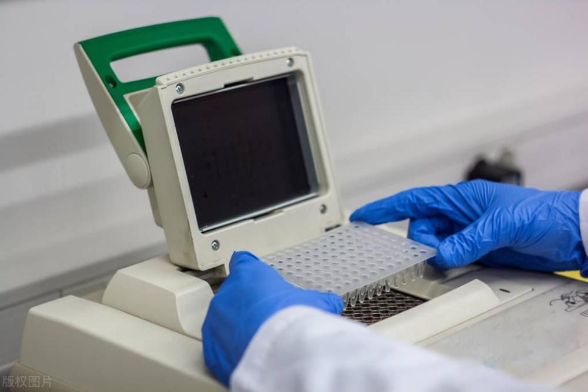

# “战时”三年医院拼命“买买买”，回归日常后，设备、耗材何处去？

过去三年，为了满足核酸检测和重症治疗的需求，医院一度曾“疯狂采购”各种设备和耗材。

有“一买就买大半年、甚至一年物资”的医院；也有好不容易拿到财政拨款，“不管用不用，先把仓库填满”的医院。

就像战时紧急动员一样，大疫当前下的医院采购没多少理性空间可言，需要考虑的不是这些设备以后怎么办，而是如何能快速地买到，经济性成了最被忽视的因素。

而今“战时”不再。

医院诊疗上回归日常，经济上回归理性考量，账本上的得失再次萦绕在各个医院院长的心头。

有医院曾花费五百万，兴建PCR实验室后，连成本都没收回来就闲置下来；有医院将闲置的数十台呼吸机等设备保养后，送到库房或者设备共享中心留待后用；也有医院借此东风，采购新设备，填补技术空白，甚至为扩张床位打下基础；更有医院研究疫中的旧设备、旧耗材的新用法，甚至为此申请专利……

大流行三年，除了隐秘的人力成本，而今留给各个医院还有一些无法抹除的设备和耗材，它们正在变成角落里的闲置物。

一家医院留下上百台PCR仪，焦虑难解

大流行后，南方沿海地区一家医院集团院长刘毅发现，不知不觉中，他已经攒下了超过百套的PCR仪器。

在日常，PCR仪是很多三甲医院检验科的标配，每台20~30万左右，日常可用做乙肝、丙肝的检测等；但过去3年，PCR仪最重要的功能是——它是核酸检测必须要用到的设备。

在大量的核酸检测任务中，检验科的医生几乎一刻不停地使用PCR仪：将标本中的核酸提取出来，加入配置好的试剂，送入扩增仪中，让原有的核酸复制变多。经过1~2小时不能中断的扩增程序后，医生在电脑上查看检测结果并进行核对，最后将数据上传。

需求量增加后，PCR仪在医院里的数量自然也越增越多。

“我们的医疗检测设备，从来没有一个像PCR这么普及，所有的县都有，甚至乡镇都有。”刘毅说，一些第三方公司甚至有几千套。

早在疫情快速过峰前，刘毅就未雨绸缪过：等核酸检测的需求退潮，这些PCR仪怎么办？

为此，该医院集团和广州一家研究院合作，改进检测方法、开发新试剂，将PCR仪器用于宏基因组检测、靶向基因检测和心血管疾病药物基因检测。

和现有的检测相比，用PCR仪器进行上述检测的优势在于成本低，能把检测从几千元降到二三百元。“这些设备成本已经收回，扔了很可惜，县级以下的医疗机构可以用它做心血管筛查和癌症早期筛查这些检测，做成白菜价。”刘毅说。

但这一切，都停留在计划阶段，到底能不能成，刘毅只能等。而在此之前，这上百套PCR仪，还得在医院里放一阵子。

这正是当下大部分医院的情况——PCR仪被闲置，束之高阁。

江苏一家区级医院，过去三年曾花费了400万买PCR仪器。疫情过后，他们用部分新仪器替换掉了老旧的，但仍有一部分PCR仪闲置下来。“不是全部闲置，就是闲置的比较多。”该院院长无奈地说。

在另外的一些地方，闲置的不止是仪器，更是整座PCR实验室。

去年10月，安徽一家三级医院专门在紧邻方舱医院的新院区，建设了一座PCR实验室。

如今，老院区的旧实验室还在运转，新院区的实验室闲置下来。“实验室是医院自己出钱建的，加上设备一共花费了500万，春节前都还没付完钱。”这家医院的财务人员告诉八点健闻，由于免费核酸的政策，医院至今未能收回成本。

令他们颇有微辞的是，隔壁县向当地人民医院拨款了6000多万，而当地就连核酸检测的耗材费用都是医院在出。

不仅在安徽，山东中部一县人民医院也有一座闲置的移动PCR实验室。不同的是，这是由当地县政府出资建设的。如今，医院也不知道如何处理它，只能暂时搁置。

在河北，一家县医院有一辆价值六七百万的核酸检测车，也闲置着。“当时要求一天检测几十万人次，现在怎么也用不了那么多了，所以都在闲置。”这家医院的院长告诉八点健闻，好在这些都是政府出资，医院没有为此付钱。

想给闲置的PCR仪找个出路的，不止上面的刘毅一人。不少医院都在想办法解决，但幸运儿只有一小部分。

“之前北京要求一些医院的核酸检测量，必须达到每日3万管，我们一下就买了几十台设备。”北京一家三甲医院总会计师李俊宏告诉八点健闻。

在北京，这些PCR仪很难闲置。“有医院是国家传染病网络实验室，PCR仪一直都是重要的设备，不少传染病都需要进行核酸检测。”李俊宏说，疫情后，医院甚至还补充了一批功能上存在不同的PCR仪器。

无数台PCR仪器高速运转的三年过去了，而今机器停转、闲置下来。在设备闲置的背面，唯一让人心头轻松的是，与PCR曾一起加班的检验科医生，也终于闲下来了。

福建某市三甲医院检验科医生王双，可顾不上PCR仪的去向，他只觉得：去年此时，跟同事三班倒都不够，还要向外院借人。每天要拧开上万个盖子，取上万个标本，人不停、机器也不停，才能完成任务。

“但如今，借人不再有，工作也轻松许多，回到日常了。”

不得不买的呼吸机等设备：无奈闲置、努力盘活

在江苏，一家区级三甲医院的院长正在为一台才买了2年多的CT机发愁。

CT机是2020年买的，为了疫情专门购置。当时，按照政策要求，需要把新冠感染患者和未感染患者区分，新的这台CT机就放在发热门诊，专门为了给新冠肺炎的相关患者做检查用。

结果用了不到2年，“现在新冠肺炎没了，它就放在那。”

CT机倒也可以换个地方，在医院的其他就诊场景里用。但要在院内给这台CT机挪位，不仅需要找个安全的地方，进行周围环境的评估评测，保证人员安全，而且林林总总算下来，移机费就要50~60万。

又是一笔开销。

在他看来，过去3年里，看着别家医院频频“超前购物”，他幸好没有过“冒进买东西”。但即使如此，买新CT机的钱大多出自医院自己的腰包，如今眼前还是面临着“要么重金移机，要么闲置放着”的两难选择。

上述医院总会计师李俊宏回忆，在疫情三年的大多数时间里，医院购置的防疫物资一直差不多，都是“整个疫情期间要用到的”，例如CT、PCR仪，以及口罩、防护服、核酸检测试剂等耗材。但到了2022年、2023年之交的新冠重症潮中，医院的重症设备集中增多。

西南地区某市级三甲医院院长冯立直言，“2022年底的感染高峰时，卫健委拼命让‘买买买’建ICU；但平时哪有这么多重症病人，疫情过后设备肯定会闲置。”

这是很多医院的普遍情况。

在距这家医院千公里的地方，华北一家市级三甲医院就曾在2022年冬天，紧急采购了40多台呼吸机、10台高流量氧疗仪，监护仪也从200台左右增加到300多台；而相应的，这家医院的日常用量大约只需15台、10台和150台。

如今，新购入的设备大都放在了设备共享中心，供其他需要的科室申领。

一些医院不忍设备闲置，最近开始尽力“盘活”上个冬季的“囤货”。

盘活的出路大致有三：补足医院原有的设备能力缺口，替换使用多年的设备，暂时用不到的就保养并管理起来，“有备无患”。

在深圳，罗湖医院集团走的是最后一条。他们索性把疫后用不到的、约20台的呼吸机集中起来，做了一次彻底保养；之后，这20台机器集中管理、“收纳”，以备未来不时之需。

而在冯立那里，多出来的呼吸机索性全部投放在病房中，轮番使用。今天用1、3、5号，明天换2、4、6号，因为“总是放库房会放坏”。

也有医院把闲置设备下放到了院外医疗点，包括社区卫生服务中心、校医院和分医院等。“肯定会有些浪费，下级医院日常用得不多，但总比闲置在医院里强。”一位受访者表示。

事到如今，也有不少医院乘上了一把“更新之风”，趁机把医院的老旧设备替换了一遍。

前述总会计师李俊宏告诉八点健闻，在工作量不变的情况下，一般医院都要等到设备状态不好、甚至报废时才会更新，时间甚至在十年及以上。如今新设备突然进来，这些老设备可以提早替换了。

湖南一家县人民医院，就在这种情况下迎来了一台新CT机。2021年，一台价值400多万的CT机，利用财政拨款购置。在此之前，院内唯一的CT机已使用了8、9年，偶尔会出小问题，而且也无法分开检查传染病患者——每做一个传染病人的检查，都要停机一小时做消杀。如今，两台CT机可以轮换使用了，解决了医院的困境。

医院的管理者刘志良反而觉得高兴：疫情3年，时常不被关注的县医院间接补足了设备短板，城里医院说的闲置，在县医院“基本不存在”。

一些医院管理者也表达了类似的看法，疫中三年的“买买买”，某种程度上成为了医院提升自身能力的机遇。

在一些地方，“采购潮”和医院扩张、医联体/医共体建设相遇，促成了多余设备的“院内消化”。

更隐秘的沉没成本：过期的耗材、另建的发热门诊

过去三年，医院因防疫添置的物资大致可以分为“四大件”：耗材，生命支持类设备，检验类设备，检查类设备。

“其中耗材的量是最大的，因为天天消耗。”李俊宏说。

一般来说，医院会对耗材的库存量设定一个“安全基数”，若库存量降到安全基数之下，则需要采购。针对防疫耗材，李俊宏所在医院通常情况下会保证半个月的库存量；但疫情爆发时，医院则会根据情况动态调整安全基数，保证一个月或更长时间的库存量。

这就是在很多医院，如今耗材会囤积的原因之一。在去年冬天“过峰”时，医院屯消耗型产品的动作也“更用力了”。

会集中大量采购的大都是县、区级医院。由于不具备和大型医药企业谈判的空间，在拿到政府拨款后，县区级医院通常会选择把仓库塞满，“不管用不用，先拿到手再说”。

上述安徽三级医院的管理者表示，2022年，当地做了十几轮全民核酸。受此影响，他所在医院在核酸检测上花了有一千万，大部分都买了核酸检测试剂。“目前耗材、药品还剩下约200万元的量，最后可能会浪费100多万。”

刘志良也见过“一买就买大半年，甚至一年物资”的医院。相对而言，他所在医院有一定的计划性，当下如院内核酸检测试剂还剩下约10000份，好在按日消耗100份左右，三个月就能用完。

耗材会陆续过期，冯立也为不知如何处理的耗材而满肚子牢骚，“比如防护服，现在到处都用得少，也就发热门诊和传染病门诊用一用；核酸检测试剂，当年囤得越多过期越多，这就是沉没成本。”

他表示，目前在日常诊疗中还可以消耗一部分耗材，但是消耗量不大，“以前一天用成百上千套防护服，现在一天十套。”面对可以预料的浪费，一些医院选择和企业商议，用耗材换取医院所需物资，或者退货。

还有医院想办法研究创新的解决方案。

深圳罗湖医院集团院长孙喜琢告诉八点健闻，深圳一个区的防护服存量差不多有小十万套，经研究，他们认为可以将把闲置的部分防护服，改为手术室外使用的医用敷料。“甚至有医院还搞了一个比赛，一个护士在8分钟内把一件防护服剪成了各种可以使用的敷料，还得了个大奖。”

孙喜琢说，医院曾反复试验发现：一件防护服被拆解后，即便经过十次消毒，其韧性、厚度都没有任何改变，“这说明这个方法很可行。”目前他们正在申请实用新型专利。

在“四大件”之外，还有些医院里隐藏着一些令人意想不到的成本，比如，出入闸机和发热门诊。

浙江一位院长告诉八点健闻，疫情期间，当地政府曾要求医院采购出入口闸机。当时医院内部判断，这个要求是“应付性”的，最终顶住压力，没有采购。

如今看来这个判断是正确的。“还好没买，买了以后又要损失好几百万。”该院长庆幸地说。

此外，在2020年，他们花100多万新建了一座发热门诊，而今也闲置了，但他觉得总比闸机强，“房子造好了总有用处，以后再做其他打算。”

（刘毅、王双、冯力、李俊宏、刘志良为化名。）

张晓艺、宋昕泽丨撰稿

李 琳丨责编

**本文首发于微信公众号「八点健闻」，未经授权不得转载**

