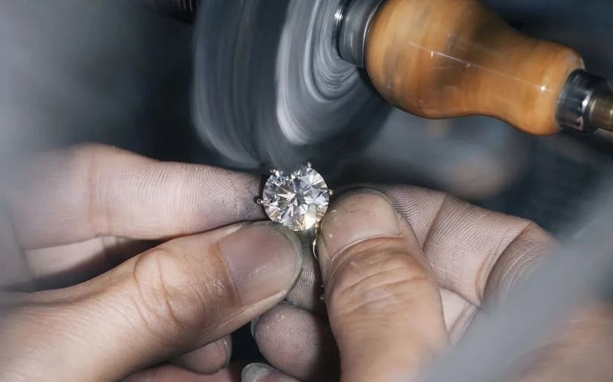
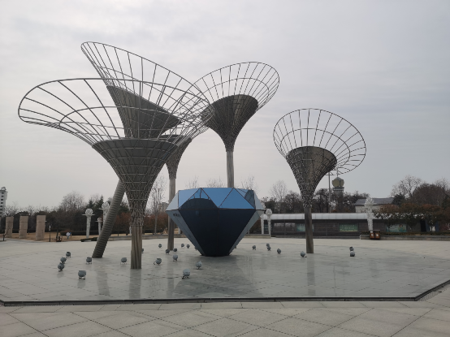
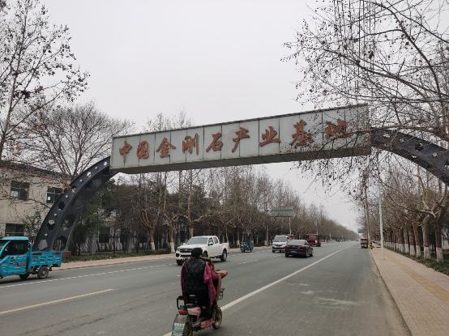
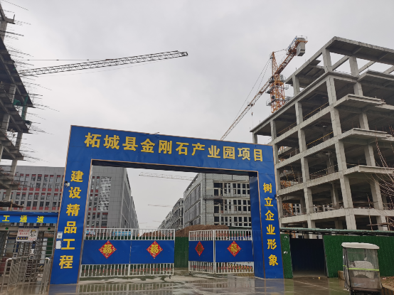

# 一座河南小县城的全球钻石生意：曾是国家贫困县，如今淘金者涌入

_来源：视觉中国_

作者 | 郭一非

编辑 | 杨布丁

出品 | 棱镜·腾讯小满工作室

如何生产出一枚与天然钻石相媲美的人工钻石？

将石墨粉、金属触媒粉等原材料，装入一台六面顶压机，模拟天然钻石的形成环境。在1300°C~1600°C的高温、5~6GPa压力下，经过7-15天的生长，历经石墨芯柱制备、合成块组装、单晶合成、提纯处理等复杂工序后，一枚培育钻石随即产生。

好比是河里的冰与冰箱里的冰的区别，作为一种人工合成钻石，培育钻石与天然钻石在晶体结构、物理、化学及光学性质等方面完全一致，区别仅为形成过程不同，但均为真钻石。这与锆石、莫桑石等仿钻完全不同，并在2018年前后得到了全球范围内的正名与认可。在零售价格方面，培育钻石已从2016年天然钻石的80%，降到如今的不足1/3。

在这个高大上的全球大生意中，一座远在河南豫东四线小城——柘城，正在帮助女性们实现钻石“克拉自由”。

贝恩咨询报告显示，2021年全球培育钻石产量为900万克拉。当地官方口径称，这其中，从柘城走出去的培育钻石规模就多达400万克拉，柘城因此被誉为“中国钻石之都”，世界首个培育钻石产品标准也在这里制定。此外，这里还拥有“培育钻石第一股”力量钻石（301071.SZ），公司在2021年上市首日时，股价最高暴涨12倍。

这背后，则是当地金刚石超硬材料产业的支撑。40余年发展历史到今天，柘城由原来“小、散、乱”的家庭作坊式生产，形成了目前单晶合成、微粉加工、制品生产的全产业链发展格局，相关企业达128家。

官方统计称，柘城年产金刚石单晶30亿克拉，其中大颗粒单晶产量占全国的60%。年产金刚石微粉60亿克拉，产量和出口量分别占到全国的70%和50%，亦被称为“中国金刚石微粉之都”。要知道，2019年，当地才摘掉国家级贫困县的帽子。

2023年全国两会期间，各地方如何立足更好发挥自身优势，做特色优势经济大文章，成为讨论热点，这也是地方激活经济发展活力的重要抓手。

2023年2月底，作者实地调研柘城，走访力量钻石、惠丰钻石（839725.BJ）等多家企业，探究培育钻石产业崛起在这座豫东小县城的背后秘密。

_当地城市规划展览馆旁，树立着一颗硕大的培育钻石雕塑_

**靠微粉起家，靠培育钻石出圈**

“我们这里的金刚石产业是以微粉加工为基础，培育钻石则是产业发展四十多年到今天，产生的一种新的产品。”柘城施诺德钻石总经理王文军向作者举例称，微粉之于单晶，好比面粉之于小麦，属于深加工过程，发展多年后，像力量钻石这类企业开始自己合成金刚石单晶。

王文军称，金刚石虽是个小产业，但是作为工业最基础的原材料，应用性非常广，国外有个指标，即每吨钢材所消耗金刚石的用量，就能代表一个国家工业发展水平。

金刚石作为自然界已知物质中硬度最高的材料，有天然与人造之分。这其中，质优粒大可以用于制作首饰的宝石级人造金刚石单晶，即为培育钻石。

追溯当地金刚石产业发展史，绕不开郑州磨料磨具磨削研究所（简称“三磨所”），这里早在1960年代突破“卡脖子”的国外垄断，成功研制出中国第一颗人造金刚石，以及核心设备——六面顶压机。

公开资料显示，上世纪80年代，在郑州三磨所担任工程师的柘城人冯金章，带着技术回乡创业，创办了全县第一家金刚石加工企业。这家工厂培养了柘城第一批熟稔金刚石合成技术与配方的骨干，工厂改制后，部分技术骨干开始出来单干，由此裂变出大大小小100多家企业。

这其中，就包括力量钻石董事长邵增明的父亲邵大勇。不过当时，这些散落县城各地的金刚石微粉厂均是家庭生产作坊，技术含量也并不高。

分水岭发生在2009年，柘城工业园区纳入了河南省180家产业集聚区序列，力量、惠丰等数十家微粉企业入驻园区，产业集聚效应开始显现，从微粉加工开始延伸到制品、单晶合成等上下游产业链。

_柘城西侧的金刚石产业基地，力量钻石等上下游企业聚集于此_

多位当地金刚石产业人士向作者回忆称，政府当时比较有魄力，思路也很清晰，就是力推金刚石产业做大做强，延伸产业链，通过建厂房、减租金、提供低息贷款、牵线科研院所等多种方式，吸引大小作坊入驻园区，形成规模优势。很多企业直到现在还享受着当时的发展红利，“当时赶上2008年金融危机之后的4万亿刺激政策，房地产上下游很多行业对金刚石微粉需求特别大，所以就发展起来了。”

不过，行业低谷期也随之到来。力量钻石办公室主任李众峰告诉作者，2013年开始，金刚石微粉低端异形料市场出现饱和，生产成本每克拉一毛钱，市场售价一度才八九分钱，亳州很多小家庭作坊成本高，就直接停机不干了，我们有规模优势，在市场艰难的时候维持下来了。

如何摆脱低价恶性竞争，寻找更高附加值的明星产品，实现产业升级，开始成为当地企业思考的命题。把传统微粉产品做精之外，“从面粉加工延伸到小麦种植”，合成金刚石单晶的创业随即开始，这也是为日后培育钻石的诞生埋下伏笔。

“工业金刚石市场价格竞争激烈，利润管控很难。同时，培育钻石市场在2016年开始发展，我们把一半产能转到生产培育钻石，等于把行业又给盘活了。”李众峰表示，力量钻石从2013年开始研发，2016年才合成了第一颗首饰级钻石（白钻），重量也都是1克拉以下的碎钻，之前多是品质一般的黄钻。

**培育钻石迎风口，卖水泥的都来了**

地处豫东，人口刚过百万，柘城的辣椒全国销量第一，20万人聚集在产业链上。相较于久负盛名的辣椒产业，本地人只知金刚石微粉，少有听说培育钻石，当地也没有开设相关零售门店。直到2021年本土第一家企业力量钻石上市，股价首日翻涨12倍，培育钻石概念才获出圈。

“力量的培育钻石规模并非最大，但上市对行业影响力大。”郑州三磨所培育钻石品牌负责人刘洋洋告诉作者，本身行业技术成熟，零售市场正处一片蓝海，加上打出培育钻石第一股的概念，如今再复制另一个“力量钻石”的故事就很难了。

单从培育钻石规模来看，作为上游原石（即培育钻石毛坯原石，需要经过切割打磨加工等工序，才形成市场可售的培育钻石成品）生产商，力量钻石目前排名行业第三位。

浙商证券研报统计测算称，中兵红箭、黄河旋风、力量钻石前三家，目前供应国内超75%的原石份额。以2021年为例，三家超硬材料业务营收分别为24亿元、15亿元及5亿元。这其中，培育钻石业务则分别为6.7亿元、8.5亿元及2亿元。

贝恩咨询报告统计，2016年培育钻石零售价格约为天然钻石的80%，随着生产工艺成熟，成本下降叠加规模化量产，2017年至2021年分别降低至65%、50%、50%、35%、30%。

中信建投的一篇研报统计，目前1克拉天然钻石的零售价为6.9万-20.2万元，同样等级下，1克拉培育钻石仅为1.3万-4.4万元。以当下1.5万元的标准品款式为例，预计2025
年，1克拉培育钻石零售价格有望下探至0.6万-1.1万元。

“天然钻石的高价使得钻石消费场景受限，相当一部分消费为婚庆场景，大部分消费者一次婚姻只会购买一次钻戒。”上述研报写道，当培育钻石终端零售价格下降至5000-8000元时，悦己需求将被点燃，佩戴不同风格的培育钻石进行日常穿搭，频率正如更换衣物或手提包。

从毛利率来看，在培育钻石产业链分工中，上游原石制造环节为60%-80%，中游打磨加工为10%-15%，下游终端零售为60%-70%。以力量钻石为例，2022年上半年，培育钻石原石业务毛利率高达83.44%，相较之下，金刚石单晶和微粉业务分别为57.94%、52.4%。

“全球2021年钻石饰品销售额840亿美元中，培育钻石仅为44亿美元，渗透率仅5%。”贝恩咨询报告预计，仅中国市场，到2025年，毛坯培育钻石销量将从2021年的140万克拉，增长至400万克拉，培育钻石市场规模也将由83亿元增至295亿元，年复合增长率为28.87%。

低渗透、高增长，一片蓝海预期中，培育钻石的淘金者已经开始集体猛踩油门，追赶风口。

中兵红箭等上游原石厂商纷纷定增募资扩产能，中国黄金、豫园股份、曼卡龙、周生生等下游珠宝零售品牌，在传统珠宝及天然钻石业务外，也都开始试水培育钻石市场。力量钻石直接与潮宏基共建合资公司，创办培育钻石珠宝首饰品牌，前者已实现5-30克拉的批量化生产。

老牌的郑州三磨所也是入局者，拥有天然钻石营销经验的刘洋洋也转换了赛道。

他告诉作者，现在很多外行也都开始扎进培育钻石行业，最近省内还有一家做水泥的公司主动来问，希望采购核心生产设备顶压机。而三磨所自己的培育钻石品牌线下门店招商加盟，也有很多人感兴趣，找过来对接。“第一家直营门店预计今年下半年在上海开业，一线城市的消费者接受度高，营销成本低，计划慢慢再从一线覆盖到重点省会城市。”

“听说利润高，很多投资机构、个体户啥的，都跑过来寻求合作，出钱出地，或者干脆自己去买顶压机试试。”一位柘城金刚石微粉公司总经理对作者表示，外面很多厂家都把产能从工业金刚石转移到了培育钻石。

**500亿产业目标下，金刚石产业如何升级？**

眼下，在“钻石之都”柘城的金刚石圈子里，是否要上马培育钻石项目，更是绕不过去的话题。

多位当地金刚石行业人士对作者表示，培育钻石属于重资产投入，一台六面顶压机就一二百万，设备少了又形成不了规模效应。在产业升级之前普遍没有完成资金以及技术的原始积累，大家主要还是做微粉，而真正微粉产品有竞争力的，也就十来家，剩下的还都靠价格竞争，靠拼命降低成本来走量，“5000万营收以上的公司不超过10家，大多都是一两千万的规模”。

“我们还没有考虑去做培育钻石。”一位规模型金刚石微粉公司负责人直言，微粉研磨和线锯领域大有可为，还远没到夕阳产业，营收规模每年都在同比增长，现在还有继续扩大产能的需求，希望往附加值更高的方向去升级。

按照当地政府的扶持计划，在力量钻石、惠丰钻石完成上市后，另一家公司厚德钻石也在推进完成股改、上市计划中。作者了解到，在当地，目前仅有力量钻石一家在批量生产培育钻石。

2022年8月，惠丰钻石公告透露，公司成功研发生产出培育钻石产品。不同于力量钻石采用的高温高压法，惠丰走的是CVD化学气相沉积法，目前还未到批量生产阶段。

惠丰钻石的相关负责人告诉作者，目前公司主业还是微粉，市占率达到20%左右，希望继续做大做强。这两年光伏行业需求量大，第三代半导体发展需求势头也不错，另外公司也在蓄力培育钻石这个第二增长曲线，升级建设了中牟县技术研发中心，重点就是开发培育钻石，已经达到小批量可售标准。“那边离省会近，招学历更高的人才更有优势。”

相较之下，力量钻石的“胃口”更大。李众峰介绍称，公司正在努力补齐上下游产业链，包括上游投资40亿元建设压机设备制造项目，下游则投资20亿元用于金刚石工具生产项目等。

_县城东区，金刚石产业园、压机制造、新材料等项目正在建设中_

对于如何升级迭代金刚石产业，柘城县县长余化敏在2023年河南省两会上提出，着力把微粉做精、单晶做强、制品做大、钻石做亮，力争两年内将压机数量由1560台提升到3000台，规模总量达到全国第一，未来金刚石超硬材料产业产值突破500亿元。

此前，当地政府设立了3000万元的科技创新基金，用于扶持企业建设技术中心。

眼下，在柘城县丹阳大道东侧，占地218亩的金刚石产业园区项目正在建设中。按照政府规划，该项目总投资60亿元，投产后，可为当地创造每年20亿的产值。

**腾讯新闻出品内容，未经授权，不得复制和转载，否则将追究法律责任**

