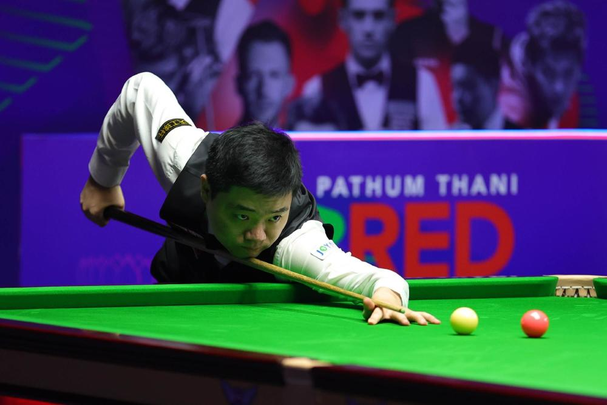
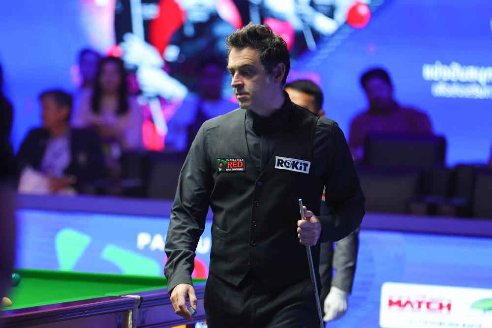
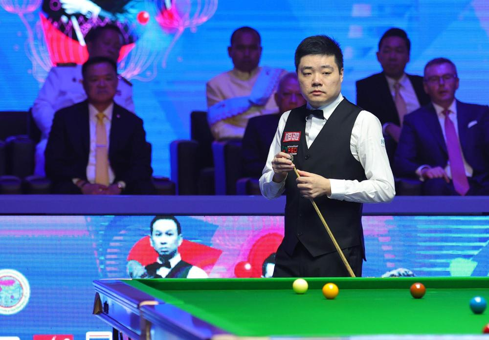
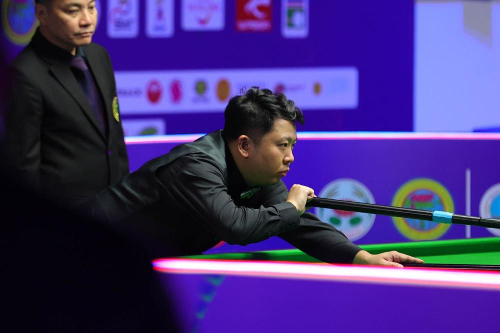

# 中国两人晋级！丁俊晖6-2击败奥沙利文 8强战将对阵宾汉姆

3月9日，2023年世界斯诺克巡回赛6红球世锦赛在泰国曼谷展开淘汰赛争夺。世界第一奥沙利文与中国领军人物丁俊晖狭路相逢，在淘汰赛首轮便遭遇，争夺一个8强席位。

比赛中，丁俊晖表现出色，最终以6-2轻松获胜，继去年底英锦赛之后，连续两场比赛战胜奥沙利文，强势晋级8强。

另外一名中国选手张安达，以6-4淘汰泰国球王瓦塔纳，同样晋级。

6红球世锦赛是邀请赛性质，已经在泰国举办多年，丁俊晖曾先后获得过冠军和亚军等荣誉。今年赛事上，他凭借着外卡资格，直接入围正赛。

在小组赛中，他与张安达、马奎尔以及泰国女子世界冠军旺哈鲁泰同在第一小组，最终他以2胜1负的战绩，小组第二晋级16强。淘汰赛抽签中，丁俊晖与奥沙利文狭路相逢，打响遭遇战。

关于丁俊晖与奥沙利文的“丁奥会”渊源，已经持续了近20年的时间，当然丁俊晖是负多胜少，但有几次关键的胜利，成就了丁俊晖生涯的高光时刻。

**丁俊晖6-2奥沙利文全程回顾**

2020年到2022年这三年期间，丁俊晖一度遭到奥沙利文七连胜，可谓战绩惨淡，但直到去年底的英锦赛1/4决赛上，丁俊晖打出了6-0的零封比分，直接将奥沙利文横扫出局，算是给了外界一个意外。

如今，两人转战邀请赛的6红球世锦赛上，再度对决，依然是抢6的短局制，丁俊晖这次又把握住了机会，虽然开局比分紧咬，但在2-2平之后，丁俊晖打出一波高潮，连下四局，最终大比分6-2锁定胜局，连续两场对决战胜奥沙利文，强势晋级8强。1/4决赛中将对阵老对手宾汉姆。

