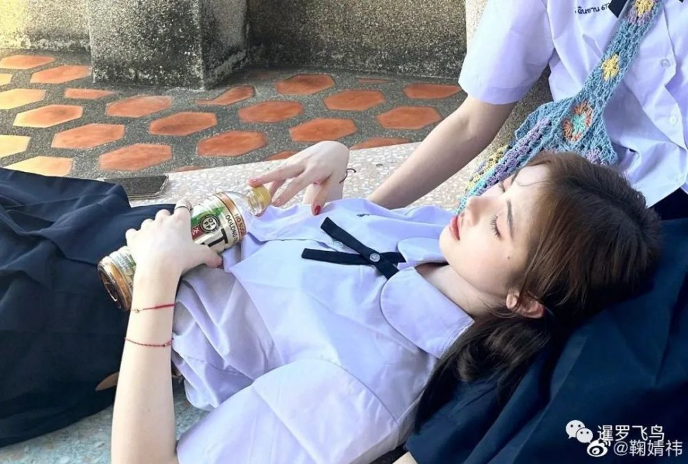
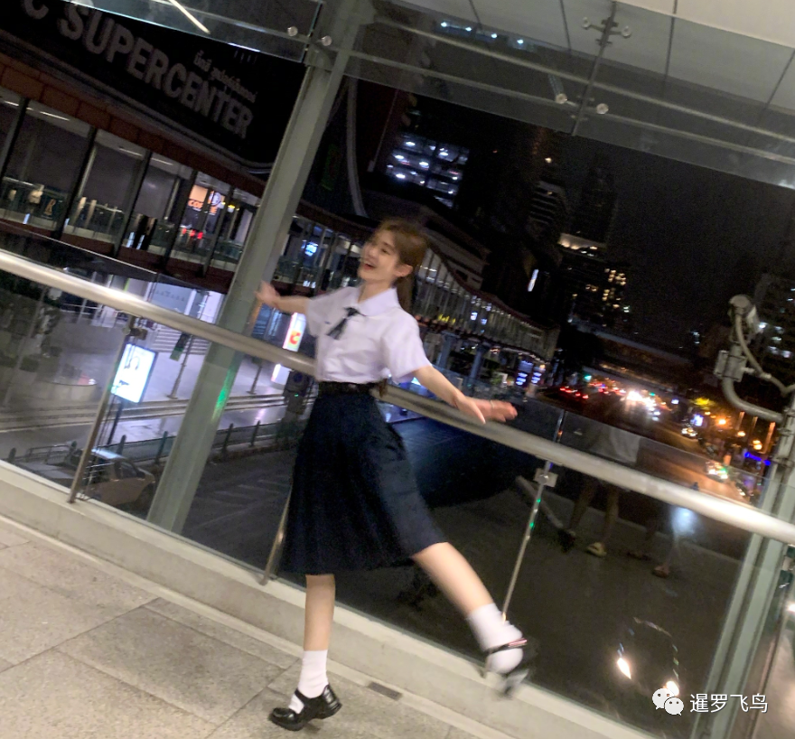
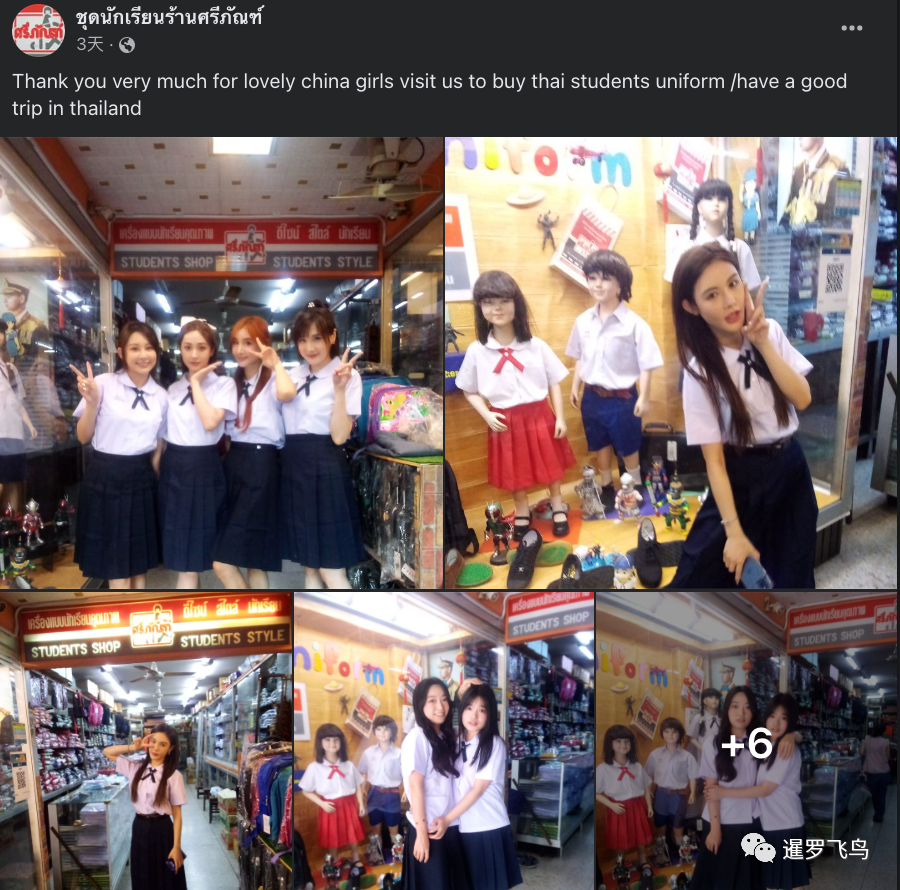
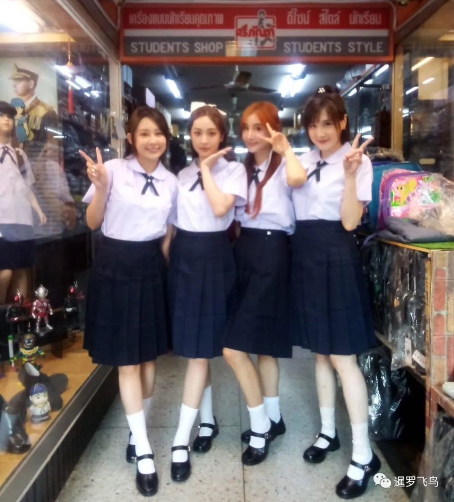
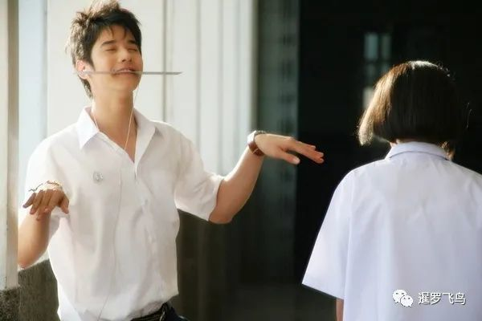
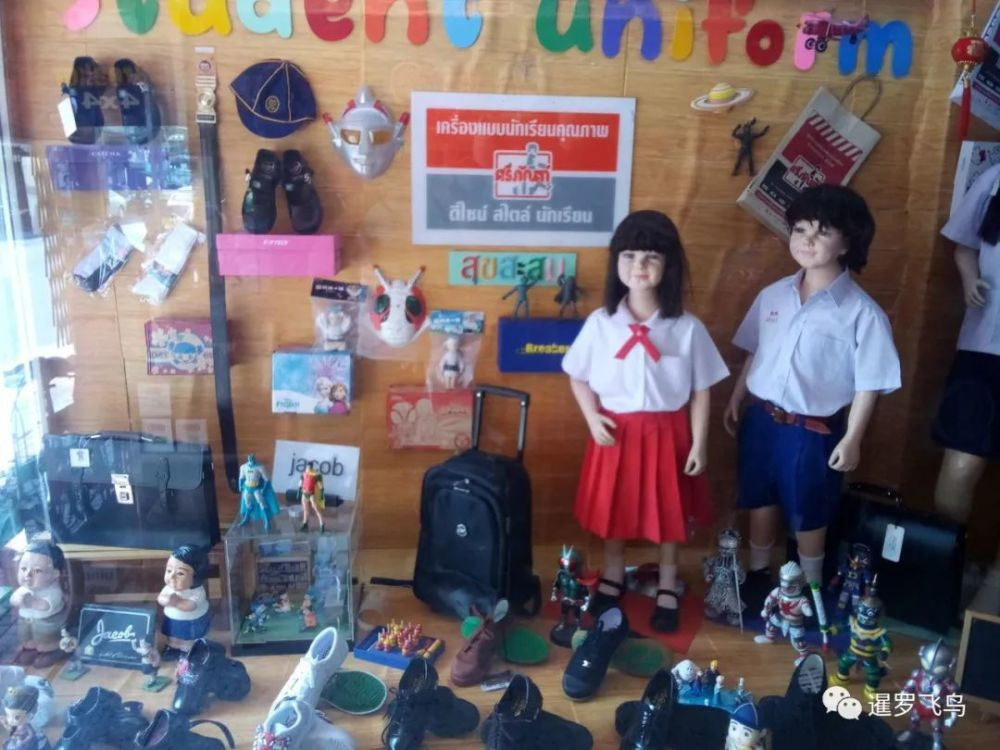

# 中国游客注意啦！旅游警示：乱穿泰国校服会被罚款

一名泰国律师警告中国游客，在泰国旅行时不要再穿泰国校服，否则将被处以1000泰铢的罚款。

_图：鞠婧祎微博晒出在泰国穿校服的照片_

在中国的女演员兼歌手鞠婧祎在她的微博上发布了一张在曼谷旅游期间身穿泰国学生制服的照片后，在泰国旅行时穿泰国校服在中国游客中似乎引起了强烈风潮。

_照片中，鞠婧祎身穿泰国学生制服，上面还绣着她泰语发音的名字，衬衫上的假学生证号写着จวีจิ้งอี
991。_

_随后，许多中国游客在社交媒体上发布了自己身穿泰国校服的照片。这些照片的大部分背景都在曼谷和普吉岛。_

_位于曼谷 Bang Lampoo 街区的学生制服店Sriphan Student
Uniform也在其官方脸书页面上发布了许多中国顾客的照片。_

_Sriphan学生制服店的店主接受泰媒采访时提到，她认为这股潮流来自疫情前在中国上映的一部名为《初恋那件小事》（Little
Thing Called Love）的浪漫喜剧泰国电影。_

这个由马里奥·毛瑞尔和 Pimchanok Luevisadpaibul 主演的泰国浪漫喜剧电影，讲述了一个
14岁的高中女生爱上了一名高年级男生，并努力提升自己以配得上他的故事。这个纯纯的爱情故事在泰国高中生的生活和友谊中展开，成为许多泰国人和中国粉丝的最爱。

泰国知名律师Ratchapon
Sirisakorn呼吁中国游客了解泰国有关学生制服的法律。他警告说，根据学生制服法，穿着校服但没有学生证可能会被处以1000泰铢的罚款哟。

律师进一步解释道，穿着校服或连衣裙模仿学生，并让他人相信这些人是学生，如果他们再展示出与泰国学校相匹配的学校名称或缩写，则是非法的。

Ratchapon律师建议中国游客和其他想要跟上潮流的人，不要在制服上印任何学校信息或只印上他们的名字，以避免受到法律指控和罚款。

□来源 暹罗飞鸟®(siambird)编辑部出品©侵权必究

