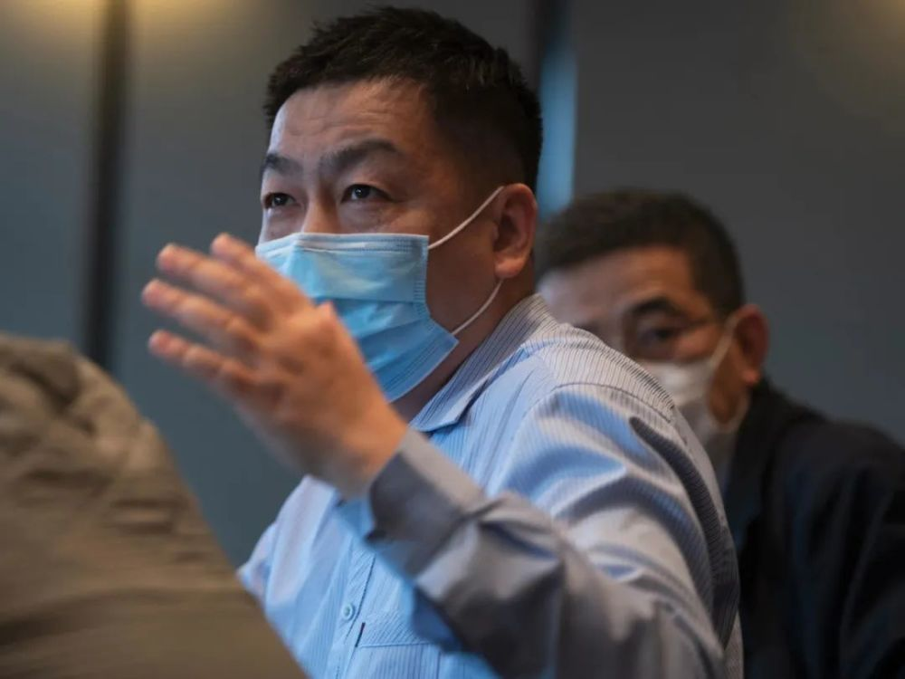

# 北京协和医院副院长杜斌：新冠之后，下一次公共卫生危机如何应对？

1982年，中国第一张为外科手术而设的重症监护病床在北京协和医院建成。1994年，杜斌在中国协和医科大学医学系完成了八年制培养，并取得医学博士学位。毕业后，杜斌一直在北京协和医院从事重症医学工作，并着手创建了医院内科ICU。

在医学领域，杜斌被称为国内的“重症八仙”之一，几乎参与了国内所有重大突发公共卫生事件的医疗救治。2020年1月18日，作为国家卫健委派出的医疗救治专家组成员，杜斌第一时间进驻新冠疫情的风暴眼——武汉。

今年全国“两会”期间，全国政协委员、北京协和医院副院长杜斌接受了《中国新闻周刊》的专访。杜斌说，他不是公共卫生学方面的专家，他的专长是危重病人的救治，但是从2003年的SARS，到如今亲历新冠大流行，他也开始思考，中国应该如何更好应对下一次可能的公共卫生危机。

_北京协和医院副院长杜斌。图/受访者供图_

一些专家呼吁，新冠疫情暴露了中国重症医疗资源的不足，疫情后应该加大投入，但杜斌并不这么认为。在医疗资源整体有限的情况下，他强调，应通盘考虑，更好应对下一次公卫危机的关键，不在于激进扩建设施，而是如何培养人才、缩小医院间诊疗水平的差距，在紧急状态下做好扩容。

不同地区医疗水平差别大是主要问题

**中国新闻周刊：新冠疫情三年中，对于不同区域间医疗资源的差距，尤其是重症医学学科的差距，你有怎样的感受？**

**杜斌：**
2020年，我最先去了武汉，在武汉市金银潭医院等定点医院指导危重病人救治，而后又去了哈尔滨、乌鲁木齐、青岛、满洲里、石家庄、通化等城市，2022年上半年参与了上海奥密克戎疫情的救治。

医疗资源天然不平衡，在全球都是如此。我没有去过特别基层的医疗卫生机构，但是，就我看到的县级医院，尤其是东南各省市的县级医院而言，重症医学科的床位数量和医疗设备的地区差异不太明显。

我感受最深的还是医疗救治水平的差别的确非常大。这种差距，倒不是说不会一个具体的操作比如气管插管，而是掌握的知识和治疗理念的水平有高低。

不过，我也能理解，这是很现实的情况。如果基层的医生能力比较强、得到了好的培训，他就有很大的可能离开基层医疗机构，比如通过报考研究生的方式。近年来，国家卫健委一直在推动优质医疗资源下沉，也在思考用什么样的机制，能够减少区域间、不同层级医疗机构间在医疗水平上的差距，但这需要一个过程。

**中国新闻周刊：临床治疗的标准化或同质化，被公认为是医学学科发展成熟的重要标志。这些年你在不同场合都提到过，中国重症医学发展中的最大短板是人才培养。中国重症医学人员的现状是怎样的？你认为应怎样解决这一问题？**

**杜斌：**
中国重症医学人员数量确实是不够的，这与疫情来不来没有关系。重症监护室，是一个医疗和护理强度要求都很高的科室，因此所配备的医护人员数量也比较多。

以英国为例，一张ICU床位至少要配置7名护理人员，但在国内，即便我们要求一张ICU床位配置2.5~3名护士，绝大多数医院依然很难达标。尤其是出现重大突发公共卫生事件，需要在ICU救治的时候，人员短缺问题就暴露得更为突出。

在政策上，原来制约我们发展的瓶颈是没有重症医学的住院医师规培制度，不过，2020年跟国家卫健委反映后，已得到解决。当然，我们会面临一些问题，我们应去想想怎么吸引年轻医生加入到重症学科中来，怎样培养出合格的医生和护士。

在发达国家，比如德国，社区诊所、小规模的医院和大医院之间，医生的水平固然有差别，但都在一定水准之上。我觉得不同国家间的差距是从医学教育开始的。我们的医学院教学水平差别很大，而且教师们面临着很大的申请各种科研基金（如国家自然基金项目）、开展科研项目的压力，难以全心全意教授学生。

**中国新闻周刊：重科研的评价体系，对于临床医生这一群体来说，会不会也是一个很大的负担，甚至会影响他们在临床诊疗能力方面的发展？**

**杜斌：**
我觉得会。我有时候愿意说一些“风凉话”或者是抱怨的话。现在任何一家医院，都要求医生又会看病、又会写文章、又会得奖、又会教书，又会申请基金和课题，如果什么都会，为什么还在这个医院待着？

在当下评价体系当中，不同医生、不同专科之间的诊疗水平很难衡量，因此最容易被量化的指标就成了评价的“尺子”，这包括论文、基金课题数量、奖项等。但是，我们的体系需要允许医务人员在职业道路上差异化发展，从事科学研究要基于兴趣。真正能够引领学科发展、做出创新发现的人是很少的。

如果一个医生醉心于教学，能够培养出很好的医学生和年轻医生，哪怕不从事科学研究，他也是一名合格的医生。正是因为采用同一把尺子衡量，才有这么多医生会花钱买论文，导致这些年国内被撤稿的医学论文很多，在科研诚信上出了问题。

_北京协和医院副院长杜斌。图/受访者供图_

盲目扩容，可能带来资源闲置和浪费

**中国新闻周刊：你如何看待新冠疫情带来的医疗基建扩张？比如兴建一些传染病医院，扩建医院ICU病床数量，大量购置呼吸机、监护仪、除颤仪等设备。该如何做好“平战结合”，避免资源浪费？**

**杜斌：** 这是现实，但我不认为是对的。我觉得这一轮扩张之后，可能会不可避免地带来资源浪费。我知道有好多医院的呼吸机已经闲置了。

很多传染病专科医院平时很难生存。在东部某个省份，平时，政府要求全市的艾滋病病人都要转到市传染病专科医院，不然该医院就没有病人。但当疫情来临时，医院却应对不过来，“平时”和“战时”状态差别很大。另外一种解决方式，就是在综合医院中建设和加强感染科，感染科平时运转压力更小，而且医院处理常见病、多发病的优势也是显而易见的。当然，有关如何建设传染病救治体系，在国内学术界和管理界一直存在争议。

几年疫情中，也有一些地方要求扩建ICU床位数。在我看来，ICU床位数应该占到医院总床位数的8%还是10%，这一要求应该基于科学测算，而不是“拍脑袋”的结果。现在大医院的ICU床位数占比不足5％，如果要扩容到10％，首先面临的障碍就是没有这么多医护人员，提供高质量的重症医学医疗护理服务。而且，如果没有足够的重症病人的话，可能还会导致资源闲置，或者收治一些本来不需要住ICU的病人。

当然，在突发公卫事件和灾难性事故中，需要有效对床位数、救治设施、空间等进行扩容，并且建立一个应急预案机制，让扩容后的医疗机构平稳运转，能够保证医疗和护理的质量，就可以了。

**中国新闻周刊：去年12月，“新十条”发布后，疫情防控的阵地转移到医院，政府也的确加快了重症救治设施的紧急扩容。应急事件中，ICU床位和设备这些硬件是可以短期快速增加的，但是人员问题怎么解决？**

**杜斌：**
中国医疗资源整体上配置是比较少的，这是很多专科面临的问题。比如，国外800~1000张床的医院，员工可以上万；而我们现在5000张床的医院，有些员工也只有5000名。但我们也要看到，即便在医疗资源充沛的国家，比如美国，真到面对大流行的时候，医院依然受到了很大的冲击，出现医疗挤兑的情况。

我们不可能在平时就准备好足够的人力和资源，然后自信地说，无论什么样的疫情或者灾难事件发生，我们都足以应对，这是不现实的。

如果平时没有足够的医疗工作量，医护人员无法持续提高知识和技能的话，他们的能力慢慢就会下降，所以我觉得盲目增加人力，不是好的做法。

应急状态下，床位扩容后，如何相应地补足重症医护人员人手不足的问题，各家医院都有各自的做法。一种较为主要的经验是，让重症专科的医护人员担任小组长，带领其他专科的医生，后者可以分担一些医疗工作，比如说，麻醉科医生通常很擅长气管插管。

**中国新闻周刊：去年年底到今年年初，疫情高峰期间，就你所在的医院来看，重症监护病房的紧急扩容开展是否顺利？中间有没有遇到什么挑战或者困难？**

**杜斌：**
我觉得把普通病房转化成ICU并不太难。只要有床位，有压缩空气和氧气，在床位旁边放一个监护仪、放个呼吸机，普通病床分分钟就变成一个简易的ICU床位，在大多数情况下并不需要更复杂的东西。

难处仍然在于重症医务人员的匮乏，在于怎样去管理病床、如何划定收治的标准、如何保证扩张之后的ICU护理安全。

北京协和医院应对得还可以。我们把病人分成几类，单纯用氧疗的或者用无创呼吸机的可以在普通病房；能收治到呼吸ICU、内科ICU和综合ICU的病人，基本上全部都是需要上气管插管或者用ECMO的危重病人，主要还是要靠科学的预案去支撑，根据医院情况去协调资源。

老龄化不一定加剧重症资源失衡

**中国新闻周刊：中国是世界上人口老龄化程度较高的国家之一，预计到2035年，全国60岁及以上人口占比将超过30%。中国ICU资源的供给现状是怎样的？ICU作为一个以老年人为主的科室，你认为该如何应对这种人口结构变化带来的需求增长？**

**杜斌：**
如果从绝对床位数来说，中国的ICU病床是少的。国家卫健委有关领导去年年底说，全国ICU床位总数已达13.81万张，接近10张/10万人的水平，其中很多ICU床位数是临时增加的，并非长久设置。

根据中华医学会重症医学分会2016年的普查，中国每10万人拥有的ICU床位数平均为3.19张，不过这个调查没有将专科ICU算进来，综合ICU与专科ICU的床位数大致持平，实际应该是再翻一倍。可以做个对比，美国的重症床位在全球是数一数二的，每10万人大概有34张ICU床位，其次是德国，大概每10万人有29张ICU病床。

不过，在我看来，随着老龄化程度加深，很难简单得出结论，认为重症医疗资源的需求就会越来越多、供给就会越来越不足。

英国每10万人的ICU病床数量是6.6张，跟中国差不多。有人比较过英国和美国ICU收治的病人的危重程度，床位数更少的英国，显然收治的病人危重程度比美国更高；美国ICU床位使用率大约是80%，其中上呼吸机的病人也就一半左右。

重症监护病房占用率是供需间的动态平衡。也就是说，随着收治标准变化，ICU资源供给是有弹性的。如果ICU病床数量不足，一些较轻的病人不再收治进来，依然可以腾出一定的床位。更何况，ICU里面一直存在着“压床”的问题，也就是一些病人长期依赖呼吸机等生命支持设备维持生命。

**中国新闻周刊：回顾中国重症医学的发展史，公共应急事件都是这个专科重要的推动力量。比如，2003年SARS之后，中国公立医院开始了一轮扩张潮，ICU也成为医院评级的重要指标，进入发展快车道。在你看来，新冠疫情对重症医学带来的影响是怎样的？**

**杜斌：**
总体来说，疫情等重大公共卫生事件促进了重症医学的专科发展。包括政府、医疗卫生界、老百姓，对重症都有了更多的认识和认可；政府的确对重症也有了一些资源的投入，这些都会促进学科的发展。

但是，在短时间内，一个国家或者地区的医疗资源都是有限的。任何一个专科都不可能有很大幅度的提升或是增加。因为一个专科得到的医疗资源显著增多，就意味着其他专科的资源显著减少。因此，在重症医学医疗资源没有显著增加的情况下，如何谋划重症医学的学科发展，其实是摆在重症医学医务人员面前的实际难题。

**中国新闻周刊：经历过这次公共卫生事件，你认为，中国的医疗卫生体系能够从中汲取怎样的经验，以便未来可以做得更好？**

**杜斌：** 我们知道疫苗很重要，药物也很重要。但是，下次我们能不能有很好的预测模型？

比如说一波流行冲击来临时，病人数量有多少、持续多久，重症病人有多少、会在何时出现，需要多少物资准备和人员配备，这对于重症医生来说，是至关重要的。最艰难的时间是一天，还是将持续一个月，差别很大。合理的预期能够让我们更加科学、有序地进行医疗资源的调配和应对。

另外，我觉得还有一点是，要认识到我们不是只看大流行这一种病。当某种疫情来临时，把多少资源放在当下流行的疾病上，多少资源放在其他疾病上，我们要做好统筹和协调。2020年初，疫情早期的时候，肿瘤病人、血液透析等病人的医疗需求在很大程度上被忽视了，而且，其他地方后来或多或少也有这样的问题。

记者：彭丹妮（pengdannie@163.com）

实习生：李金津

