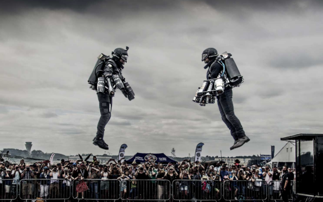
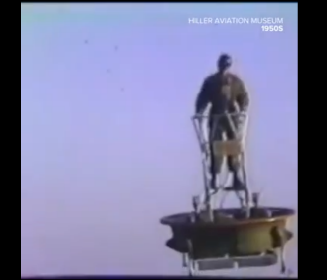
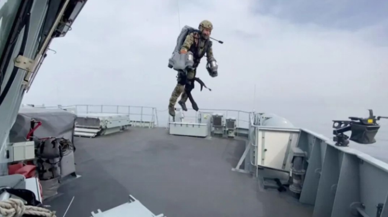
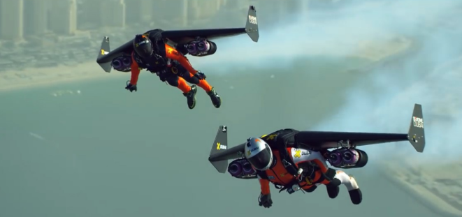

# 印陆军订购喷气背包，打造边境作战“钢铁侠”？

近日，据印度媒体报道，印度陆军边防部队已经开始测试一种用于边境作战的新式装备，即前几年颇为流行的喷气背包。此前，印度陆军在2023年1月发布了招标书，紧急采购48套喷气背包。

印度媒体特别强调，印度陆军采购以及用于测试的这批喷气背包，旨在加强边防部队在中印边境地区的巡逻、监视以及作战能力。可以说，印度陆军此次紧急采购的这种新式单兵飞行器，显然心存企图。

那么，这种颇具“噱头”的单兵飞行器究竟会装备到印度陆军的哪些部队？这些喷气背包会对边境形势产生哪些影响？

_在航展上进行表演的喷气背包。_

**有可能装备印军特种部队**

目前，印度媒体关于此事披露的信息并不多。不过，通过对于采购时间、数量以及关于这种喷气背包的部分性能，还是可以分析出更多的信息。首先，在喷气背包会装备于哪些部队这个问题上，笔者推测印度陆军很可能是将其分配给最为精锐的特种部队或者侦察兵，而不是普通的边防巡逻部队，主要理由有以下几个方面：

其一，这次印度陆军采购喷气背包的时间要求很紧迫，数量也只有48套，很显然并不是为大规模装备给边防巡逻部队而准备的，考虑到漫长的边境线以及印度陆军规模庞大的高原山地部队，再加上印军边防部队的部署情况，区区48套喷气背包连“九牛一毛”都算不上。所以，将这48套喷气背包集中起来配备给人数较少的特种部队或者侦察兵，反而能起到更大的作战效果。

其二，从印度媒体披露的信息看，此次印度陆军测试的就是采用英国重力工业公司技术研发的喷气背包。关于这型喷气背包，笔者在之前的专栏文章中进行过介绍。不过，按照印度方面的说法，目前已经实现了重力工业喷气背包大约70%的印度国产化，显然印度国内企业是引进了英国重力工业公司的相关技术，而不是单纯的采购成品。就在前不久的印度班加罗尔航展上，这型喷气背包也进行了首次公开展示，只不过当时没有引起更多媒体的注意。

对于英国重力工业公司研发的这型喷气背包，笔者认为确实只能装备给训练有素、操作技术娴熟且身体条件更为强壮的特种兵和侦察兵。因为重力工业喷气背包采用了非常独特的一台背负式主喷气式发动机加双臂各两台辅助喷气式发动机的布局，与漫威电影《钢铁侠》中钢铁侠盔甲的动力系统颇为类似。在《钢铁侠1》中，托尼·斯塔克制造出第一代盔甲并且进行试飞的场面，很多观众可能都记忆犹新。最初，托尼·斯塔克无法掌控好手部推进器以及脚部推进器的推力平衡，在实验室内撞得东倒西歪，不仅起了火，还砸坏了多辆豪车。

_冷战时期，美国对单兵飞行器进行了大量的探索，但都为大批量列装部队。_

重力工业喷气背包的飞行操控与钢铁侠盔甲也非常类似，背负式主喷气式发动机就相当于钢铁侠盔甲的脚部推进器，提供主要的推力，而双臂的辅助喷气式发动机除了提供部分推力外，更为主要的则是用于飞行姿态的控制和平衡。所以，重力工业喷气背包不仅要求飞行者身体更为强壮，能够承担背负式主喷气式发动机的重量，还要求具备更强的臂力，以便操控辅助喷气式发动机实现安全可控的飞行。如果飞行者装备重力工业喷气背包后，无法熟练掌握飞行技能，身体条件又不够强壮，即便是能够勉强飞起来，也很可能会发生失控坠毁的事故，导致机毁人亡。

所以，无论是英国重力工业公司，还是其他国家的类似企业，比如美国喷气背包航空公司、法国扎帕塔公司，通常情况下都是由最为熟悉本公司单兵飞行器的创始人来进行飞行展示。而在2021年英国皇家海军进行的重力工业喷气背包飞行展示中，担任飞行者的都是精挑细选经过长时间相关训练的陆战队员。

其三，重力工业喷气背包的有效载荷实在是太小了。根据英国重力工业公司公布的喷气背包主要性能数据，其五台喷气式发动机总的最大推力为144千克，而喷气背包的全重（包括发动机以及携带的燃料）约为50千克。考虑到飞行安全以及推力裕度等因素，英国重力工业公司建议飞行者的重量（包括体重、装具以及随身携带的必要装备）不要超过85千克。这就意味着要携带更多的装备，就必须严格限制飞行者的体重，所以，对于在高原山地地区执行任务的印度陆军边防部队来说，除了飞行者自身的体重、必要的防寒装备以外，恐怕连自动步枪以及弹药都带不了。如果是特种兵以及侦察兵不携带武器，只携带用于侦察、定位以及目标指示、瞄准的单兵光电观测仪，从有限负重的角度来看还是可以接受的。

_英国皇家海军陆战队测试喷气背包。_

**高原山地作战使用难题多**

从英国重力工业公司喷气背包的其他性能来看，就目前的技术水平而言已经算是不错的了，其最大飞行时速可达60千米，飞行时间8分钟，最大升限3658米。如果是按照直线飞行来计算的话，来回跨越2公里范围内的各种地形障碍应该是没有太大问题的。不过，这些性能数据都是英国重力工业公司在低海拔地区或海面上飞行所取得的，如果是到了边境的高原山地环境下，重力工业喷气背包的性能将大打折扣。

关于高原山地环境对于武器装备的影响，特别是对于飞行器以及动力系统的不利影响，最为主要的影响在于，高原山地地区的气压低、空气稀薄，含氧量少，从而导致喷气式发动机推力大幅降低。如前文所述，重力工业喷气背包在低海拔地区的总推力为144千克，那么到了高原山地地区，按照海拔高度的不同，其总推力会降到120千克，甚至100千克以下，而喷气背包本身的重量就有50千克，这也就意味着，大多数印军士兵哪怕是一丝不挂，使用重力工业的喷气背包也飞不起来。

另一方面，由于在高原山地地区喷气式发动机燃料燃烧不完全，耗油率也要大幅上升，直接导致飞行时间和航程大幅缩水——在低海拔地区能够飞行8分钟，在高原山地地区可能只有4～6分钟。而且，如何提高重力工业喷气背包的升限也是一个大问题，很多高原山地地区的海拔高度都已经会超过3658米这一数值了。

_现在不少民用企业也在研发单兵飞行器。_

所以，印度陆军如果是直接将重力工业喷气背拿来使用，恐怕要面对太多很难解决的难题。要么，印度国内企业，或者印度著名的军工科研机构——印度国防研究与发展组织对重力工业喷气背包进行全面改进提升，使其能够具备在3000米以上高原山地地区作战使用的能力。要么，就只能在相对低海拔地区使用重力工业喷气背包，限制其使用的地域范围。

当然，如果印度陆军能够有效使用重力工业喷气背包，让少数精锐的特种兵和侦察兵插上翅膀，具备短距飞行越障能力，确实还是有一定的威胁。在当今世界各军事强国的作战体系中，都非常强调信息化建设。而要实现真正的信息化，首先就要大力拓展和增强信息情报的获取能力。那么，在高原山地地区，因为地形以及环境极其恶劣，信息情报的获取就显得更为重要，其核心就是多个关键“点”的控制，简单地说，就是夺点、卡点乃至拔点。

可以设想，印度陆军的少数精锐特种兵和侦察兵利用喷气背包跨越常人无法越过的障碍，比如较深的峡谷、山脊等，到达某些占据制高位置的关键点，而且这些点通常又难以遭到对方的攻击。这时，就等于印军夺取并且卡住了这个关键点，再利用侦察设备监视对方，并且为己方的远程攻击火力提供目标信息数据，甚至发射激光束进行照射，用于激光制导弹药的目标指示，那么就会形成极大的威胁。对方如果要拔除印军这个点也会面临很多困难，或者印军特种兵和侦察兵在被发现之前，利用喷气背包返回本方基地，全身而退，则更为麻烦和棘手。所以，印军一旦在边境将喷气背包成规模地投入使用，那就不能等闲视之，应及早做准备。

