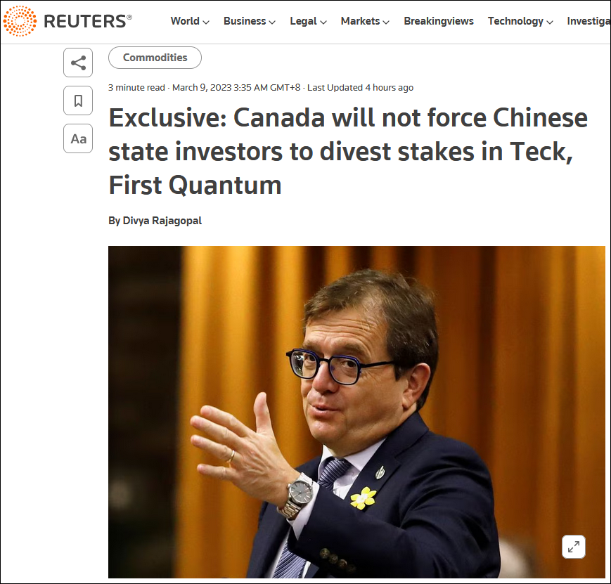

# 去年要求3家中企从加矿产企业撤资后，加拿大首次对中方未来投资表态

【文/观察者网 熊超然】当地时间3月7日晚间，加拿大自然资源部部长乔纳森·威尔金森（Jonathan
Wilkinson）告诉路透社，加拿大不会强迫其三家大型矿业公司的中国国有投资者减持股份，因为此举将带来政策上的不确定性。

去年11月2日，加拿大政府曾发表声明，以所谓“国家安全”为由，要求三家中资企业从加拿大动力金属公司等加方企业撤资。事后，此举招致了加拿大采矿业的批评，并让外界对于中国在加矿产业的其他投资前景产生了疑问。

路透社称，此次威尔金森的表态，是加拿大政府官员首次澄清中资企业，特别是中国国企，对加矿产企业投资的未来前景。

_路透社独家报道截图_

路透社独家报道称，威尔金森是于3月7日晚在多伦多参加加拿大勘探与开发商协会（PDAC）年会期间受访表态的，他表示：“如果你开始去回顾投资，就会产生各种不确定性，不确定一项‘投资’是否真的是一项投资。”

去年11月2日，加拿大政府以所谓“国家安全”为由，要求中矿（香港）稀有金属资源有限公司、盛泽锂业国际有限公司以及Zangge Mining
Investment（Chengdu）Co Ltd等三家中国公司剥离其在加拿大关键矿产公司的投资。受此消息影响，中矿资源竞价跌停。

而本次表态涉及的加拿大三家大型矿业公司则是泰克资源（Teck Resources）、艾芬豪矿业有限公司（Ivanhoe Mines
Limited）以及第一量子矿业有限公司（First Quantum Minerals
Limited），它们的最大单一股东都是中国国有企业。中国国企在三家分别拥有10.3%、26%和18.3%的股份。

据报道，受威尔金森表态影响和消息提振，这三家加拿大大型矿业公司的股价当天均有不同程度的上涨。

_资料图：加拿大自然资源部部长乔纳森·威尔金森_

事实上，加拿大去年底发布的消息，已经令该国规模较小的矿业公司感到担忧，这些公司也正在寻求为关键金属矿产资源的勘探筹集资金。

不过，威尔金森还是声称，加拿大仍然担心中国国有企业通过长期承购协议等机制“控制”加拿大矿业公司，而在这种机制下，买家可以用特定价格获得独家的长期金属矿产供应。

路透社则补充称，一段时间以来，加拿大及其盟友国家正在寻求与中国所谓的“脱钩”，比如实现在电池金属供应链上的多元化。此外，今年春季，加拿大还将推出修订后的《加拿大投资法》（Investment
Canada Act），该法案将拒绝加拿大政府认为对其国家安全构成威胁的外国投资，或对其施加条件。

而另一方面，威尔金森又澄清说，加拿大将继续与中国进行贸易。他的原话是：“加拿大当然会继续与中国进行贸易，其中一些可能涉及关键矿产的贸易。”

除了去年底加拿大要求三家中企撤出对加矿产企业投资，加拿大创新、科学与工业部部长商鹏飞还曾声称，当外国投资威胁到加拿大国家安全和重要的矿产供应链时，加方会果断采取行动。

对此，中国外交部发言人当时就指出，全球矿产资源产业链供应链的形成和发展，是市场规律和企业选择共同作用的结果。加方泛化国家安全概念，人为对中加企业间正常的经贸投资合作设置障碍的做法，与其自身标榜的市场经济原则和国际经贸规则背道而驰，不利于有关产业发展，有损全球产业链供应链的稳定。

中方敦促加方停止对中国企业的无理打压，为中国企业在加正常经营提供公平、公正、非歧视的营商环境。中国政府将继续坚定维护本国企业的正当合法权益。

与此同时，中国商务部新闻发言人也强调，中方对加方以国家安全为名，干扰阻断中加企业正常商业合作的行为表示坚决反对。我们敦促加方认真对待中方关切，停止将经贸问题政治化，为包括中国在内的各国投资者营造公平、公正、透明和非歧视的营商环境。中方将采取必要措施，坚决维护中国企业的合法权益。

**本文系观察者网独家稿件，未经授权，不得转载。**

