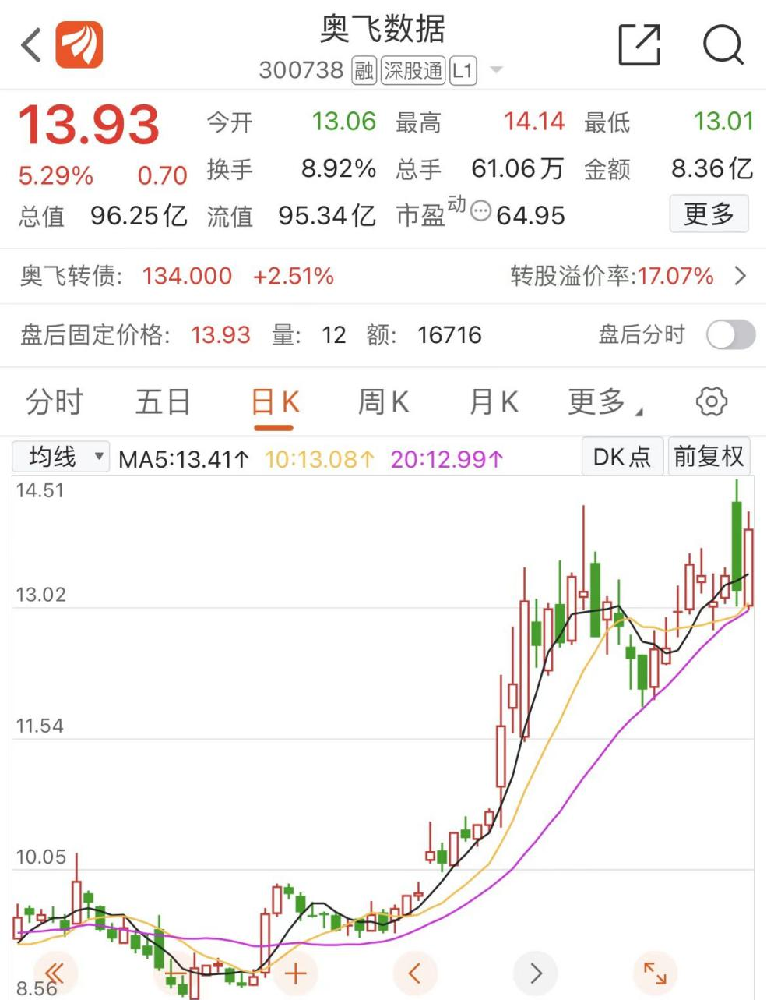
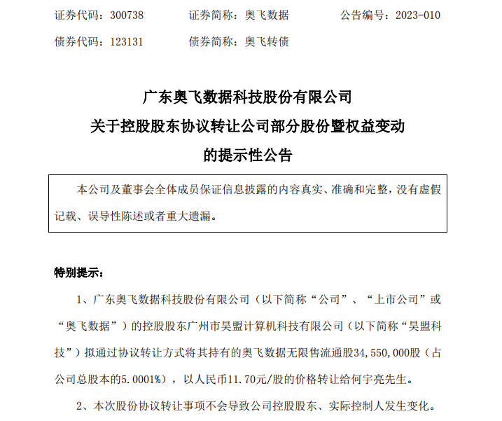
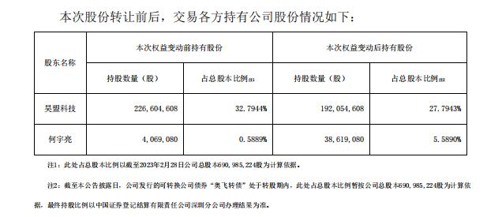

# 土豪打工人！年薪41万，自掏腰包4亿增持自家股票，有何来头？

A股又现土豪董秘！

A股一家IDC领域上市公司奥飞数据的董秘将“自掏腰包”4亿元购买自家股票，而这近乎相当于年薪的千倍。披露数据显示，该董秘2021年薪酬为41.43万元。

值得一提的是，奥飞数据在今年股价表现突出。3月8日，大数据板块再度活跃，奥飞数据大涨5.29%，报收13.93元/股，年内涨幅近60%，总市值为96.25亿元。根据公告，公司董秘将以11.7元/股的价格购买5%公司股份，按最新收盘价来看，已浮盈19%。

董秘“自掏腰包”4亿买5%公司股份

3月3日，奥飞数据公告，公司控股股东昊盟科技于2023年3月1日与何宇亮签订《股份转让协议》，昊盟科技拟通过协议转让方式将其持有的公司无限售流通股3455万股（占公司总股本的5.0001%），以11.7元/股的价格转让给何宇亮，股份转让总价款约为4.04亿元。本次股份协议转让事项不会导致公司控股股东、实际控制人发生变化。

在此次协议转让前，何宇亮持有奥飞数据406.08万股，占公司总股本的0.5889%。本次股份转让完成后，昊盟科技将持有1.92亿股公司股份，占公司总股本27.79%；何宇亮将持有3861.9万股公司股份，占公司总股本5.589%。

公告显示，何宇亮现任公司董事、副总经理、董事会秘书，其不存在《公司法》第一百四十八条规定的情形，最近3年不存在有证券市场不良诚信记录的情形。公告称，本次股份转让价款分3笔支付，共计约4亿元资金，由何宇亮以自有资金及自筹资金方式支付。

公告表示，本次权益变动是受让方基于对公司战略发展的坚定信心及对公司长期投资价值和未来发展前景的充分认可，同时公司控股股东通过本次股份转让事项，与公司核心管理人员进行深度合作，提升公司凝聚力和竞争力；本次权益变动亦是转让方基于自身经营发展作出的决定，价款将用于补充日常经营的流动资金。本次权益变动不会导致公司控股股东及实际控制人发生变化，不存在损害公司或其他股东利益的情形。本次交易不会对公司人员、资产、财务、业务、机构等方面的独立性产生影响，不会对公司治理结构及持续经营产生影响。

2021年年薪41万元

值得注意的是，何宇亮既是奥飞数据的董秘，也是公司的十大股东之一。公告显示，在上市前，何宇亮就持有公司40万股原始股，占总股份的0.82%，此后公司有过数次转增股本，在此次协议转让前，截至2022年9月30日，何宇亮持有奥飞数据406.91万股，占公司总股本的0.5889%。

资料显示，何宇亮，1980年8月出生，毕业于中山大学旅游酒店管理专业，本科学历，于2016年取得深圳证券交易所董事会秘书资格证书。2014年至今担任奥飞数据董事、副总经理、董事会秘书。

Wind数据显示，何宇亮2021年薪酬为41.43万元。而此次购买股份需要支付约4亿元。

企查查显示，何宇亮共担任5家企业的法定代表人，其中两家为注销状态。

年内股价上涨近60%

股价方面，近期，大数据板块活跃，奥飞数据年内股价上涨近60%。

资料显示，奥飞数据是华南地区领先的IDC服务商，成立之初以带宽租用业务为主，2014年开始向自有数据中心战略转型，2018年上市后公司借助资本之力，对内通过不断的资本投入加快自建数据中心，对外收购完善全国布局，卡位核心城市加速全国机柜部署。截至2022上半年，公司在北京、广州、深圳、海口、南宁、廊坊拥有12座自建数据中心，可用机柜数达到22000个，同比增长29.41%。

国信证券研报表示，随着《数字中国建设整体布局规划》发布，相关顶层规划落地，数字中国建设被纳入领导干部考核指标，彰显全面部署数字中国的决心。通信产业是数字基础设施，也是数据要素产业的重要参与方，有望全面受益，其中重点关注：

（1）数据要素催动运营商价值重估：运营商是数据供应商、数据服务商重要参与者之一，数据资产进表后运营商资产价值亟待重估；（2）算力基础设施：算力基础设施是数字中国建设的关键基础设施，“东数西算”工程投资有望加速，叠加AI结构性需求催化，设备商、第三方IDC厂商等有望受益；（3）低估值与政府支出受益板块：数字基础设施中的物联网、北斗等板块目前估值水平合理，具备向上空间，同时数字技术与政务、社会服务、生态环境等方面的融合需要政府开支支持，相关厂商To
G业务具备较好弹性，建议关注政府支出受益板块如北斗等

富荣基金的基金经理李延峥认为，TMT行业或将迎来一个周期性向上的拐点，而其中计算机的拐点可能会更早。在过去两年，因疫情影响导致政府IT支出减少、现场交付延后以及5G渗透缓慢等原因，计算机行业的业绩出现明显下滑，拖累行业市场表现。近段时间以来，很多政策都在支撑计算机行业往上发展，叠加疫情防控政策的科学调整，预计在今年上半年可以看到计算机行业基本面的改善。同时，新技术的出现，对整个计算机行业相关应用，包括AI服务器的需求会带来较大刺激，使得我们对未来1-2年的产业趋势更加有信心。

