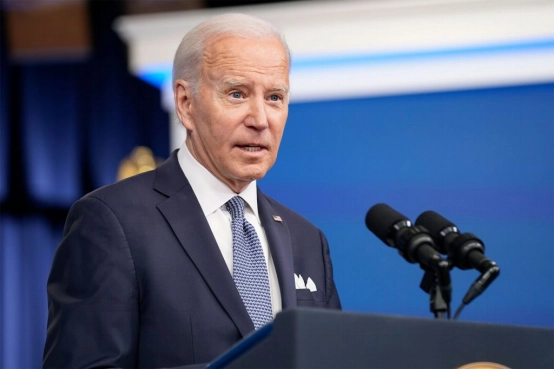

# 外媒曝光：美国正谋划成立又一个“俱乐部”，目标还是中国

【环球时报-环球网报道
记者倪浩】据《华尔街日报》9日报道，美国与欧盟正在推进一项以关键矿产为重点的贸易协议的起草工作，预计本周五美国总统拜登和欧盟委员会主席冯德莱恩将就此展开讨论，迈出构建这一被媒体称为“关键矿产买家俱乐部”的第一步。

据《华尔街日报》报道，这个所谓“关键矿产买家俱乐部”原本意在协调美欧因《通胀削减法案》而产生的分歧，但现在另一个重要的目的
“把清洁能源供应链从中国转移出去”更加暴露。报道援引双方官员的话说，作为本周五会议的部分内容，美国和欧盟的目标是宣布开始就相关协议条款展开谈判。

_拜登，资料图，图自外媒_

去年，美国通过《通胀削减法案》，称将对气候和清洁能源领域投资约3700亿美元，其中包括对美国消费者购买新能源车提供总计7500美元的税收抵免优惠。但该优惠有严格的适用条件：新能源汽车所有材料和关键矿物须有一定比例来自美国或与美国有自由贸易协定的国家，以及新能源汽车所使用的电池组件有一定比例在美国或与美国有自由贸易协定的国家组装制造或在北美被回收。不过，由于包括欧盟和日本在内的几个美国盟友没有与美国签订自由贸易协定，这项规定引发了西方盟友对美国的强烈不满，认为美国的规定是不公平竞争，对欧洲产业不利。

今年2月，法国和德国的高级官员在访问美国时，呼吁成立一个“关键矿产买家俱乐部”，以解决上述问题。随后，这一俱乐部的组建被提上日程。《华尔街日报》报道说，美国和欧洲官员都认为，成立俱乐部是尝试解决美欧之间围绕着《通胀削减法案》产生的紧张关系的一种方式。

据报道，美国与欧盟、日本和英国的贸易协议将是这个“关键矿产买家俱乐部”的第一步，然后七国集团将与非洲、亚洲或拉丁美洲矿产资源丰富的国家如乌克兰或赞比亚等接触，并寻求与它们达成协议，以确保原材料供应。知情人士表示，美国和欧洲官员已经开始相关联系，七国集团将为这些矿产资源国开发采购矿产的基础设施提供资金。

报道援引知情人士的话称，目前正在拟定的贸易协议范围较窄，只限于锂和镍等关键矿产。虽然达不到传统自由贸易协定（FTA）的标准，但该协议将很大程度上平息其他西方盟国对美国在这方面的强烈不满。

值得注意的是，《华尔街日报》称，成立该俱乐部的目标是确保西方世界能够可靠地获取关键矿物，但该俱乐部的成立还将造成采用来自中国等国矿产的车辆无法获得补贴。

行业观点认为，如上述“关键矿产买家俱乐部”成立，将导致中国企业通过贸易或投资方式参与美国新能源汽车市场受到限制。对于中国新能源汽车行业而言，美国曾经是一个重要的目标市场，但随着美国贸易限制措施的出台，中国企业的海外开拓不得不变得谨慎起来。

对此，中国社科院美国研究所研究员吕祥接受《环球时报》记者采访时表示，俱乐部成立的目的之一是拜登政府对西方盟友的一种安慰，折射出拜登一贯拉拢盟友围堵中国的执政思路；另一方面也暴露出，一直以自由市场经济自居的美国处处违背市场规律，违反世贸组织原则的荒唐做法。他表示，中国在新能源汽车行业深耕多年，目前在全球的领先优势已经非常明显。在这种情况下，美国拉拢西方盟友组建所谓俱乐部，是一种“挣扎性”行为，短期难以影响整个产业链。

