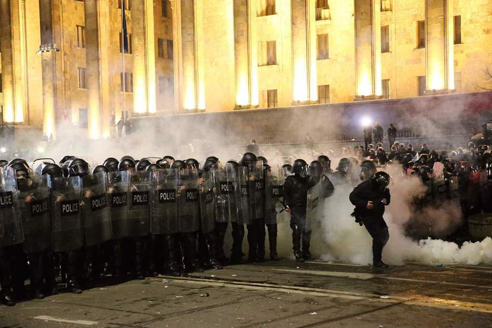

# 引发大规模抗议后，格鲁吉亚执政党撤销“外国代理人法案”

在引发大规模批评与抗议后，格鲁吉亚执政党已宣布撤销“外国代理人法案”。

_当地时间2023年3月9日，格鲁吉亚第比利斯，身穿防暴装备的警察在面对抗议者。视觉中国
图_

据美国有线电视新闻网（CNN）报道，当地时间3月9日，格鲁吉亚执政党宣布撤销一项有争议的“外国代理人法案”。此前，格鲁吉亚议会于当地时间3月7日通过了“外国代理人法案”的一读，该法案要求所有从海外获得超过20%资金的组织都必须登记为“外国代理人”，否则将面临巨额罚款。

据路透社报道，格鲁吉亚执政党主席伊拉克利·科巴希泽3月8日表示，“外国代理人法案”法律有助于根除那些违背国家利益的力量，并批评格鲁吉亚的“激进反对派”煽动抗议活动。

据法国24小时（France24）新闻网与美国有线电视新闻网报道，自3月7日起，格鲁吉亚首都第比利斯连续两晚暴发大规模抗议活动。数千人在位于第比利斯的议会大楼外聚集，抗议者挥舞欧盟、美国和乌克兰的旗帜，一些抗议者向建筑物的窗户投掷石块，并试图打破防护屏障。当地警察用高压水枪、催泪瓦斯和闪光弹驱散试图抗议者。格鲁吉亚内政部表明，截至9日已逮捕142名与抗议活动有关的人士。

据美国有线电视新闻网报道，格鲁吉亚批评人士表示，“外国代理人法案”疑似效仿俄罗斯法律，将对该国的公民社会产生寒蝉效应，损害民主政体。也有抗议者担心该法案会离间本国与欧洲的关系。报道称，格鲁吉亚于2022年3月申请加入欧盟。虽然格鲁吉亚没有获得候选资格，但欧洲理事会已表示，如果格鲁吉亚实施某些改革政策，将愿意给予格鲁吉亚欧盟候选国的资格。

