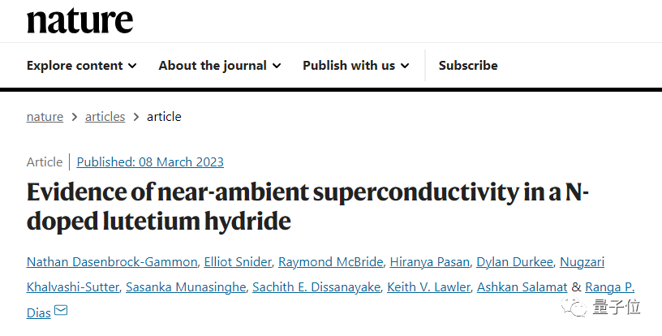
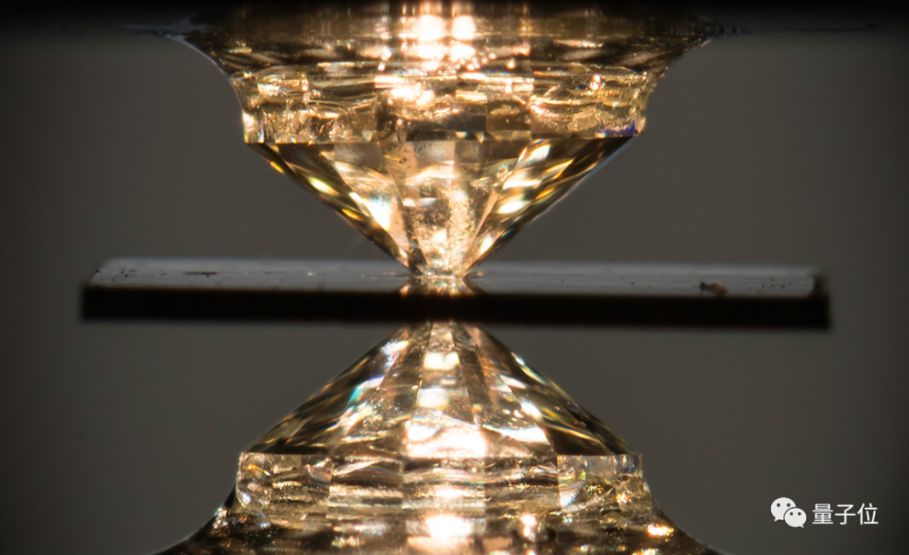
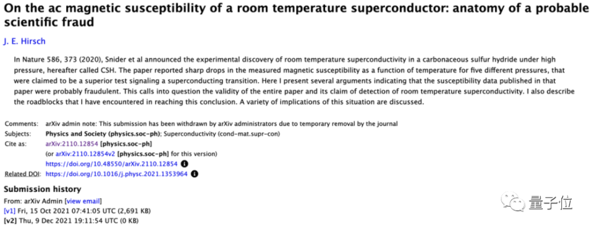
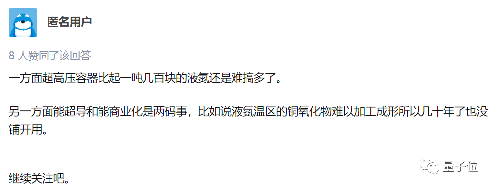
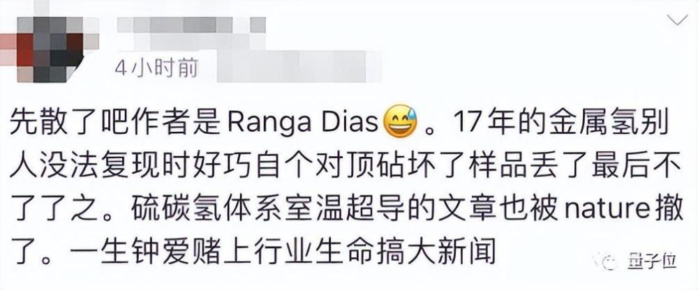

# 物理学大突破！Nature凌晨发稿：21℃实现室温超导，赌城现场被挤爆

物理学界又被扔下一枚核弹！

还是因为那石破天惊、看上去分分钟要把诺奖斩获马下的四个字：

**室温超导** 。

并且这次，来自罗彻斯特大学的Ranga Dias团队，给出的结果 **压强更低，临界温度更高** ：

新材料在约21℃的室温条件下， **加压到1万个标准大气压** 就会出现超导现象。

p.s. 人类已经可以在5-6万个大气压下合成钻石。

在拉斯维加斯，最新成果的发布现场，小小报告厅里挤满了各路物理大牛。包括高温超导先驱朱经武教授，以及此前一直在质疑室温超导的日内瓦大学凝聚态物理学家Dirk
van der Marel。

_图源：周华@aps，左一为朱经武_

而在报告厅外，更是挤满了大批未能入场的物理学研究者，以至于保安需要不断驱散人群，防止消防隐患。

就在今天凌晨，Nature还正式发表了Dias团队的新论文。时间戳显示，这篇论文在2022年8月投出，今年1月18日被Nature接收。

这事为何如此受关注？

毕竟如果室温超导成真，那么超导磁体相关研究，如粒子对撞机、可控核聚变、量子计算机等，都将获得新突破，还能降低我们日常生活中电力传输损耗的问题……总之是物理层面巨大的突破。

消息传开，全球都炸锅了。

相关问题直接连夜冲上知乎热搜第一。

Reddit上，这一话题的热度也是隔几分钟就往上窜一窜。

状态嘛，就是一整个兴奋期待又充满犹疑。

兴奋的是，尽管1GPa的压力值仍然很高（约为1万个标准大气压），但在物理学中，已经是从高压到近常压的重大突破。

犹疑的是，事情很大条，但研究团队有黑历史——去年10月，该团队登上Nature封面的“首个室温超导体”论文，被Nature强制撤稿。

原因是Nature认为Dias他们的数据处理方式有问题。并且其实验结果也一直未能被成功复现。

这位老哥又搞啥大新闻？

不管怎么说，咱们还是先来看一下这枚“核弹”究竟包含哪些内容。

美国物理学会年会（APS）现场，科普了好几分钟超导发展史后，Ranga Dias突然拿出重头戏——团队发现的又双叒一个室温超导新材料。

这种材料由 **镥-氮-氢** （Lu-N-H）构成，它最爆炸的点在于，超导现象不仅能在21℃的室温条件下实现，压强还从上百GPa降低到了1GPa。

原本Nature那篇（撤稿的）论文介绍的新材料由 **氢-硫-碳** 组成，宣称在15℃、267GPa压强条件下，实现了室温超导，当时已经震惊了一众人。

另外，就连合成金刚石都需要5GPa压强和1400℃高温……

当然，1GPa仍然不是一个小数目，相当于标准大气压的10000倍（标准大气压约为101.325kPa）。

Ranga Dias在会议摘要中更是宣称：

有了这种材料，近常压超导和应用技术的黎明已经到来。

这种材料是怎么做出来的呢？

团队先是从镥和氢的化合物上入手，测量了一通数据，发现在加入一点氮后，材料达成超导条件所需的温度数值变高了，最终合成了这种室温超导材料。

所以，团队如何判断自己的材料达到了超导条件？

理论上来说，仍然得靠两个效应判断。

一个是 **完全抗磁性** ，又称迈斯纳效应，能让超导体内部的磁感应强度为零，及超导体排斥体内的磁场。这种特性最大的用途是用来做磁悬浮。

另一个则是 **零电阻效应** ，指的是某种材料在常温时是导体、半导体甚至绝缘体，但当温度下降到某一特定值时，它的直流电阻突然下降为零。

通常用迈斯纳效应测量起来比较困难，不少研究用的都是零电阻效应的判断方法，即在某种条件下观察到材料电阻变为0。

但具体到实验测量上就又没这么简单了。

这是因为在具体实验中，实际能测量的合成物样本往往非常小（使用金刚石等装置加压时，最大的压力只在两个金刚石的“尖对尖”之间出现），导致测量结果可能出现偏差。

与此同时，测量电阻值还需要给样品加上额外的装置，这又会对实验测量精度进一步提出要求，因此在获取测量数据后，往往还需要对数据进行处理，来判断材料是否达成了室温超导条件。

从数据测量方法上，团队仍然采用了和上次相似的一种方法——使用背景减法消除嘈杂背景信号。

这是在进行背景减法前的数据和处理后的实验结果：

这是团队测量这种材料实现超导所需的温度条件和压强图，其中在1GPa的时候，材料能在接近21℃的温度条件下实现超导：

但比较奇怪的是，从上面这张图来看，随着压力继续增大，材料实现超导的温度数值又变低了……

遗憾的是，Dias的这次分享并没有开放现场提问环节。

这次新材料的测量结果和数据是否真实，还得交给学术界的研究者去仔细鉴别。

研究者争议缠身

但正如不少网友所提醒的那样，Ranga Dias其人，确实争议缠身。

前文说到，在2020年的时候，Dias就宣布一种由氢-硫-碳三种元素组成的新材料可以实现室温超导（15℃，267GPa）。

尽管压力条件相较此次给出的结果，距离实际应用更远，但作为“首个室温超导成果”，这项研究在当时同样轰动了学界，还登上了Nature封面。

然而，就在这篇论文发表后的两年间，围绕这项研究，可谓争议不断。其他实验室反复尝试，都未能复现结果。

2021年8月25日，一个核心争议点被揪了出来：论文的磁化率数据有问题。

简单来说，就是Dias团队在处理原始数据时，用特殊方法对背景噪声进行了去除，但在论文中却没有针对这一数据处理方法，给出合理的解释。

提出h指数的理论物理学家Jorge Hirsch在验证数据之后，直接质疑Dias团队用多项式曲线拟合数据“是一种捏造”，是“ **一场科学骗局** ”。

到了2022年年底，这一出造假疑云发展到高潮：Nature直接不管9位论文作者的集体抗议，强制撤下了他们的封面文章。

对于这一结果，Dias的团队显然并不服气。上个月，他们又在arXiv上发了篇新文章，把大家质疑的种种数据重新测了一遍。

不过这一次，超导现象出现的温压条件有所变化：在133Gpa条件下，氢-硫-碳化合物的临界温度为260K，约为零下13℃。

但在争议之中，Dias却已经为自己搞出的新材料成立公司，基于现有研究成果来开发商用室温超导体。

除了这事儿外，Dias老哥博士后期间发表的一篇论文也惹出过麻烦。

当时，他所在的哈佛大学团队宣布合成出了 **首个金属氢** ，论文发表在Science上。Dias正是该论文的第一作者。

离谱的是，论文发表后，研究团队称由于操作失误， **该金属氢样本已经损毁或消失** 。

“还需等同行复现”

对于这次新成果，不同的网友也有不同的看法。

有一批网友已经嗨了：

要是室温超导真的实现，意味着包括可控核聚变、量子计算在内的领域，全都会被新的技术颠覆。

甚至还有网友表示，这要是能整出来，绝对是诺奖级的研究成果。

还有网友已经开始探讨这种新材料的商业化落地可能性了。

但与此同时，也有不少网友发现了这里面的问题，整体抱持一种谨慎态度。

一方面，有网友已经发现，这个老哥黑历史比较多：

另一方面也有网友表示，对于这类研究，最好还是等一等同行复现的结果：

这次结果仍然只是一家之言，而不是同行评议的结果。

而量子位一位不愿透露姓名的南大凝聚态物理硕士已经表示：

鱼羊 萧箫 发自 凹非寺 量子位 | 公众号 QbitAI

论文地址：

https://www.nature.com/articles/s41586-023-05742-0

参考链接：

[1]https://www.zhihu.com/question/588302961

[2]https://www.reddit.com/r/science/comments/11lsyt6/researchers_claim_to_have_squeezed_room/

[3]https://meetings.aps.org/Meeting/MAR23/Session/K20.2

