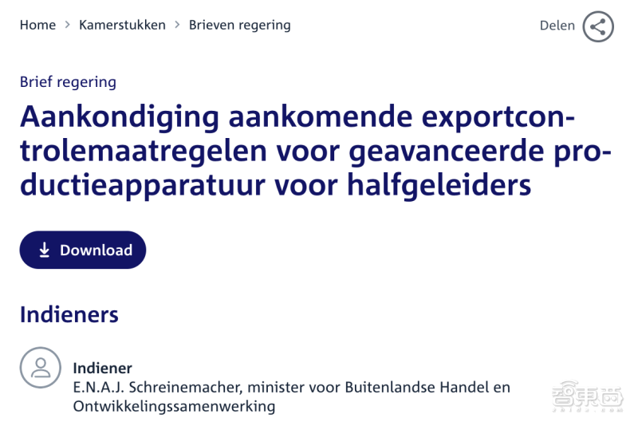
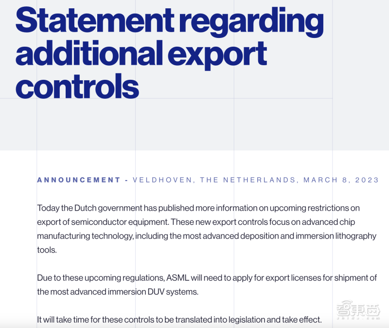

# 荷兰正式出手！限制DUV光刻机出口

芯东西3月9日消息，当地时间3月8日，荷兰宣布正式加入美国在半导体行业对中国的限制行列。荷兰贸易部长Liesje
Schreinemacher致议会函中透露，荷兰计划对半导体技术出口实施新的限制，这些限制将在夏季之前实施。

_荷兰贸易部长Liesje
Schreinemacher致议会函_

在致函中，Schreinemacher没有说明哪些半导体相关设备会受到影响，但她强调，这些公司必须申请出口这项技术的许可证，“限制措施只会包括可以制造最小、最强大芯片的非常高规格的系统，包括ASML制造的一些
**深紫外（DUV）光刻机** 。”

ASML回应荷兰半导体出口管制新规：并不适用于所有浸入式光刻设备称，他们还没有收到“非常高规格的系统”的明确定义，此举不会对该公司2023年或者长期的财务表现产生重大影响。不过，受新规影响，ASML需要申请出口许可证才能装运其DUV光刻机。

_ASML官方回应_

DUV光刻机被用于生产28nm及更成熟制程的芯片，理论上最高能制备7nm，主要供应商有荷兰ASML、日本尼康、日本佳能等。从ASML界定的范畴来看，荷兰出口限制新规可能主要涉及能生产先进制程芯片的高端DUV光刻机型号的采购，暂不影响2000i之前的型号。

_ASML
DUV光刻机型号一览（图源：ASML）_

去年10月，美国政府对中国实施了芯片制造工具出口限制，但要使这些限制生效，需要拥有相关关键技术的荷兰、日本供应商同意，因此今年1月初开始，美国政府就一直在游说荷兰与日本达成限制向中国出口先进芯片制造工具的协议。

这也是荷兰首次公开这一协议的部分细节，据传日本最快也将于本周更新其芯片出口政策。

在本周荷兰和日本经美国强烈游说的新出口管制的更多细节公布之前，ASML的CEO Peter
Wennink将在该公司位于荷兰维荷芬（Veldhoven）的总部发表讲话。

一、扩大现有出口管制，将出台国家管制清单

在致函中，Schreinemacher称，荷兰在全球半导体产业链中发挥着重要作用，鉴于技术发展和地缘政治影响，政府有必要扩大对特定半导体制造设备的现有出口管制。

Schreinemacher称，荷兰政府已决定采取“尽可能谨慎和准确的措施……以避免对产业链造成不必要的破坏，对于重要的公司来说，了解他们所面临的问题，并有时间适应新规则”。

荷兰还将以国家安全为由，以最快的速度对相关技术进行监管，因此内阁将推出一份国家管制清单。

除此以外，Schreinemacher还计划在Wassenaar
Group等论坛上推动全球对于先进芯片制造的控制，这一由发达国家组成的团体可以制定用于军事系统设备的出口限制。

二、销售DUV需申请许可证，业绩表现暂无影响

虽然在信件中，Schreinemacher没有明确提到中国和全球最大光刻机巨头ASML，但这两者都会受到影响。

ASML在全球芯片供应链中占据着至关重要的地位，是唯一一家能够制造高度精密的极紫外（EUV）光刻机的公司，而这也正是生产先进芯片的关键设备。

ASML更先进的EUV光刻机已经于2019年就禁止向中国销售。

如今，受荷兰即将出台的法规影响，ASML需要申请出口许可证才能装运其DUV光刻机。ASML回应称，不过此举不会对该公司2023年或者长期的财务表现产生重大影响。

更重要的是，荷兰政府的新出口管制措施仅适用于“最先进”工具，但ASML还未收到有关“最先进”的明确定义。因此，ASML将其解释为“临界浸没式”（critical
immersion），将其定义为TWINSCAN NXT:2000及后续的浸没式光刻系统。

Wennink说，他“比以往任何时候”都更加严密地防范知识产权盗窃风险。因为，美国对中国采购先进芯片和半导体设备施加了越来越多的限制，这增加了他们在安全工作方面的风险。

同时，Wennink还警告各国政府不要陷入保护主义，他认为芯片行业使全球社会取得了巨大进步。

结语：中荷应共同维护供应链稳定

ASML预计2023年在中国的销售额将保持在22亿欧元左右，这也意味着其销售额已经相对收缩，因为其整体销售额增长幅度可能在25%左右。

荷兰政府的最新公告只透露部分细节，但留下了更重要的疑点，那就是ASML是否能够为自2014年以来向中国客户销售的价值超过80亿欧元的DUV光刻机继续提供服务。

关于荷兰将对华禁供的ASML光刻机范围从EUV光刻机扩大到DUV光刻机的消息，1月30日，中国外交部长秦刚曾同荷兰副首相兼外交大臣胡克斯特拉通电话，就双边关系等问题深入交换意见。

秦刚指出，“开放务实”是中荷关系的最大特色，双方要共同维护国际产业链供应链稳定，维护开放而非分裂、有序而非混乱的国际贸易环境。胡克斯特拉副首相兼外交大臣表示，荷方愿推动两国开放务实的全面合作伙伴关系不断发展，将继续以负责任方式处理对华经贸事宜。

来源：ASML官网、荷兰众议院官网

