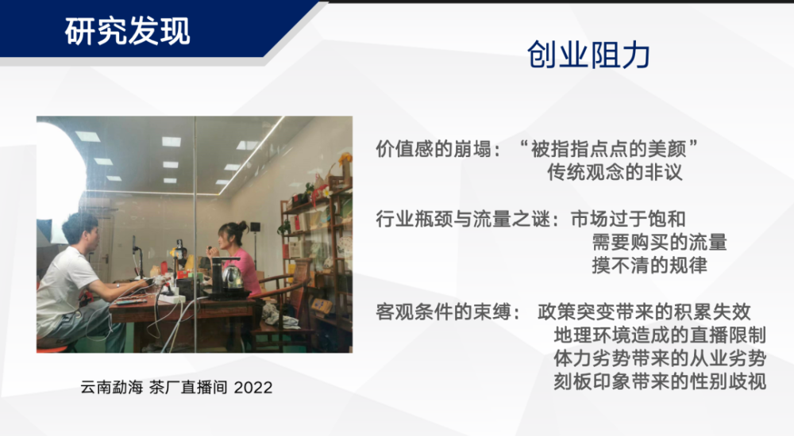

# 调研称大部分农村直播赚不到钱，“一个月赚几百，遭家人反对与质疑”

近年来，伴随直播电商浪潮的兴盛，相关平台时常推出农村主播作为代表案例，介绍直播电商平台对农业经济的拉动作用，但多数的农村带货主播能够实现“财务自由”吗？

3月9日，在“县乡数字经济视角下的就业与新职业”交流活动现场，中国社会科学院新闻与传播研究所研究员曾昕的调研结果显示，有很多乡村女性的（直播电商）创业是不被认可的，大部分农村直播是赚不到钱的，不买流量的涨粉非常困难，可能辛劳一个月，最后也就赚到几百块，反而还会因此遭到家人的反对与质疑。

但他们仍在坚持，因为“创业”对很多乡村女性来说，是一个自我发现的过程。一位乡村妇女对曾昕表示，“我三十多岁了，每天照顾老公孩子，但没有人跟她说谢谢。然而在网上，很多人会跟她说‘小姐姐你好好看’。”

曾昕对第一财经记者表示，县乡通过数字化“创业”确实结果不确定，大家的抉择因素也不同，大部分会根据最终效果进行筛选，比如有一定收入基础的家庭，会继续利用闲暇时间进行直播带货；如果家庭协商结果并不乐观的，可能会退回家庭。但除了财务收入之外，她们会获得更多情感层面的收获，比如通过成立各种QQ群，进行业务、家庭、日常生活的交流等。

曾昕发现，主播的职业迅速流行之时，对外曝光更多的d是所谓的头部、顶流和明星式大主播，但她在田野调查中发现，电商主播这一职业带来的社会影响远非在此止步。电商直播在乡村的迅速“下沉”，带给广大农村、乡镇个人深远的影响。“做主播”可能不再仅仅是一份工作的选择，而是一场个人对于自我认知、对于生活想象的再塑造。

县乡经济是近期政府政策重点强调的方向与领域，今年2月，中共中央、国务院印发的《数字中国建设整体布局规划》提出，深入实施数字乡村发展行动，以数字化赋能乡村产业发展、乡村建设和乡村治理。在中央政策的引导下，地方日益发觉电商产业大有可为，能够成为地方创收的重要途径，因此加紧完善基础设施，出台优惠政策，以此吸引电商从业者。基地建设、物流整合、招商引资、租金减免、学费补贴、会展筹备是地方政府“筑巢引凤”的重要策略。

在微信战略研究院高级研究员张斌在走访重庆一个比较偏远的城口县乡村时，发现这个村距离县城有一个小时车程，途中都是蜿蜒山路，大多数路段都没有划分车道。就在这样一个村里，村民也通过小程序搭建了一套数字乡村信息系统，里面基本包含了各种治理和服务的工具。每户的家庭档案、房屋档案和产业信息也都可查，村干走访日志也可以记录在上面。群众需要生活缴费、代开证明、申请就业培训、包括超市的积分兑换服务一应俱全。

通过走访县乡数字化落地，张斌发现，在推动乡村和县城发展的过程中，最重要的要素是人，不是外来人口，而是当地人；政策上应多鼓励返乡创业，比如有的大学生在大城市工作没几年不想卷了，或者对自己的职业生涯一眼看到头了，也会选择返乡创业。张斌认为，这些人在大城市见过世面，受过商业化和数字化洗礼，一旦回到基层，他们的思路往往比当地人要开阔，对工具的使用更加娴熟，也懂得利用外部资源。

当然，县乡数字化过程也存在了包括曾昕所提收入不稳定等问题与风险，张斌举例称，部分农产品在打开线上销路方面的一些问题，农产品因为它的生产方式和产业规模，很多并没有实现品牌化，消费者相应也便比较谨慎。“即使产品的证照齐全，一个地方性的特色产品如何才能获得全国市场的青睐，也是挺困难的，”张斌称。

