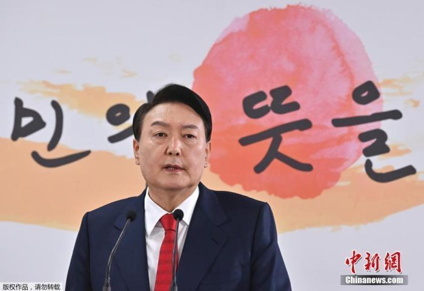

# 韩媒：韩国总统尹锡悦将于3月16日至17日访问日本

中新网3月9日电 据韩联社报道，韩国总统尹锡悦将于3月16日至17日访问日本。

_资料图：韩国总统尹锡悦。_

据此前报道，3月1日，韩国总统尹锡悦出席“三一独立运动104周年”纪念仪式时曾表示，希望韩日两国放弃历史恩怨，成为“拥有共同普世价值观的合作伙伴”。

此后不久，尹锡悦政府公布日本二战时期强征劳工受害者赔偿问题的解决方案，韩方将设立公共赔偿基金，代替被告日企支付赔偿金和利息，由此引发韩国国内抗议声不断。

