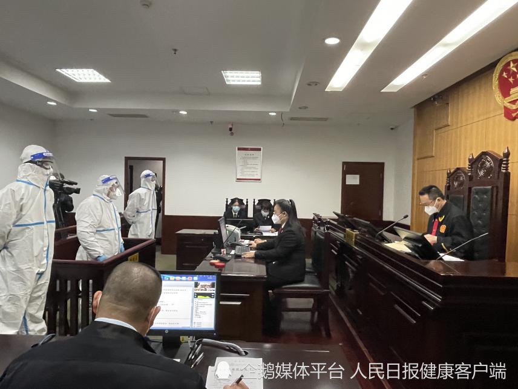

# 167人涉疫轻微不再被起诉，已判决生效的将继续执行

**人民日报健康客户端记者 杨晓露**

最高人民检察院检察长张军日前在十四届全国人大一次会议上作最高检工作报告时指出，对拒绝执行疫情防控措施致病毒传播、造成严重后果的，以妨害传染病防治罪起诉542人；情节轻微的，不起诉167人。

北京市鑫诺律师事务所律师赵晓林表示，涉疫轻微的不再被起诉，体现了新冠“乙类乙管”后的执法有度，但对于在“乙类乙管”前已经判决确定有罪并生效执行的，该判决的效力不会受到影响，这是维护法律的严肃性和权威性所要求的。

_2022年4月，山东烟台市芝罘区人民法院公开开庭审理首例疫情防控期间妨害传染病防治罪案。山东烟台市芝罘区人民法院官网图_

人民日报健康客户端记者在中国检察网检索发现，今年2月，陕西渭南市就公布了2份涉嫌妨害传染病防治罪案的不起诉决定书。决定书显示：被告人张某、苏某虽然因个人疏忽导致新冠病毒疫情在社会面广泛传播，但根据相关规定，该行为已不再符合刑法中关于妨害传染病病防治罪的构成要件要求，决定对张某和苏某不起诉。

赵晓林律师介绍，犯罪情节轻微的判定主要考虑社会危害性，需要综合考虑犯罪的时间、地点、场所、环境、手段、方法、侵害对象、犯罪后果、犯罪次数、犯罪动机等。对不予起诉的人员来说，除人民法院生效裁判文书确认有罪外，其他情况均应当视为无罪。无罪就不会有犯罪记录，因此也不会影响本人或未来子女报考需要政审的工作。

疫情期间已经判决的妨害传染病防治罪该如何处理呢？赵晓林告诉人民日报健康客户端记者，根据刑法规定的溯及力原则，对于已经作出的生效判决，不因法律及相关规定的变化而发生变化，是继续有效的，犯罪行为人应继续接受刑事处罚。

此前，最高人民法院、最高人民检察院、公安部、司法部等联合发布通知《关于适应新阶段疫情防控政策调整依法妥善办理相关刑事案件的通知》，对涉疫轻微刑事案件，重在疏导和化解矛盾，统筹落实少捕慎诉慎押刑事司法政策。但对侵犯医务人员人身安全、扰乱正常医疗秩序和严重妨害养老机构、社会福利机构等重点机构防控秩序，对涉疫药品、检测试剂等制假售假、走私贩私、哄抬物价等危害严重、性质恶劣等犯罪行为，依法从严惩治，坚决维护国家安全和社会稳定。

