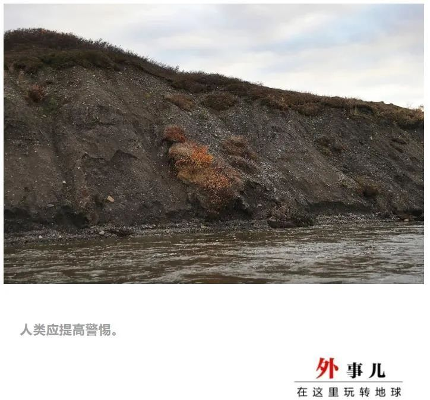

# 4.85万年，迄今最古老病毒被复活，仍具感染性

随着全球气候的变暖，北极的永久冻土融化，已潜伏在此数万年的病毒可能会复苏。

综合欧洲新闻网和美国有线电视新闻网3月9日报道，为了评估这些病毒可能对人类带来多大的风险，有研究人员正小心心翼翼地复活其中一些病毒。

来自法国马赛艾克斯大学医学院和基因研究组的教授米歇尔·克拉维里及其团队最近表示，他们已经成功地从永久冻土层中分离并复活了几种古老的病毒，最古老的病毒可追溯至4.85万年前，至今仍具感染性。

**遥远至4.85万年前的病毒被复活**

回溯至2003年，克拉维里在冻土层中发现一种特殊的病毒。这种病毒被称为巨型病毒。这种病毒比普通病毒大得多，不需要借助电子显微镜，在普通光学显微镜下即可看见，这使得该病毒更有利于实验室研究。

受俄罗斯科学家团队等的启发，他将从西伯利亚永久冻土中采集的样本进行了测试。2012年，俄罗斯科学家团队从松鼠洞穴中发现了3万年前的种子，并复活了一株野花。自此以后，许多科学家们也成功复活了一些远古的微型动物。

2014年，克拉维里和他的团队成功分离出永久冻土中的一种病毒，并将它植入培养细胞，使它在3万年来首次具有传染性。为了安全起见，他研究的这种病毒只能感染一种名为变形虫的单细胞生物，不能针对动物或者人类。他们在2015年再次分离出另一种同样只能感染变形虫的病毒。

今年2月18日，他们将研究结果发表在《病毒》杂志上。研究结果显示，他们从西伯利亚七个不同地区的永久冻土样本中分离出几种古代病毒株，并表明它们都可以感染变形虫。除了他之前复活的两种病毒，这些最新的毒株代表了五种新的病毒。按照土壤的放射性碳定年法测算，最古老的病毒大约有4.85万年的历史。

克拉维里表示，感染变形虫的病毒经过这么长的时间后仍然具有传染性，这表明可能存在更大的问题，担忧人们会将他的研究当做一种科学奇观，而不是担心可能复活的古代病毒会给公共健康带来威胁。

“永久冻土中可能存在其他病毒。我们看到了很多其他病毒的痕迹，我们不确定它们是否还活着，但我认为，如果感染变形虫的病毒还活着，其他病毒就没有理由不活着。”克拉维里对美国有线电视新闻网说。

**冻土中病毒和细菌感染人类的先例**

永久冻土覆盖了北半球五分之一的面积，几千年来主要分布在阿拉斯加、加拿大、俄罗斯的北极苔原和北方森林。它充当着时间胶囊的作用，不仅保存古代病毒，还保存了许多已经灭绝动物的遗骸。有线电视新闻网称，永久冻土是一种很好的存储介质，不仅仅是因为它很冷，还因为这是一个光线无法穿透的无氧环境。

_当地时间2019年9月17日，美国阿拉斯加州基瓦林纳，基瓦林纳附近的冻土带。由于地球温度的上升，阿拉斯加85%以下的永久冻土正在融化。图/视觉中国_

不过，随着北极气温快速上升，其升温速度比全球其他地区快四倍，永久冻土层的表层储存作用被削弱，远古的病毒和细菌可能由此释放，已有科学家发现永久冻土层中的病毒和细菌可以感染人类的的痕迹。

1997年，科学家从美国阿拉斯加州苏厄德半岛一个村庄的永久冻土中发现了一具女性尸体，其肺部样本中含有导致1918年流感流行的毒株基因。

2012年，科学家证实，埋葬在西伯利亚的一名300年前的女性遗骸中含有一种病毒，其遗传特征与导致天花的病毒相似。

2016年7月至8月期间，西伯利亚暴发炭疽疫情，影响了数十人和2000多头驯鹿。此次疫情暴发正值异常炎热的夏季，永久冻土层解冻多，从中释放出来的炭疽可能引发了疫情。

**人类接触古老病毒的风险在增加**

美国有线电视新闻网称，在现实世界中，科学家们并不知道，这些病毒一旦暴露会有多久的传染性，也不知道病毒遇到合适宿主的可能性有多大。虽然北极地区也有360万人口，但它总归是一个人烟稀少的地方，这使得人们接触到古老病毒的风险很低。

尽管如此，克拉维里称，“在全球变暖的背景下，风险必然会增加，永久冻土层的融化将继续加速，随着工业投资的兴起，更多的人将会居住在北极地区。”

警告北极地区可能成为病毒沃土的科学家，不止克拉维里。去年，一组科学家发表了一项研究，他们他们从位于北极圈内的加拿大淡水湖哈森湖采集了土壤和湖泊沉积物的样本，并对沉积物中的遗传物质进行了测序。通过计算机模型分析发现，在靠近大量冰川融化水流入湖泊的地方，病毒找到新宿主的可能性更高。随着气候变暖，病毒很有可能找到新宿主。

来自瑞典于默奥大学临床微生物学系名誉教授比吉塔·埃文加德表示，人类应该更好地监测永久冻土融化时其潜在病原所带来的风险。

但埃文加德同时也警告称，不要危言耸听，必须记住，人类的免疫防御系统是在与微生物环境密切接触的情况下发展起来的。

埃文加德说，如果永久冻土中隐藏着一种人类数千年未接触过的病毒，我们的免疫防御是不够充分的。我们应该积极主动地应对，战胜恐惧的方法就是了解相关的知识。

记者 | 朱月红

编辑 | 樊一婧

