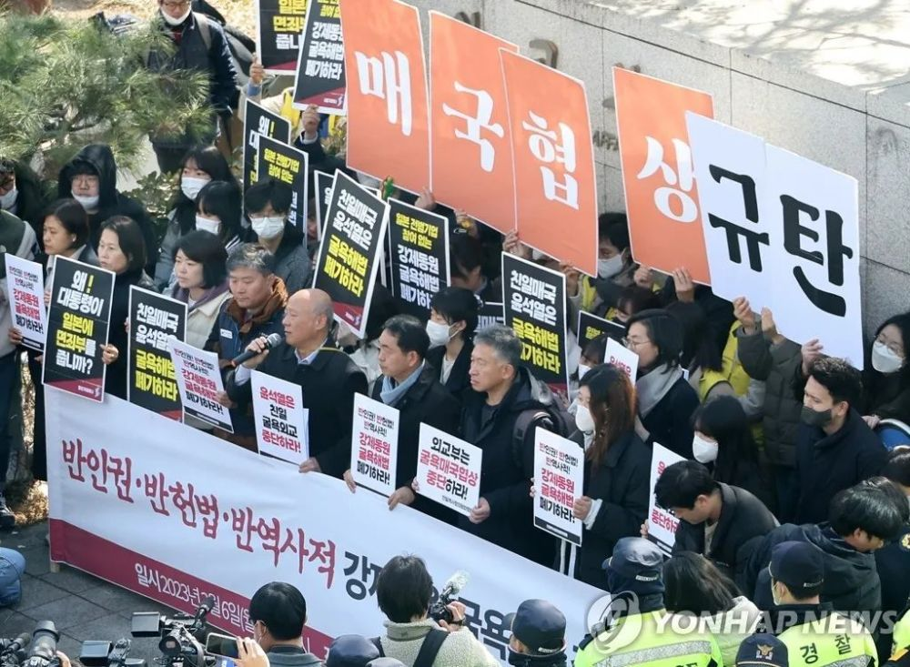

# “屈辱外交”还是韩日关系回暖？六成韩国人反对“自己赔自己”

**85%的受访者认为，日本政府没有为其战时暴行忏悔。**

周五公布的一项民意调查显示，近60%的韩国人反对政府在不涉及日本公司的情况下自行赔偿日本战时强征劳工受害者的方案。另一方面，韩日高层近期的互动计划似乎预示两国关系正在升温。

根据韩国政府6日公布的赔偿方案，韩国行政安全部下属的财团将代替被告日本企业支付赔偿金和利息，相当于自己花钱赔自己，引发受害者团队和民众的强烈反对，直言这是“屈辱外交”。而总统尹锡悦表示，这是政府尊重受害者立场、谋求韩日两国共同利益和未来发展的结果。

韩国盖洛普周三周四对1002名成年人展开了民调。结果显示，59%的人反对这一赔偿方案，因为它不要求日本的官方道歉和赔偿。

约35%的受访者表示，出于国家利益和韩日关系的考量，他们支持这一赔偿计划，另有6%的人表示不确定。

_3月6日，民众在韩国外交部前举行集会，抗议政府对日本战时强征劳工赔偿问题的解决方案。图源：韩联社_

盖洛普韩国公司表示，那些支持赔偿方案的人大多是韩国执政党的支持者，他们对总统尹锡悦给予了积极评价。但在其他人口群体中，更多人反对该方案。

对于韩日关系的未来，64%的人表示，除非日本表现出态度上的转变，否则没必要急于修补两国关系的裂痕；31%的人表示，应该迅速改善两国关系，哪怕需要韩国的妥协。

85%的受访者认为，日本政府没有为其战时暴行忏悔。只有8%的人相信日本对过去的错误行为感到遗憾。

在95%的置信水平下，该民调的误差幅度为正负3.1%。

对于韩国的“让步”，日本方面似乎已有所“回应”。

日韩两国政府9日宣布，韩国总统尹锡悦夫妇将于16至17日访问日本，并与日本首相岸田文雄举行会谈。这将是韩国总统时隔4年再度访日。此外，据日媒消息，日本政府拟邀请尹锡悦出席5月七国集团首脑会议（G7广岛峰会）期间的扩大会议。

**出品 深海区工作室**

**撰稿 王佳烨**

**编辑 深海贝**

