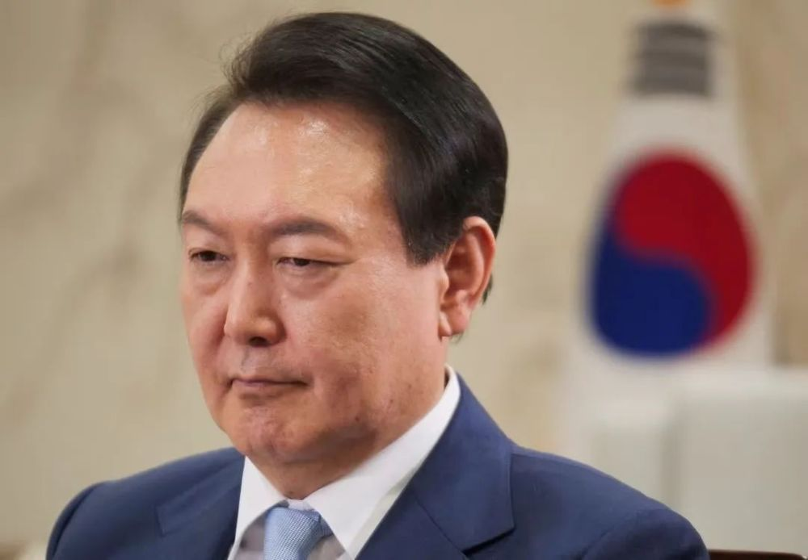
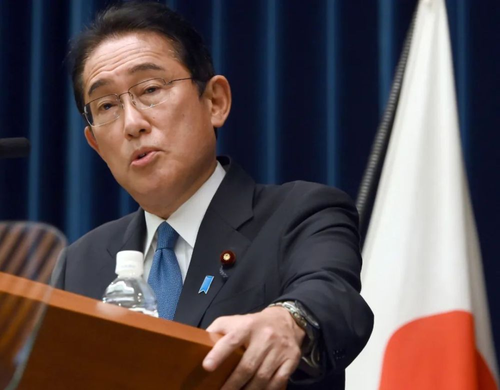
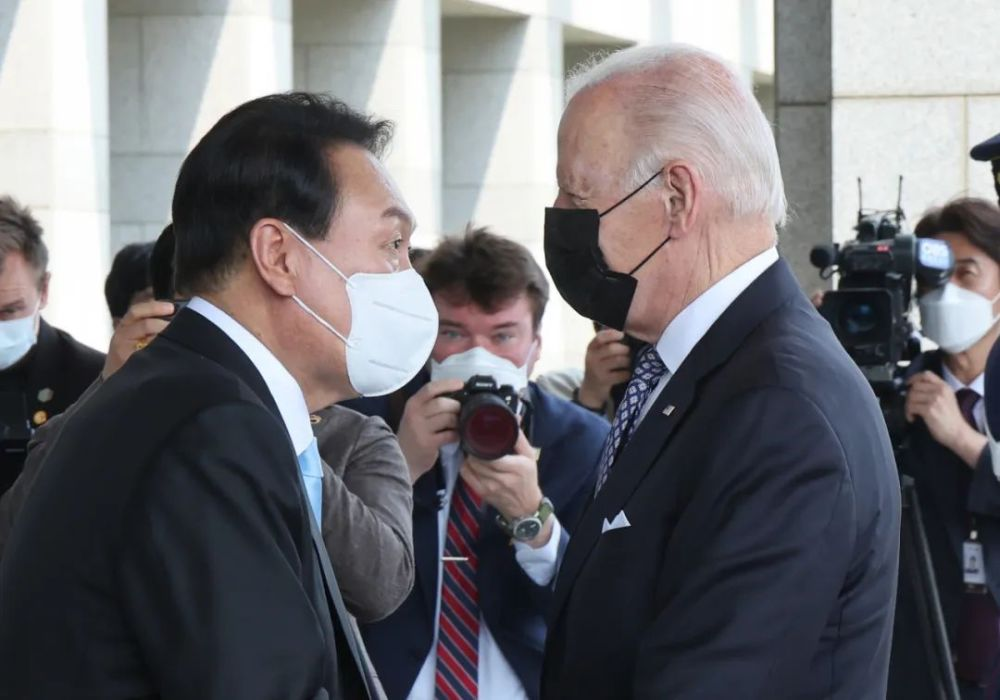
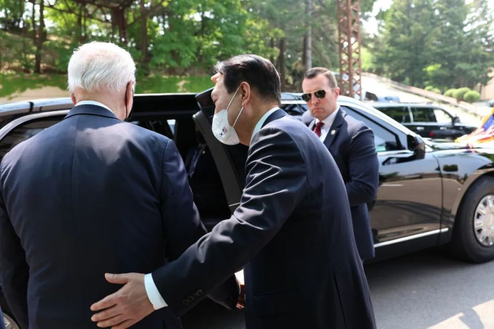

# “屈辱外交”？尹锡悦的外交“狂飙”除了示好日本，还想取悦美国

据韩联社报道，韩国总统室9日称，韩总统尹锡悦将应邀于3月16日至17日对日本进行访问，与日本首相岸田文雄举行会谈。

2019年，时任韩国总统文在寅在日本大阪出席G20会议。尹锡悦成为4年来首位访问日本的韩国领导人，这也是尹锡悦自去年5月上任以来首次访日。

日本共同社称， 2011年12月时任韩国总统李明博访日之后，两国首脑每年一次互访的“穿梭外交”中断，12年后，韩日或将借此访重启“穿梭外交”。

韩国总统室表示，相信尹锡悦此访将推动韩日领导人时隔12年重启交流，成为韩日关系改善和发展的重要里程碑。

岸田文雄表示，将使双方会晤成为“致力于加强双边关系的机会”。日本内阁官房长官松野博一称，韩国是日本在应对国际社会围绕各种课题开展合作的重要邻国，期待此访能推动基于友好的两国关系得到进一步发展。

时隔12年，两国为何在此时重启首脑访问？长安街知事（微信ID：Capitalnews）
注意到，韩日这次互抛媚眼的重要背景，正是韩方近日提出了二战时期被日本强征韩籍劳工受害者赔偿问题的“解决方案”。

长期以来，强征劳工赔偿问题是横在韩日关系中间最大的拦路石。但在3月6日，韩国政府宣布解决方案——韩国行政安全部下属财团筹措资金，替被告日本企业代付赔偿金。

也就是说，本应由日方向韩国受害者进行赔偿，韩国大手一挥，要自己掏钱赔自己。

方案一经发布，立即引发韩国受害劳工及家属、市民团体等的强烈抗议。韩国市民6日在首尔外交部大楼前抗议，称该赔偿方案“给战犯企业免罪符”，绝不接受第三方代付赔偿金，并敦促政府撤回该方案。

韩国社交媒体上也充斥着反对声音。有韩国网友狠批尹锡悦政府：“不要称之为对强征劳工问题的解决方案，不要称之为协议，这是卖国行为。”

韩国最大在野党共同民主党党首李在明说，这一方案是对强征劳工受害者的“二次加害”，是“与大法院判决背道而驰的暴行”，更是“韩国外交史上的耻辱和污点”。

尹锡悦政府的这一决定，不仅背离韩国主流民意，也被质疑为“忘记和背叛历史”。

日本1910年至1945年殖民统治朝鲜半岛期间，强征了大批劳工到日本做苦力，据统计多达78万人。这些劳工被以诱骗、胁迫等方式带到日本从事劳役，饱受非人待遇，不少人甚至被折磨致死。

长期以来，韩国受害劳工及遗属多次发起诉讼向日方索赔，但日本政府和相关企业一直以两国1965年签订《韩日请求权协定》“已解决”索赔问题为由拒绝赔偿。

2018年，韩国大法院就三起索赔诉讼做出终审判决，认定《韩日请求权协定》不妨碍强征劳工受害者起诉企业，判令涉事日企赔偿原告。

反观加害者的态度——日本非但没有正视和反省历史问题，反而由此对韩方实施经济报复，包括对出口韩国的半导体产业部分重要原材料实施管制。

强征和奴役劳工，是日本军国主义在对外侵略和殖民统治期间，对包括中国、韩国等在内的亚洲国家人民犯下的严重人道主义罪行。

面对如此恶劣的历史罪行、如此傲慢的施害者，韩国竟能自降国格，受害者亲手替加害者赔偿自己，也难怪会背上“屈辱外交”的骂名。

而对于韩国主动“分忧”，日本自然是大喜。岸田文雄当即对韩国举动表示“赞赏”。

更讽刺的是，在即将到来的韩日首脑会谈上，岸田表示还将当面对韩方的“解决方案”表示支持，并将力挺在韩国国内遭到反对的尹锡悦。

_岸田文雄 资料图_

实际上，在强征劳工赔偿方案公布前后，尹锡悦已经数次发表日本已从“军国主义侵略者”转变为“合作伙伴”的言论，顶着韩国民众的骂声，向日方频频抛出橄榄枝。

赔偿方案公布后，尹锡悦“趁热打铁”推进访日，韩政府对此高度评价，称重启穿梭外交“将成为韩日关系改善和发展的重要里程碑”。

不过，值得一提的是，尹锡悦此次访日将以工作访问规格进行，连国事访问的规格都够不上。韩媒对此找补称，“两国或许考虑到此访日程紧迫而做出该决定”。

两天里双方将谈什么？按照韩媒的预测，随着强征劳工赔偿问题的解决，“日本对韩出口限制措施”等议题将被纳入讨论——自己赔偿自己之后，韩国还得当面请求日本撤销制裁。如此外交，谈何平等？

外界分析，尽管日方主动邀尹锡悦访问以显示“热情”，但韩政府屈辱式的外交努力，换来的恐怕只会是日本惯有的表面热络，在两国未来交往中，韩国难以获得真正的尊重和公平地位。

日方的一个表态已证明了这一点。共同社报道称，日本政府正在拟邀尹锡悦出席5月七国集团首脑会议（G7广岛峰会）期间的扩大会议，但前提竟是要看韩方能不能“切实履行强征劳工解决方案”。

实际上，顶着韩国内的激烈舆论、背着屈辱外交的骂名，尹锡悦的这场外交“狂飙”背后，除了向日本示好，更重要的还是取悦老大哥美国。

_去年5月，拜登抵达首尔龙山总统府，同尹锡悦举行首脑会谈。图源：视觉中国_

要知道，强征劳工赔偿方案公布后，比日本更高兴的国家，就是美国。

韩国刚一公布赔偿方案，白宫就于当地时间5日深夜发表声明，对韩方的宣布表示欢迎。

拜登在声明中称，这份方案“将为美国两个亲密盟友开启合作与伙伴关系的突破性新篇章”，美国政府还将继续“协助”日韩两国改善关系。

美国国务卿布林肯发表声明，强调美日韩三边关系对美方“印太战略”的重要性。

美国驻日本大使伊曼纽尔8日表示，他赞赏岸田文雄和尹锡悦，称二人将未来置于比历史更优先的地位。

其实，韩国最终给出这一赔偿方案，背后也离不开美国的“努力”。

美国国务院发言人普赖斯透露，拜登政府任期内，美国高级官员已与日韩两国举行多达25轮三边会面。

据路透社报道，岸田文雄身边一名消息人士透露，美国政府一直在施压韩日两国，催促双方尽快“和解”。

长期以来，日韩不和成为美国在加强美日韩同盟体系中的阻碍，如今韩国在最大的心结上向日“求和”，美国当然乐见其成，未来拉拢两国推动其地缘政治行动将更得心应手。

_去年5月，拜登结束对韩国的国事访问，尹锡悦送别。图源：视觉中国_

在韩国发布实质上放弃向日方索赔的方案后，美国确实也在第一时间给出了“奖赏”——拜登邀请尹锡悦夫妇，于4月份对美国进行国事访问。

这是继法国总统马克龙后，拜登就任总统以来第二次招待国事访问的贵宾，他将为尹锡悦举行盛大国宴，以及各种最高规格的礼遇。

可见，韩国的做法深得拜登欣赏。只是，尹锡悦为美国的地缘政治目标主动开路，送上的是一份与狼共舞的“投名状”，代价却是韩国自降国格。

在美日的一声声赞赏中，尹锡悦是否会“迷失自我”，仍待观察。可以肯定的是，在国际交往中，国格一旦丢了，腰板儿必将弯下半寸。

