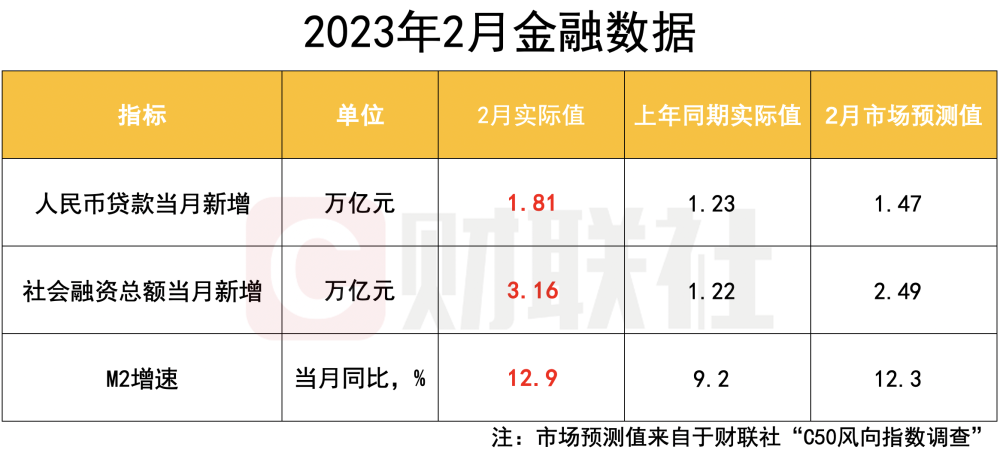
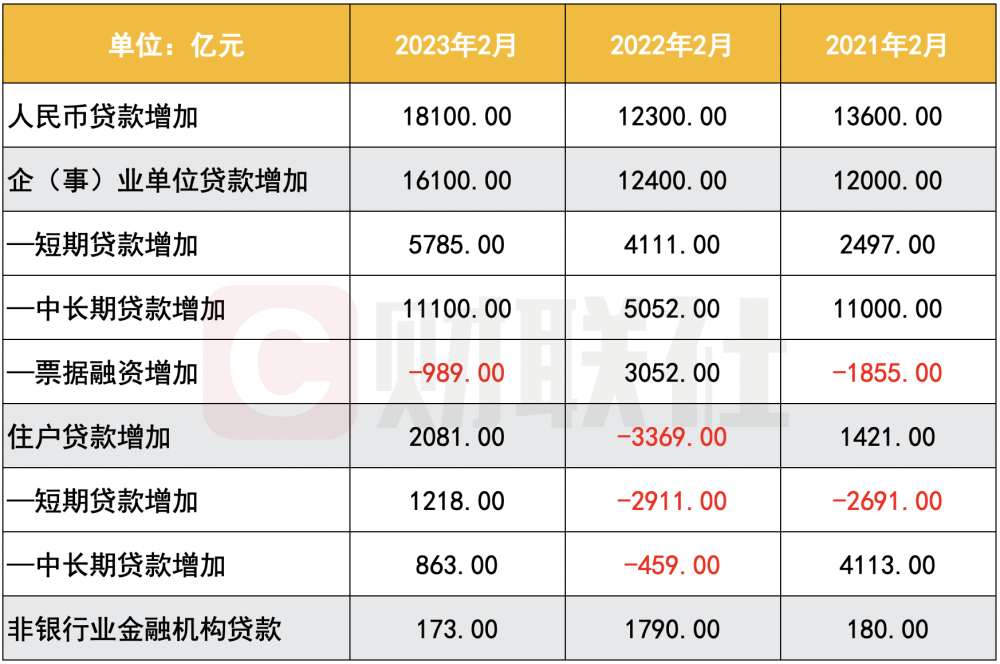
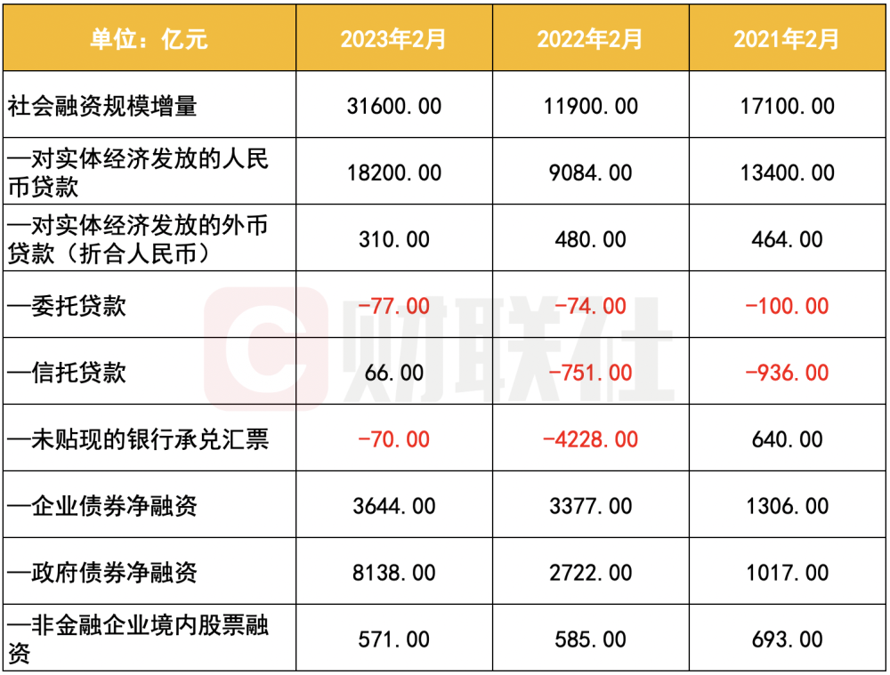
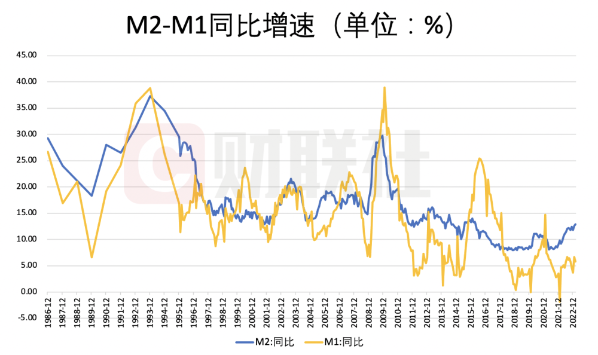

# 债券融资复苏社融同比多增近2万亿 M2增速上行或由存款派生加快所致

**财联社3月10日讯（记者 徐川）**
人民银行今日发布数据显示，2月新增人民币贷款1.81万亿元，比上年同期多增5928亿元；同时，2月社融新增强势增长至3.16万亿元，且恢复同比多增，超出上年同期1.95万亿元。

整体上看，2月金融数据高于市场预期。财联社“C50风向指数调查”显示，市场机构对2月人民币贷款新增的预测中值为1.47万亿元；另对2月社融新增的预测中值为2.49万亿元。

业内人士表示，在经济修复态势良好、市场主体预期改善、稳经济政策持续发力和银行竞争性投放下，信贷增长较往年更为积极，继1月信贷大幅增长后，2月新增规模续创同期历史新高。

**居民短贷修复明显 同比多增超千亿**

2月人民币贷款同比多增近6000亿元。分部门看，住户、企（事）业单位分别同比多增约5450亿元、3700亿元。

在去年低基数下，住户信贷同比显著改善。数据显示，2月住户贷款增加2081亿元，短期贷款与中长期贷款均由上年同期的“负增”大幅转为“正增”，分别增加1218亿元、863亿元。环比来看，呈现出“短贷增、中长贷降”，短期贷款由1月的341亿增至1218亿元，中长期贷款则由1月的2231亿元降至863亿元。

中国民生银行首席经济学家温彬认为，伴随疫情冲击消退，居民生活半径快速扩大，消费环境、消费秩序逐步改善，加之政策支持效果持续显现，消费和服务业数据明显反弹，带动居民短贷加快修复。但同时，温彬也指出，“不排除存在部分按揭转经营贷等套利行为，从而冲高规模”。

对于居民中长期贷款，川财证券首席经济学家陈雳对财联社记者表示，当前稳地产政策频出，在房地产政策边际改善带动下，居民改善型住房需求得到了支持，居民购房需求有望逐步回暖。

另一方面，2月企（事）业单位贷款增加1.61万亿元，其中，中长期贷款增加1.11万亿元，同比多增超6000亿元；短期贷款增加5785亿元，同比多增约1600亿元；票据融资则减少989亿元，同比多减超4000亿元。

“2月企业中长期贷款需求大幅改善，政策支持和基建发力都是重要影响因素。”陈雳表示，而票据融资大幅减少，说明实体融资需求稳增长政策的助力出现了明显修复，信贷结构迎来改善。

此外，东方金诚首席宏观分析师王青认为，2月企业贷款在总量延续扩张的同时，期限结构也在继续改善。这一方面源于经济回暖背景下银行风险偏好回升，另一方面也因监管要求银行“进一步优化信贷结构”，银行在政策面引导下也有意加大中长期贷款投放力度。

**社融同比多增近2万亿 企业债券融资复苏**

社融方面，2月社融规模增量为3.16万亿元，比上年同期多1.95万亿元，实现超预期放量。多位市场人士表示，除投向实体经济的贷款大幅多增超9000亿元外，主要贡献来自债券融资显著修复。

与上月相比，2月企业、债券融资均恢复同比正增长。数据显示，2月企业债券净融资3644亿元，同比多34亿元；政府债券净融资8138亿元，同比多5416亿元。

“主要是春节后国债、地方政府一般债发行加快。”王青分析称，数据显示，2月政府债券净融资8138亿元，同比大幅多增5416亿。这也显示为助力经济较快修复，年初除专项债发行节奏较快外，财政发力全面靠前。

值得注意的是，企业债券发行也在企稳，环比1月多增2158亿元，改变了此前企业债券融资对社融增量的拖累。

植信投资研究院高级研究员王运金对此表示，不仅企业债券发行规模增长明显，发行结构也出现较好改善。2月企业债、公司债、中期票据等中长期债种发行好于上月及去年同期，短期融资券对社融增长的贡献相对下降，民营企业债券融资支持工具取得较好效果。

另从表外融资来看，2月委托贷款减少77亿元，同比多减3亿元；信托贷款增加66亿元，同比多增817亿元；未贴现的银行承兑汇票减少70亿元，同比少减4158亿元。三项合计减少81亿元，而上年同期大幅减少超5000亿元。

王青表示，2月信托贷款有所恢复，为2020年5月以来首度正增，这可能与去年11月“金融16条”鼓励信托等资管产品支持房地产合理融资需求有关。

**M2增速延续高位上扬 创2016年3月来新高**

近几个月来，M2同比增速盘旋于高位是一个引人注目的金融指标变化。M2高增仍在延续，2月末，M2余额275.52万亿元，同比增长12.9%，增速分别比上月末和上年同期高0.3个和3.7个百分点。

2月M2同比增速创下2016年3月以来新高，且超出市场预期。财联社“C50风向指数调查”显示，参与机构的预测中值为12.3%，最高值为12.7%，不及2月实际值。

M2增速高企在一定程度上与上年同期增速基数下沉有关；同时，多位业内人士表示，主要原因在于2月贷款同比多增带动存款派生加快，叠加财政支出力度加大，推动M2增速高位上行。

光大银行金融市场部宏观研究员周茂华表示，2月国内活动持续回暖，市场主体借贷活动扩张带动了银行货币创造；同时，金融机构加大债券投资力度与积极财政靠前发力。整体上看，M2同比略高于名义GDP增速，反映目前国内货币环境保持合理适度，继续经济复苏提供有力支持。

“M2增速处于高位，背后的原因还包括上年财政大规模退税等因素带来的影响。”王青表示，这显示货币、财政政策共同发力作用下，金融体系对实体经济的货币供应量持续高增；伴随疫情影响全面退去，宽货币向宽信用渠道正在打通，其对实体经济的提振效应将在一季度有充分体现。

在M2高位上扬的同时，狭义货币（M1）同比增长5.8%，比上月末低0.9个百分点。此消彼长之下，M2与M1同比增速的剪刀差转而扩大了1.2个百分点，此前1月为收窄2.2个百分点。

（财联社记者 徐川）

