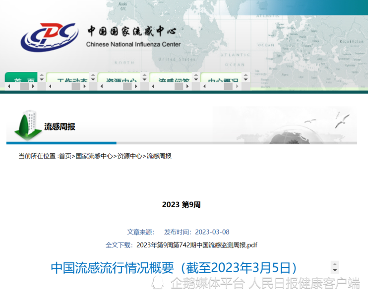

# 国家流感中心一周报告720起流感样病例，现在打疫苗仍能起预防作用

**人民日报健康客户端记者 谭琪欣 张爽**

3月8日，国家流感中心发布的最新流感周报显示，本周流感病毒检测阳性率继续上升，共报告720起流感样病例暴发疫情，比上周（第八周）390起增长了近一倍。以季节性甲型H1N1亚型流感病毒为主、季节性甲型H3N2亚型流感病毒共同流行。现在打流感疫苗还来得及吗？

**现在打疫苗仍能起到很好的预防保护作用**

“现在去打疫苗，肯定还是有用的，尤其是对于重症高风险人群，建议应接尽接。”
3月9日，北京佑安医院感染综合科主任医师李侗曾接受人民日报健康客户端记者采访时表示。

“按照流感发生的规律，每年的秋冬季以及冬春之交都是高发期，易形成流行，随着温度逐渐上升，流感的发病率会逐渐下降。但去年5-6月份时也有一波流感的小高峰，因此不好预测这轮疫情什么时候结束。”
浙江大学医学院附属第一医院传染科主任盛吉芳告诉人民日报健康客户端记者，而流感疫苗是有效的预防手段，建议去年没接种的人群，尽早去补种，仍能起到很好的预防保护作用。

李侗曾介绍，流感疫苗接种后需14天才能起到防护作用，虽然预计半个月后气温可能回暖，但甲流疫情会不会随着气温回暖得到有效控制仍然是未知数，如果疫情持续，人群感染发病的风险还是很高，因此，建议大于65岁的老年人、小于5岁的孩子尤其是不足2岁的孩子，以及本身有血液系统疾病者、免疫系统疾病和心血管病的人都属于高危人群，尽快接种疫苗。

**目前无药物可有效预防感染**

盛吉芳告诉记者，目前国内尚无预防流感的药物获批，无论是暴露前预防还是暴露后预防，都不建议自行服药。“无论是玛巴洛沙韦还是奥司他韦，都属于抗流感病毒治疗药物，建议在感染24小时-48小时内服用最佳。当用于预防用药时，吃完24小时身体就逐渐代谢掉了，在这种情况下还能起到多大的预防效果，尚无明确的证据支持。”

“玛巴洛沙韦在国内唯一获批的适应症是治疗12周岁及以上急性无并发症的流感患者，包括存在流感并发症高风险的患者，不推荐作为预防用药自行服用。不过，对于一些有重症风险的患者，在暴露后有较高感染风险的（同居住的人有感染的），可以在医生建议下按照一定的剂量服用以控制疾病发展。”李侗曾介绍。

**多数患者对症用药后能在1天内有效缓解**

“近期发热门诊的患者激增，每天发热门诊就诊的患者超400人，70%-80%都是甲流，说明此轮疫情值得引起重视。但与此同时，临床上观察到这次感染甲流的发热患者都以青壮年/儿童为主，大多数患者在对症用药后症状能在1天之内得到有效缓解，而新冠截至目前尚无特效药。”盛吉芳告诉记者，因此，无论从临床表现还是治疗手段上来看，相比于新冠，甲流更为可控。

盛吉芳认为，很多人感觉这轮甲流很严重，主要原因还是因为前3年的社交不活跃情况下，流感流行在一个相对的低水平。而现在彻底回归正常，流感的流行，也回归到疫情前状态，给人的感觉是严重了，但其实和疫情前也差不多。

李侗曾建议，如果出现高热持续不退，轻微活动后就出现呼吸困难，甚至其他明显的症状，比如剧烈咳嗽、氧饱和度明显下降、神智意识改变等情况，应该及时去医院就诊。中国疾控中心3月8日发布甲型流感健康提示，提醒做好个人防护，保持环境卫生，加强集体单位健康监测，尽快接种流感疫苗是科学预防甲型流感的有效举措。

