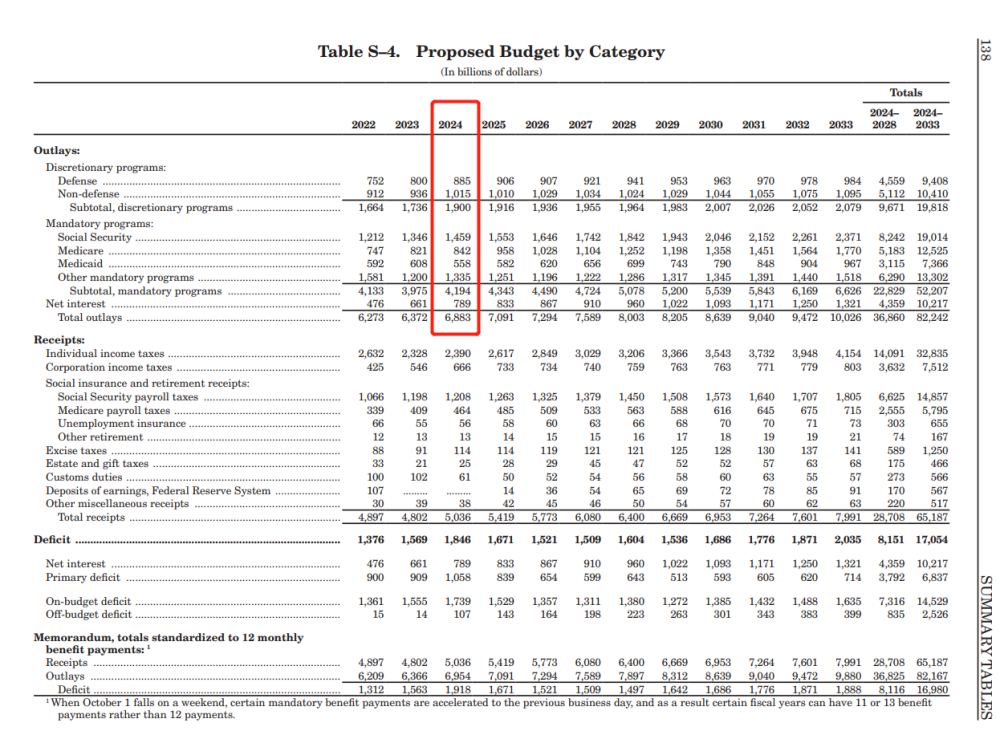
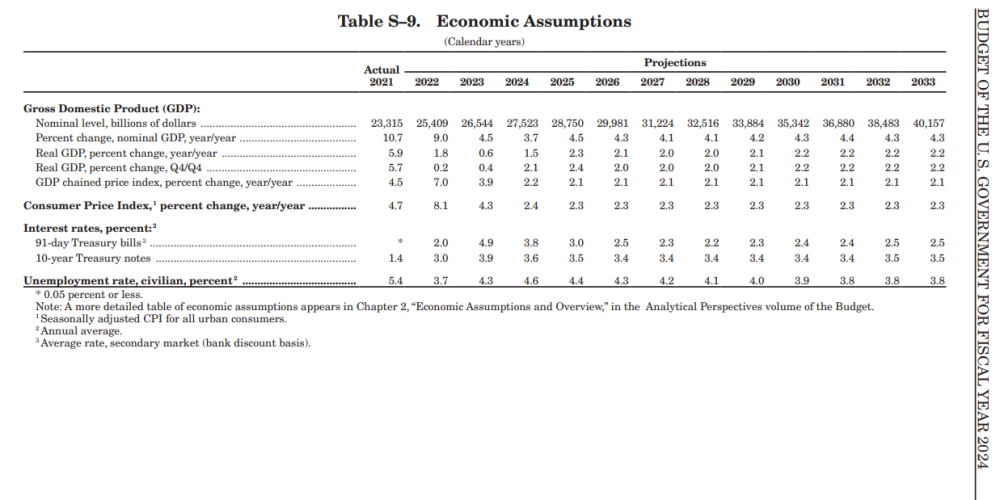

# 拜登6.9万亿财年预算案：国防部预算增至8420亿美元 向富裕人群加税

**财联社3月10日讯（编辑 史正丞）** 美国当地时间3月9日，拜登政府正式发布2024财年财政预算案，为美国国会崭新一轮的推诿扯皮吹响了号角。

当地媒体CNN直白地表示，
**拜登的这份预算案想要通过共和党控制的众议院“门都没有”，唯一的作用就是在后续的国会山讨价还价中，公开展现自己的立场和核心诉求** 。

_（拜登预算案，来源：美国政府）_

从总数来看， **白宫为今年10月开始的2024财年提出了近6.88万亿美元预算总数，较当前财年的6.37万亿美元进一步上升**
；其中防卫开支从8000亿美元提高至8850亿美元（其中国防部预算8420亿美元，包含60亿美元援乌支出），联邦社保和医保支出进一步提升，而联邦医疗补助则有所下降。算上节节攀升的利息支出，即便拜登一直在宣传减少赤字的努力，美国政府未来十年每年的财政亏空大致都会在1.5-2万亿美元之间。

同时，拜登政府在预算案的经济预期章节中，也明确预期 **当前财年经济增速将显著放缓，失业率上行则更多从年底开始反映** 。

_（预算案经济预测，来源：美国政府）_

**预算案要点概述**

**向富裕人群和企业加税：** 作为这份财政案中媒体最为关心的部分，拜登提议为 **净资产超过1亿美元的人群设立25%的最低税率**
，其中也包括未实现的资产增值部分（例如股票）。同时他也提议把2017年特朗普税改下调的公司税率从21%加回28%，跨国公司海外利润的税率从10.5%提升至21%，以及将股票回购税率从1%上调至4%。

此外，拜登还准备把特朗普削减的 **最高一档个税税率从37%加回至39.6%**
，适用于年收入达到40万美元的个人，或年收入达到45万美元的夫妇。对于华尔街基金经理惯用的避税套路，拜登还提议对收入超过100万美元的人士，
**以个税税率来征收资本利得税** 。白宫强调，这一系列的加税措施，将在 **未来10年（较原路径）减少3万亿美元的赤字** 。

通过向高收入人群增税，拜登政府预计， **原本将在2028年面临支付困难的联邦医保，能因此获得额外25年的喘息时间**
。同时还能为胰岛素、慢性病仿制药设置每月支出上限。

**向医药巨头、原油巨头开火：** 基于《通胀缩减法案》赋予的联邦医保集采谈判权力， **该预算案还将扩大联邦医保可选择集采的药物范围**
，以及加快谈判流程。 **拜登政府同时提出取消数十亿美元的美国油气公司税务补贴** ，和有利于“持续炒房”的房地产特别税务补贴项目。此外，拜登政府还提议
**堵上利用加密货币亏损降低税负的漏洞** 。

**扩大儿童养育税收抵免：** 拜登提议将 **每个6岁以下儿童的税收抵免额度从2000美元上调至3600美元，6岁以上则为3000美元**
。同时该预算案也将设立一个全新的联邦照看项目，提供普遍、免费的学前教育，并增加现有的早教项目拨款。

拜登财政案还将建立一项 **全国性的带薪家庭和病假计划** ，为新生儿父母、家庭成员病重和自身出现严重疾病等情况的职工提供12周的带薪假期。

**共和党火速回应“没门”：** 对于这份预算案，共和党众议员领袖凯文·麦卡锡在社交媒体上回应称，
**拜登提议的“万亿增税”将会造成美国家庭直接或间接支付更高的费用，而美国政府目前的问题是支出，而不是收入。**

_（来源：社交媒体）_

（财联社 史正丞）

