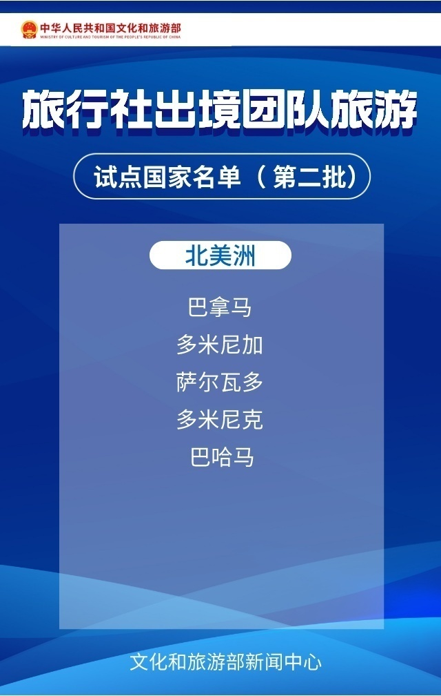

# 旅行社出境团队游逐步恢复，60国出境游名单完整版来啦

来源：文旅之声

3月10日，文化和旅游部发布《关于试点恢复旅行社经营中国公民赴有关国家（第二批）出境团队旅游业务的通知》，自2023年3月15日起，试点恢复全国旅行社及在线旅游企业经营中国公民赴有关国家（第二批）出境团队旅游和“机票+酒店”业务。同时公布了40国出境游名单，此前公布了第一批试点恢复出境游和相关业务的泰国、印度尼西亚、柬埔寨等20个国家。戳图查看名单完整版↓是否有你心怡的目的地？

