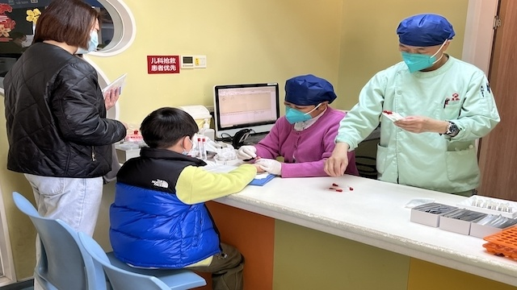

# 深圳调整流感风险等级，由低变为中

3月10日，深圳方面调整了流感风险等级。深圳市疾病风险综合预报结果显示，3月8日-14日，深圳市流感的风险等级由“低”调整为“中”。

深圳方面提醒市民，要做好手卫生等个人防护，近期少去人多通风不良的公共场所。

目前，深圳疾控中心也给出了六招预防流感方式，一是打流感疫苗，这是预防流感最有效的方法之一。二是咳嗽或打喷嚏时，用纸巾、毛巾等遮住口鼻。三是勤洗手，尽量避免触摸眼睛、鼻或口。四是尽量避免去人群聚集场所。五是家中、托幼机构、学校班级等场所每天尽可能保持开窗通风。六是出现流感样症状后，应避免带病上班、上学，接触家庭成员时戴口罩，减少疾病传播，儿童、老年人、有基础病、孕妇等人群出现症状需提高警惕，根据病情需要及时就医治疗。

值得一提的是，3月8日，中国国家流感中心也发布了2023年第九周流感监测周报，据显示，2023年2月27日-2023年3月5日这一周，南、北方省份流感病毒检测阳性率继续上升，A(H1N1)pdm09（季节性甲型H1N1亚型流感病毒）为主、A(H3N2)（季节性甲型H3N2亚型流感病毒）共同流行。其中，南方省份哨点医院报告的ILI%（流感样病例就诊比例）为7.6%，
高于前一周水平（3.9%），高于2020-2022年同期水平（3.3%、2.2%和3.8%）。

